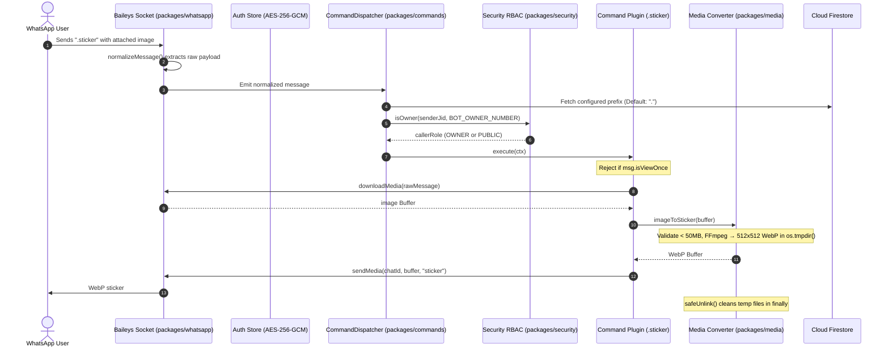
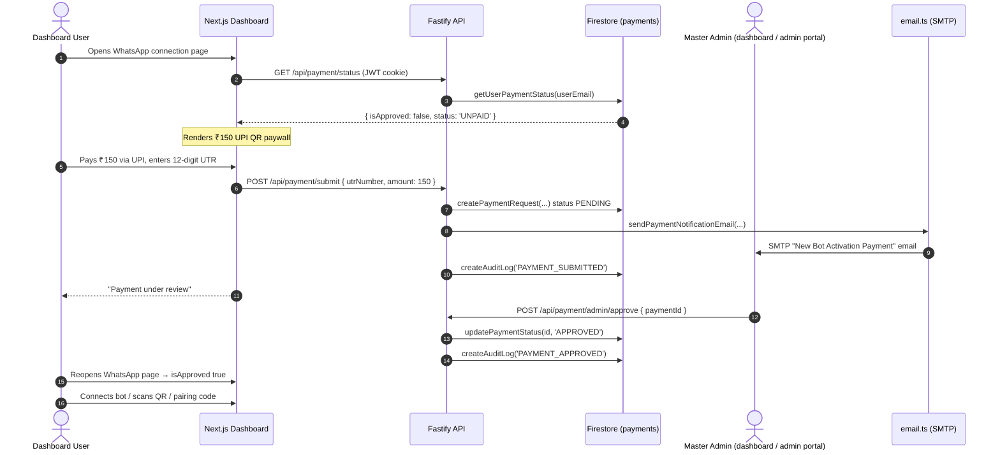
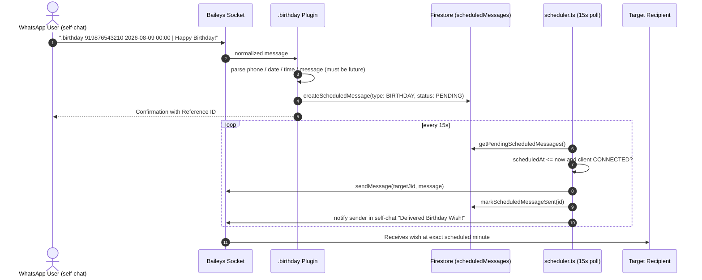

# Brain Architecture Blueprint — Caldera Bot (Private Self-Hosted WhatsApp Bot)

This document serves as the comprehensive technical specification, architecture guide, and file-by-file reference for the **Caldera Bot — Private Self-Hosted WhatsApp Multi-Device Automation Bot** (monorepo name `private-md-bot-monorepo`). It is designed so that any engineer or agent can immediately understand the entire codebase structure, design decisions, data flow, and exact responsibilities of every file.

---

## 1. High-Level Architecture & System Design

The application is a production, single-user (with paid-user onboarding) private monorepo powered by **pnpm workspaces** and **Turborepo**. It cleanly isolates WhatsApp protocol logic (`packages/whatsapp`) from API endpoints, database interactions, command execution, monetization, scheduling, and the Next.js control dashboard. It ships three front-end surfaces plus two cloud deployment targets:

| Surface | Technology | Hosted At | Purpose |
| :--- | :--- | :--- | :--- |
| **Landing page** (`landing/`) | Static HTML/CSS/JS | Netlify → `caldera-bot.netlify.app` | Marketing, features, pricing (₹150 lifetime), creator profile. Also served by the API at `/landing/` when the folder is present. |
| **Web dashboard** (`apps/web`) | Next.js 15 App Router | Netlify → `dashboard-caldera-bot.netlify.app` (can also run on Render / localhost:3000) | Authenticated control center: WhatsApp connection, commands, auto-replies, AI, media, logs, security, settings, admin portal. |
| **Standalone admin portal** (`admin/`) | Static HTML/CSS/JS + Firebase compat SDK | Netlify → `admin-caldera-bot.netlify.app` | Master admin approvals for the ₹150 UPI activation monetization flow. Realtime Firestore listener. |
| **API + Bot runtime** (`apps/api`) | Fastify REST + WebSocket | Render → `https://caldera-bot-api.onrender.com` (or localhost:4000) | Backend API, Baileys WhatsApp socket, BullMQ audit worker, background scheduler, payment verification. |

```mermaid
flowchart TD
    subgraph WhatsApp Network
        WA[WhatsApp Servers / Protocol]
    end

    subgraph Cloud Frontends (Netlify)
        L[landing/ static page]
        A[admin/ static admin portal]
        N[apps/web Next.js 15 Dashboard]
    end

    subgraph Core Monorepo: private-md-bot
        subgraph packages/whatsapp
            WAC[WhatsAppClient] <--> AuthStore[useFirebaseAuthState AES-256-GCM]
        end

        subgraph packages/commands
            Disp[CommandDispatcher] --> Reg[CommandRegistry]
            Disp --> AR[AutoReply Engine]
            Reg --> Plugins[Plugins .ping .sticker .vv .birthday .poll etc.]
        end

        subgraph packages/security
            Enc[AES-256-GCM Encryption]
            Perm[RBAC Permission Checker]
            RL[Rate Limiter]
        end

        subgraph packages/database
            DB[firebase-admin / Firestore] <--> Firestore[(Cloud Firestore)]
        end

        subgraph apps/api
            Fastify[Fastify REST API & WS Gateway]
            Worker[BullMQ Audit Worker] <--> Redis[(Redis 7)]
            Sched[Scheduler: Birthday + Scheduled Messages]
            Mail[email.ts nodemailer SMTP]
        end

        subgraph apps/web
            Next[Next.js 15 Control Dashboard]
        end
    end

    WA <-->|Baileys Protocol| WAC
    AuthStore <--> Enc
    AuthStore <--> DB
    WAC -->|messages.upsert| Disp
    Disp --> Perm
    Disp --> RL
    Plugins --> MediaPkg[packages/media FFmpeg]
    Plugins --> AIPkg[packages/ai Gemini/OpenAI/Ollama]
    Plugins --> DB
    Sched --> WAC
    Sched --> DB

    Next <-->|HTTP / REST| Fastify
    Next <-->|WebSocket /ws| Fastify
    A -->|Firebase Auth + Firestore direct| Firestore
    A -->|API fallback| Fastify
    L --> N
    L --> A
    Fastify --> DB
    Worker --> DB
    Mail -->|SMTP| AdminEmail
    AdminEmail[contact.subhroy@gmail.com / aarsxlan@gmail.com]
```

### Core Monorepo Principles
1. **Isolated Protocol Layer (`packages/whatsapp`)**: Baileys protocol code is strictly encapsulated inside `packages/whatsapp`. The rest of the application interacts with WhatsApp only through clean internal interfaces.
2. **Session Security at Rest**: Baileys auth keys and credentials are encrypted using Node.js `crypto` **AES-256-GCM** before being stored in Firestore (`sessions` collection) via the `firebase-admin` SDK. If `SESSION_ENCRYPTION_KEY` is missing or invalid, the app fails securely.
3. **Mandatory Privacy Defaults**: `MESSAGE_LOGGING=false` and `AI_ENABLED=false` are default settings. No message content is written to disk or logs unless explicitly enabled.
4. **View-Once Media Handling**: View-once media is respected by default — `sticker` and `toimg` reject it. A dedicated `.vv` / `.avv` command allows revealing view-once media: it looks up the **originally received message** from the client's recent-message cache, downloads it, and re-sends it as normal saveable media.
5. **Monetization Gate**: WhatsApp connection (QR + pairing) is gated behind a **₹150 one-time UPI activation payment** + admin approval. Payment requests are stored in Firestore (`payments`), verified by an admin (dashboard Admin Portal or the standalone `admin/` portal), and exempted emails bypass the gate.
6. **Scheduled Delivery Engine**: `.birthday` / `.schedule` queue messages in Firestore (`scheduledMessages`); a background scheduler in `apps/api` delivers them at the exact scheduled minute and notifies the sender in their self-chat.
7. **Zero Telemetry**: No third-party analytics, remote tracking, or cloud bot host dependencies beyond Firebase/Render/Netlify infra.
8. **Deployment Split**: Dashboard + static sites are hosted on Netlify; the API/bot runtime is hosted on Render; `docker-compose.yml` remains available for fully self-hosted deployments.

---

## 2. Comprehensive File-by-File Blueprint

---

### Root Workspace Files

#### 1. [package.json](file:///c:/Users/Subhankar%20Roy/Downloads/wp_bot/package.json)
- **Purpose**: Root package manifest for the monorepo workspace.
- **Key Fields & Responsibilities**:
  - `name`: `"private-md-bot-monorepo"`, `private: true`, `version: "1.0.0"`.
  - `packageManager`: `"pnpm@9.15.4"` (Pinned to satisfy Netlify Corepack; previously `11.9.0`).
  - `engines.node`: `>=20.0.0`.
  - `scripts`:
    - `build`: `turbo run build` (Executes build tasks across workspace in dependency order).
    - `dev`: `turbo run dev` (Starts API server and Next.js web app concurrently).
    - `lint`: `turbo run lint`.
    - `test`: `turbo run test` (Executes Vitest test suites in packages).
    - `type-check`: `turbo run type-check` (Runs `tsc --noEmit` across all packages).
  - `devDependencies`: `turbo` (^2.4.0), `typescript` (^5.7.3), `vitest` (^3.0.5).

#### 2. [pnpm-workspace.yaml](file:///c:/Users/Subhankar%20Roy/Downloads/wp_bot/pnpm-workspace.yaml)
- **Purpose**: Defines workspace package boundaries for pnpm.
- **Content**:
  ```yaml
  packages:
    - "apps/*"
    - "packages/*"
  ```
- **Function**: Directs pnpm to recursively discover packages in `apps/api`, `apps/web`, `packages/whatsapp`, `packages/commands`, `packages/ai`, `packages/database`, `packages/security`, `packages/media`, and `packages/config`.

#### 3. [turbo.json](file:///c:/Users/Subhankar%20Roy/Downloads/wp_bot/turbo.json)
- **Purpose**: Turborepo task pipeline orchestration config.
- **Function**: Uses Turborepo 2.0+ `tasks` syntax:
  - `build`: `dependsOn: ["^build"]` so dependent packages build first. Caches `.next` and `dist` outputs (`.next/cache` excluded).
  - `dev`: `cache: false`, `persistent: true`.
  - `lint`, `test`, `type-check`: defined with empty outputs (no caching).

#### 4. [.gitignore](file:///c:/Users/Subhankar%20Roy/Downloads/wp_bot/.gitignore)
- **Purpose**: Git tracking exclusion list.
- **Function**: Prevents committing `node_modules`, build artifacts (`.next`, `dist`, `out`, `*.tsbuildinfo`), temporary media processing files (`tmp/`, `temp/`), logs, and secrets (`.env`, `firebase-service-account.json`, `openify-studio-firebase-adminsdk-*.json`).

#### 5. [.env.example](file:///c:/Users/Subhankar%20Roy/Downloads/wp_bot/.env.example)
- **Purpose**: Master environment variable schema template.
- **Documented Variables**:
  - `PORT`: API server port (default `4000`). `NODE_ENV` (`development`/`production`/`test`).
  - `API_URL` (default `http://localhost:4000`) and `WEB_URL` (default `http://localhost:3000`): CORS allow-list origins and absolute links used in outbound emails.
  - `SESSION_ENCRYPTION_KEY`: 64-character hex string (32 bytes) for AES-256-GCM.
  - `JWT_SECRET`: Secret key for dashboard JWT tokens.
  - `FIREBASE_SERVICE_ACCOUNT_PATH`: Path to the Firebase service account JSON key. Alternatives: inline `FIREBASE_SERVICE_ACCOUNT` JSON or `GOOGLE_APPLICATION_CREDENTIALS`. Local emulator only: `FIREBASE_PROJECT_ID` + `FIRESTORE_EMULATOR_HOST`.
  - `NEXT_PUBLIC_FIREBASE_API_KEY`, `NEXT_PUBLIC_FIREBASE_AUTH_DOMAIN`, `NEXT_PUBLIC_FIREBASE_PROJECT_ID`, `NEXT_PUBLIC_FIREBASE_STORAGE_BUCKET`, `NEXT_PUBLIC_FIREBASE_MESSAGING_SENDER_ID`, `NEXT_PUBLIC_FIREBASE_APP_ID`: Firebase **web SDK** config inlined into the dashboard at build time for Google sign-in. MUST be the same project as the service account. Next.js reads these from `apps/web/.env.local`.
  - `REDIS_URL`: Redis connection string (`redis://localhost:6379`).
  - Privacy flags: `MESSAGE_LOGGING=false`, `AI_ENABLED=false`, `MEDIA_RETENTION=temporary`, `ANALYTICS=false`, `THIRD_PARTY_TRACKING=false`.
  - `BOT_OWNER_NUMBER`: Phone number of bot owner (digits only or JID).
  - AI keys: `GEMINI_API_KEY`, `OPENAI_API_KEY`, `OPENAI_BASE_URL`, `OLLAMA_BASE_URL`.
  - (Not documented in the example but read by `email.ts`: `SMTP_HOST`, `SMTP_USER`, `SMTP_PASS`, `SMTP_PORT`, `SMTP_SECURE`.)

#### 6. [.npmrc](file:///c:/Users/Subhankar%20Roy/Downloads/wp_bot/.npmrc)
- **Purpose**: pnpm CLI & network configuration.
- **Settings**:
  - `block-exotic-subdeps=false`: Allows exotic subdependencies (e.g. Baileys `libsignal` git subdependency).
  - `node-linker=hoisted`: Uses flat node_modules linking for maximum tool compatibility.
  - `fetch-retries=5`, `fetch-retry-mintimeout=20000`, `fetch-timeout=300000`: Extended network retries for tarball downloads.

#### 7. [server.js](file:///c:/Users/Subhankar%20Roy/Downloads/wp_bot/server.js)
- **Purpose**: Single command launcher — `node server.js` runs the whole stack (API + WhatsApp bot + dashboard).
- **Function**: Auto-builds `apps/api` (`pnpm --filter @private-md-bot/api build`) and `apps/web` (`pnpm --filter @private-md-bot/web build`) when `dist` / `.next` are missing, spawns api via `node apps/api/dist/index.js` (port 4000) and web via `next start -p 3000`, prefixes logs with `[api]`/`[web]`, and tears down both children on SIGINT/SIGTERM or child exit.
- **Notable behaviors**:
  - Locates the Next.js binary across monorepo/hoisted locations (`apps/web/node_modules/next/dist/bin/next`, root `node_modules/next/dist/bin/next`, root `node_modules/.bin/next`).
  - `API_ONLY=true` skips the web build/start entirely (used for the standalone Render API backend; dashboard is Netlify-hosted).
  - Patches `.next/routes-manifest.json` (ensures `dataRoutes`/`staticRoutes`/`dynamicRoutes` arrays exist) to keep `next start` happy after Netlify-style builds.
- **Prereq**: Firestore reachable — run `pnpm --filter @private-md-bot/api firebase:setup` once after placing the service account.

#### 8. [.pnpmfile.cjs](file:///c:/Users/Subhankar%20Roy/Downloads/wp_bot/.pnpmfile.cjs)
- **Purpose**: Programmatic pnpm package resolution hook script.
- **Function**: Exports `hooks.readPackage(pkg)`. Strips out `@whiskeysockets/eslint-config` from package dependency and devDependency trees during `pnpm install` resolution.

#### 9. [docker-compose.yml](file:///c:/Users/Subhankar%20Roy/Downloads/wp_bot/docker-compose.yml)
- **Purpose**: Multi-container self-hosted production deployment orchestration.
- **Services Defined**:
  - `redis`: Redis 7 Alpine container for BullMQ queues & rate limiters with healthcheck (`redis-cli ping`).
  - `api`: Fastify API server container built from `docker/Dockerfile.api`; mounts `./firebase-service-account.json` read-only at `/app/firebase-service-account.json`; env-driven keys (`SESSION_ENCRYPTION_KEY`, `JWT_SECRET`, `BOT_OWNER_NUMBER`, privacy flags).
  - `web`: Next.js web dashboard container built from `docker/Dockerfile.web`; `API_URL=http://api:4000`.
  - `caddy`: Caddy 2 reverse proxy handling TLS and traffic routing (ports 80/443).
- **Note**: The database is **Cloud Firestore** (managed by Firebase, no local container). `redis` is used by BullMQ (`apps/api/src/queue.ts`) for audit-log queuing and is optional — the app degrades to direct Firestore writes.

#### 10. [netlify.toml](file:///c:/Users/Subhankar%20Roy/Downloads/wp_bot/netlify.toml)
- **Purpose**: Netlify deployment config for the Next.js dashboard.
- **Settings**:
  - `build.command`: `pnpm --filter @private-md-bot/web build`; `publish`: `apps/web/.next`.
  - `build.environment`: `NODE_VERSION=20.18.0`, `PNPM_VERSION=9.15.4`, `NETLIFY_USE_PNPM=true`.
  - `[[redirects]]`: `/api/*` → `https://caldera-bot-api.onrender.com/api/:splat` (status 200, proxies API calls to the Render backend).

#### 11. [render.yaml](file:///c:/Users/Subhankar%20Roy/Downloads/wp_bot/render.yaml)
- **Purpose**: Render Blueprint for cloud API + dashboard hosting.
- **Services**:
  - `private-whatsapp-bot-api` (Node web, region oregon): `pnpm install && pnpm build`, start `pnpm --filter @private-md-bot/api start`; auto-generates `SESSION_ENCRYPTION_KEY` and `JWT_SECRET`; defaults `MESSAGE_LOGGING=false`, `AI_ENABLED=false`, `PORT=4000`, `NODE_VERSION=22.0.0`.
  - `private-whatsapp-bot-web` (Node web, region oregon): `pnpm install && pnpm build`, start `pnpm --filter @private-md-bot/web start`; `PORT=3000`.

---

### Static Marketing Surfaces (`landing/` + `admin/`)

#### 12. [landing/index.html](file:///c:/Users/Subhankar%20Roy/Downloads/wp_bot/landing/index.html)
- **Purpose**: Editorial landing page for the bot (Caldera branding, Steep-style design).
- **Content**: Quiet navbar, hero with floating artifact cards, privacy/security section, "rare accent peach" editorial spotlight, features grid (`.vv`, `.birthday`, `.ai`, `.sticker`/`.toimg`), pricing section (**₹150 one-time lifetime license**, UPI), creator profile card (Subhankar Roy — avatar, bio, portfolio/social links), footer.
- **SEO**: `canonical` to `caldera-bot.netlify.app`, Open Graph + Twitter card meta, `robots: index,follow`, theme color `#fc5000`, links to `manifest.webmanifest`.
- **Constants**: `BOT_PRICE = '150'`, `BOT_CURRENCY = '₹'` inlined in a header script.

#### 13. [landing/style.css](file:///c:/Users/Subhankar%20Roy/Downloads/wp_bot/landing/style.css) & [landing/script.js](file:///c:/Users/Subhankar%20Roy/Downloads/wp_bot/landing/script.js)
- **Purpose**: Landing styling (Inter + Source Serif 4 typography, pill buttons, art-directed sections) and small JS behaviors. `script.js` is lightweight; pricing values come from the inline `BOT_PRICE` constant.
- **Serving**: Hosted on Netlify at `caldera-bot.netlify.app` and optionally by the API at `/landing/` via `@fastify/static` (see `apps/api/src/server.ts`).

#### 14. [admin/index.html](file:///c:/Users/Subhankar%20Roy/Downloads/wp_bot/admin/index.html)
- **Purpose**: Standalone **Master Admin Portal** (hosted at `admin-caldera-bot.netlify.app`, `noindex`).
- **Structure**: Login card (Google sign-in + email/password) → dashboard view with KPI grid (Pending Approvals, Total Revenue ₹150 × approved, Approved Users, Total Submissions) and a payments approval table with filter pills (ALL / PENDING / APPROVED / REJECTED).
- **Auth note**: Uses Firebase compat SDK (`firebase-app-compat`, `firebase-auth-compat`, `firebase-firestore-compat`). Only allowlisted admin emails (`contact.subhroy@gmail.com`, `aarxslan@gmail.com`) may proceed; others are force signed out.

#### 15. [admin/app.js](file:///c:/Users/Subhankar%20Roy/Downloads/wp_bot/admin/app.js)
- **Purpose**: Admin portal logic.
- **Function**:
  - Initializes Firebase (web config for project `openify-studio`).
  - `auth.onAuthStateChanged` enforces the `ALLOWED_ADMIN_EMAILS` allowlist.
  - `subscribeToPayments()` uses a **realtime Firestore `onSnapshot`** listener on the `payments` collection; on failure falls back to `GET https://caldera-bot-api.onrender.com/api/payment/admin/requests`.
  - Approve/reject first writes `status` directly to the Firestore `payments` doc (merge); on error falls back to the Render API `POST /api/payment/admin/approve|reject`.
  - Revenue KPI: `approved * 150`.

#### 16. [admin/style.css](file:///c:/Users/Subhankar%20Roy/Downloads/wp_bot/admin/style.css)
- **Purpose**: Admin portal styling (Plus Jakarta Sans + Space Grotesk, dark header, table cards).

---

### Database Package (`packages/database/`)

#### 17. [packages/database/src/index.ts](file:///c:/Users/Subhankar%20Roy/Downloads/wp_bot/packages/database/src/index.ts)
- **Purpose**: Firestore data-access layer via the `firebase-admin` SDK. Exports `db` (a typed object of CRUD helpers), `getDb()`, and types.
- **Collections** (doc id in parentheses):
  - `users` (doc id = `username`): `id`, `username`, `passwordHash`, `totpSecret`, `totpEnabled`, `googleUid`, `role`, `createdAt`, `updatedAt`.
  - `sessions` (doc id = `${sessionKey}_${key}`): `sessionKey`, `encryptedData` [AES-256-GCM Base64], `updatedAt`.
  - `commandConfigs` (doc id = `name`): `name`, `enabled`, `aliases`, `cooldown`, `ownerOnly`, `description`, `category`, `updatedAt`.
  - `autoReplies` (auto doc id): `trigger`, `matchType`, `response`, `enabled`, `priority`, `cooldown`, `createdAt`, `updatedAt`.
  - `settings` (doc id = `key`): `key`, `value`, `description`, `updatedAt`.
  - `auditLogs` (auto doc id): `action`, `actor`, `details`, `ipAddress`, `createdAt`.
  - `payments` (auto doc id): `userId`, `userEmail`, `utrNumber`, `amount`, `status` (`PENDING`/`APPROVED`/`REJECTED`), `createdAt`, `updatedAt`.
  - `scheduledMessages` (auto doc id): `targetNumber`, `targetJid`, `message`, `scheduledAt`, `senderJid`, `type` (`BIRTHDAY`/`SCHEDULED`), `status` (`PENDING`/`SENT`/`FAILED`), `createdAt`.
- **Notable helpers**:
  - Users: `countUsers`, `createUser`, `findUserByUsername`, `findUserById`, `setUserGoogleUid`. `findUserByUsername`/`findUserById` fall back to a `where('email'|'id', ...)` lookup so email-identified Google users resolve.
  - Sessions: `getSession`/`upsertSession`/`deleteSession`.
  - Settings/commands/auto-replies/audit logs: unchanged set of CRUD helpers. `getAuditLogs` uses `orderBy('createdAt','desc').offset().limit()`.
  - Payments: `createPaymentRequest`, `getPaymentRequests` (newest first), `getUserPaymentStatus(userIdOrEmail)` — returns `{ isApproved, status, request? }` and **exempts** the hard-coded list `['contact.subhroy@gmail.com', 'aarxslan@gmail.com', 'admin', 'admin@openify.studio']`; `updatePaymentStatus(id, 'APPROVED'|'REJECTED')`.
  - Scheduled: `createScheduledMessage`, `getPendingScheduledMessages` (`status == 'PENDING'`), `markScheduledMessageSent`.
  - Health: `ping()`.
- **Design notes**: No composite indexes required for core reads. Credential resolution order in `getDb()`: `FIREBASE_SERVICE_ACCOUNT` (inline JSON) → files found at `FIREBASE_SERVICE_ACCOUNT_PATH` / `GOOGLE_APPLICATION_CREDENTIALS` → bundled candidates `openify-studio-firebase-adminsdk-fbsvc-8938483736.json` (repo-root) and `firebase-service-account.json` (searched relative to cwd, repo root, and `__dirname` `../../../`) → `FIREBASE_PROJECT_ID` (emulator only). Honors `FIRESTORE_EMULATOR_HOST`.

#### 18. [packages/database/package.json](file:///c:/Users/Subhankar%20Roy/Downloads/wp_bot/packages/database/package.json)
- **Purpose**: Database package manifest exporting `@private-md-bot/database`.
- **Dependencies**: `firebase-admin` (^13.4.0), `@types/node`, `tsup`. The build marks `firebase-admin` as external so it stays a runtime dependency.

#### 19. [packages/database/tsconfig.json](file:///c:/Users/Subhankar%20Roy/Downloads/wp_bot/packages/database/tsconfig.json)
- **Purpose**: TypeScript configuration for database package.
- **Settings**: Target `ES2022`, module resolution `NodeNext`, declaration generation enabled.

---

### Configuration Package (`packages/config/`)

#### 20. [packages/config/package.json](file:///c:/Users/Subhankar%20Roy/Downloads/wp_bot/packages/config/package.json)
- **Purpose**: Package manifest for `@private-md-bot/config`.
- **Dependencies**: `dotenv` (^16.4.7), `zod` (^3.24.2).

#### 21. [packages/config/tsconfig.json](file:///c:/Users/Subhankar%20Roy/Downloads/wp_bot/packages/config/tsconfig.json)
- **Purpose**: TypeScript configuration for config package.

#### 22. [packages/config/src/index.ts](file:///c:/Users/Subhankar%20Roy/Downloads/wp_bot/packages/config/src/index.ts)
- **Purpose**: Centralized environment variable parsing and validation.
- **Functions & Logic**:
  - Loads `.env` via dotenv from multiple candidate paths (cwd, `../../.env`, `__dirname`-relative `../../../`, `../../../../`) for Turborepo package resolution.
  - Exports `envSchema` (Zod object validation).
  - Validates `SESSION_ENCRYPTION_KEY` is exactly 64 hex characters (has a dev default), `JWT_SECRET` min 16 chars.
  - Parses `PORT`/`NODE_ENV`, `API_URL`, `WEB_URL` (URL-validated).
  - Transforms string boolean flags (`MESSAGE_LOGGING`, `AI_ENABLED`, `ANALYTICS`, `THIRD_PARTY_TRACKING`) to native booleans.
  - `getEnv()`: Lazily evaluates `process.env` against schema and returns frozen `env` object; throws in production on validation failure. Also exports `env` (evaluated once at import).

---

### Security Package (`packages/security/`)

#### 23. [packages/security/package.json](file:///c:/Users/Subhankar%20Roy/Downloads/wp_bot/packages/security/package.json)
- **Purpose**: Package manifest for `@private-md-bot/security`.

#### 24. [packages/security/tsconfig.json](file:///c:/Users/Subhankar%20Roy/Downloads/wp_bot/packages/security/tsconfig.json)
- **Purpose**: TypeScript compiler settings for security package.

#### 25. [packages/security/src/encryption.ts](file:///c:/Users/Subhankar%20Roy/Downloads/wp_bot/packages/security/src/encryption.ts)
- **Purpose**: AES-256-GCM symmetric encryption & decryption helpers.
- **Functions & Implementation Details**:
  - `getEncryptionKey(customKey?)`: Reads `SESSION_ENCRYPTION_KEY` from environment or argument. Throws hard error if key length is not 64 hex chars (32 bytes).
  - `encryptData(plaintext, customKey?)`: Generates 12-byte random IV via `crypto.randomBytes()`, encrypts plaintext using `aes-256-gcm`, retrieves 16-byte auth tag, concatenates `IV + AuthTag + Ciphertext`, and returns Base64 string.
  - `decryptData(ciphertextBase64, customKey?)`: Decodes Base64 buffer, extracts IV (first 12 bytes), AuthTag (next 16 bytes), and Ciphertext. Verifies authentication tag integrity before returning UTF-8 string.

#### 26. [packages/security/src/permissions.ts](file:///c:/Users/Subhankar%20Roy/Downloads/wp_bot/packages/security/src/permissions.ts)
- **Purpose**: RBAC role hierarchy and owner verification module.
- **Functions**:
  - `normalizePhoneNumber(input)`: Strips non-digit characters (`/\D/g`) to normalize WhatsApp JIDs (`1234567890@s.whatsapp.net` -> `1234567890`).
  - `isOwner(senderJid, configuredOwnerNumber, isFromMe?)`: Checks if normalized sender phone number matches configured owner number. Does not rely on `fromMe` flag alone.
  - `hasPermission(callerRole, requiredRole)`: Evaluates numeric role weights (`PUBLIC`: 1, `ADMIN`: 2, `OWNER`: 3).

#### 27. [packages/security/src/password.ts](file:///c:/Users/Subhankar%20Roy/Downloads/wp_bot/packages/security/src/password.ts)
- **Purpose**: Secure password hashing engine using Node.js native `crypto.scrypt`.
- **Functions**:
  - `hashPassword(password)`: Generates 16-byte random salt, derives 64-byte key via `scrypt`, returns `salt:derivedKeyHex`.
  - `verifyPassword(password, hash)`: Extracts salt, re-derives key, and compares using `crypto.timingSafeEqual()` to prevent timing side-channel attacks.

#### 28. [packages/security/src/sanitizer.ts](file:///c:/Users/Subhankar%20Roy/Downloads/wp_bot/packages/security/src/sanitizer.ts)
- **Purpose**: Injection and path traversal sanitizer.
- **Functions**:
  - `sanitizeShellArg(arg)`: Tests input against metacharacter regex (`/['"`$;|&><\\]/`). Throws error if shell characters are detected.
  - `sanitizeFilePath(filePath, allowedDir?)`: Normalizes path via `path.normalize()`, checks for directory traversal sequences (`..`, `\0`), and verifies path starts with `allowedDir`.

#### 29. [packages/security/src/rate-limiter.ts](file:///c:/Users/Subhankar%20Roy/Downloads/wp_bot/packages/security/src/rate-limiter.ts)
- **Purpose**: In-memory sliding window rate limiter.
- **Class**: `RateLimiter(windowMs, maxRequests)`.
- **Method**: `isRateLimited(key)` maintains timestamp arrays per key, filters out timestamps older than sliding window start, returns `true` if valid timestamp count exceeds `maxRequests`.

#### 30. [packages/security/src/index.ts](file:///c:/Users/Subhankar%20Roy/Downloads/wp_bot/packages/security/src/index.ts)
- **Purpose**: Barrel export file re-exporting encryption, permissions, password, sanitizer, and rate-limiter modules.

---

### WhatsApp Isolated Package (`packages/whatsapp/`)

#### 31. [packages/whatsapp/package.json](file:///c:/Users/Subhankar%20Roy/Downloads/wp_bot/packages/whatsapp/package.json)
- **Purpose**: Package manifest for `@private-md-bot/whatsapp`.
- **Dependencies**: `@whiskeysockets/baileys` (^6.7.16), `pino` (^9.6.0), `ws` (^8.18.0), plus workspace packages `@private-md-bot/config`, `@private-md-bot/database`, `@private-md-bot/security`. `@hapi/boom` is a **devDependency** (used for `DisconnectReason` typing only).

#### 32. [packages/whatsapp/tsconfig.json](file:///c:/Users/Subhankar%20Roy/Downloads/wp_bot/packages/whatsapp/tsconfig.json)
- **Purpose**: TypeScript configuration for WhatsApp package.

#### 33. [packages/whatsapp/src/types.ts](file:///c:/Users/Subhankar%20Roy/Downloads/wp_bot/packages/whatsapp/src/types.ts)
- **Purpose**: Type declarations for WhatsApp adapter.
- **Interfaces**:
  - `ConnectionStatus`: `'DISCONNECTED' | 'CONNECTING' | 'CONNECTED' | 'PAIRING'`.
  - `NormalizedMessage`: `id`, `chatId`, `senderJid`, `senderNumber`, `pushName?`, `fromMe`, `isGroup`, `body`, `hasMedia`, `mediaType?` (`'image'|'video'|'audio'|'document'|'sticker'`), `isViewOnce`, `quotedMessage?` (optional; see note below), `rawMessage`.
  - `MessageHandler` / `StatusHandler` callback types.
  - **Note**: `quotedMessage` is declared but **never populated** by `normalizeMessage()` in the current `client.ts` — plugins that rely on `ctx.message.quoted` (`.toaudio`, `.togif`) are currently broken (see Known Issues).

#### 34. [packages/whatsapp/src/auth-store.ts](file:///c:/Users/Subhankar%20Roy/Downloads/wp_bot/packages/whatsapp/src/auth-store.ts)
- **Purpose**: Custom encrypted Firestore auth state adapter for Baileys.
- **Functions**:
  - `useFirebaseAuthState(sessionKey = 'default_session')`:
    - Intercepts Baileys credential reads (`readData`) and key mutations (`writeData`).
    - Serializes state objects using Baileys `BufferJSON.replacer` and encrypts with `encryptData()`.
    - Upserts encrypted strings into the `sessions` Firestore collection via `db.upsertSession` (doc id `${sessionKey}_${key}`).
    - Decrypts via `decryptData()` and parses using `BufferJSON.reviver`.
  - `clearFirebaseAuthState(sessionKey = 'default_session')`: Batch-deletes all session docs matching the session key prefix (used on logout / logged-out disconnect).

#### 35. [packages/whatsapp/src/client.ts](file:///c:/Users/Subhankar%20Roy/Downloads/wp_bot/packages/whatsapp/src/client.ts)
- **Purpose**: Master WhatsApp client interface encapsulating Baileys lifecycle.
- **Class**: `WhatsAppClient`
- **Methods & Responsibilities**:
  - `connect()`: Loads auth state via `useFirebaseAuthState()`, initializes Baileys socket (`makeWASocket` with `syncFullHistory: false`, `generateHighQualityLinkPreview: true`), binds `creds.update` and `connection.update` handlers.
  - Reconnect Logic: Exponential backoff (`1000 * 2^attempts`, max 30s) on unexpected disconnects. `DisconnectReason.loggedOut` clears the Firestore auth store and reconnects.
  - `requestPairingCode(phoneNumber)`: Triggers Baileys pairing code flow for 8-digit phone number pairing.
  - `disconnect()`: Sets explicit-disconnect flag, unbinds listeners, closes socket, clears Firestore auth state.
  - `sendMessage(chatId, content)` & `sendMedia(chatId, media, type, options)`: Dispatch text and media (`image`/`video`/`audio`/`sticker`) messages.
  - `downloadMedia(msg)` / `downloadMediaFromContent(content)`: Download media via Baileys `downloadMediaMessage` — the content-based variant powers `.vv` unwrapping of quoted view-once media.
  - `getCachedMessage(id)` / `cacheMessage(id, msg)`: In-memory recent-message cache (bounded to 300 entries) backing `.vv`.
  - `normalizeMessage(msg)`: Normalizes raw messages; unwraps view-once wrappers (`viewOnceMessage`, `viewOnceMessageV2`, `viewOnceMessageV2Extension`).
  - **Message dedup**: `processedMsgIds` Set (capped at 1000) prevents double-processing on multi-device sync.
  - **History skip**: Ignores messages older than 2 minutes at ingest to keep responses instant.
  - **Echo-Loop Guard**: Downstream handlers (dispatcher/auto-reply) ignore `fromMe` messages.
  - **Logging Guard**: Pino logger redacts `message.body`, `creds`, `keys`, `qr`, `pairingCode`; log lines omit body when `MESSAGE_LOGGING=false`.

#### 36. [packages/whatsapp/src/index.ts](file:///c:/Users/Subhankar%20Roy/Downloads/wp_bot/packages/whatsapp/src/index.ts)
- **Purpose**: Barrel export re-exporting `WhatsAppClient`, types, and auth-store helpers.

---

### Media Processing Package (`packages/media/`)

#### 37. [packages/media/package.json](file:///c:/Users/Subhankar%20Roy/Downloads/wp_bot/packages/media/package.json)
- **Purpose**: Package manifest for `@private-md-bot/media`.

#### 38. [packages/media/tsconfig.json](file:///c:/Users/Subhankar%20Roy/Downloads/wp_bot/packages/media/tsconfig.json)
- **Purpose**: TypeScript configuration for media package.

#### 39. [packages/media/src/converter.ts](file:///c:/Users/Subhankar%20Roy/Downloads/wp_bot/packages/media/src/converter.ts)
- **Purpose**: FFmpeg media conversion engine.
- **Functions & Process Flow**:
  - `validateMediaBuffer(buffer, maxSize)`: Validates non-empty buffer and enforces file size limit (default 50MB).
  - `createTempFile(ext, buffer)` / `safeUnlink(filePath)`: Write/clean random temp files in `os.tmpdir()` inside `finally` blocks.
  - `imageToSticker(imageBuffer)`: FFmpeg `scale=512:512:force_original_aspect_ratio=decrease,format=rgba,pad=512:512...` → WebP.
  - `videoToSticker(videoBuffer)`: FFmpeg with `-t 10` (max 10s), `fps=15`, `-loop 0` → animated WebP sticker.
  - `stickerToImage(stickerBuffer)`: WebP → PNG.
  - **Note**: There is **no exported `extractAudioFromVideo`** — `.toaudio` imports it and currently fails to compile.

#### 40. [packages/media/src/index.ts](file:///c:/Users/Subhankar%20Roy/Downloads/wp_bot/packages/media/src/index.ts)
- **Purpose**: Barrel export file for media converter functions (`export * from './converter'`).

---

### AI Provider Package (`packages/ai/`)

#### 41. [packages/ai/package.json](file:///c:/Users/Subhankar%20Roy/Downloads/wp_bot/packages/ai/package.json)
- **Purpose**: Package manifest for `@private-md-bot/ai`.
- **Dependencies**: `@google/genai` (^2.16.0), `@private-md-bot/config`.

#### 42. [packages/ai/tsconfig.json](file:///c:/Users/Subhankar%20Roy/Downloads/wp_bot/packages/ai/tsconfig.json)
- **Purpose**: TypeScript compiler settings for AI package.

#### 43. [packages/ai/src/types.ts](file:///c:/Users/Subhankar%20Roy/Downloads/wp_bot/packages/ai/src/types.ts)
- **Purpose**: AI type declarations.
- **Interfaces**: `AIProviderType` (`'gemini' | 'openai' | 'ollama'`), `AIResponse`, `AIProvider`.

#### 44. [packages/ai/src/providers.ts](file:///c:/Users/Subhankar%20Roy/Downloads/wp_bot/packages/ai/src/providers.ts)
- **Purpose**: AI provider adapters and factory.
- **Classes**:
  - `GeminiProvider`: Connects to Google Gemini 2.5 Flash via `@google/genai` SDK.
  - `OpenAIProvider`: Issues HTTP POST to OpenAI-compatible `/chat/completions` endpoint.
  - `OllamaProvider`: Issues HTTP POST to local Ollama `/api/generate` endpoint.
- **Privacy Hard Guard**: Every `generateText` implementation checks `env.AI_ENABLED`. If `false`, throws `Error('AI features are disabled by configuration. No data was transmitted.')` without issuing network requests.

#### 45. [packages/ai/src/index.ts](file:///c:/Users/Subhankar%20Roy/Downloads/wp_bot/packages/ai/src/index.ts)
- **Purpose**: Barrel export for AI types and providers.

---

### Plugin Command Registry Package (`packages/commands/`)

#### 46. [packages/commands/package.json](file:///c:/Users/Subhankar%20Roy/Downloads/wp_bot/packages/commands/package.json)
- **Purpose**: Package manifest for `@private-md-bot/commands`.

#### 47. [packages/commands/tsconfig.json](file:///c:/Users/Subhankar%20Roy/Downloads/wp_bot/packages/commands/tsconfig.json)
- **Purpose**: TypeScript compiler settings for commands package.

#### 48. [packages/commands/src/types.ts](file:///c:/Users/Subhankar%20Roy/Downloads/wp_bot/packages/commands/src/types.ts)
- **Purpose**: Command execution context and plugin interfaces.
- **Interfaces**:
  - `CommandContext`: `client`, `message`, `args`, `prefix`, `callerRole`, `reply()`, `replyMedia()`.
  - `CommandPlugin`: `name`, `aliases`, `description`, `category` (`'general'|'utility'|'media'|'ai'|'admin'`), `ownerOnly`, `enabled`, `cooldown`, `execute()`.
  - **Note**: `category` does NOT include `'group'` — `.admins` uses `'group'` and fails type-check (see Known Issues).

#### 49. [packages/commands/src/registry.ts](file:///c:/Users/Subhankar%20Roy/Downloads/wp_bot/packages/commands/src/registry.ts)
- **Purpose**: Plugin registry holding active command plugins.
- **Class**: `CommandRegistry` registers default commands, manages command-to-alias maps, and resolves commands via `getCommand(nameOrAlias)`.
- **Registered defaults** (25 plugins): `ping`, `menu`, `help`, `about`, `owner`, `settings`, `sticker`, `toimg`, `ai`, `group`, `promote`, `demote`, `kick`, `tagall`, `antilink`, `ytmp3`, `ytmp4`, `vv`, `birthday`, `id`, `calc`, `poll`, `toaudio`, `togif`, `admins`.

#### 50. [packages/commands/src/auto-reply.ts](file:///c:/Users/Subhankar%20Roy/Downloads/wp_bot/packages/commands/src/auto-reply.ts)
- **Purpose**: Automated rule evaluation engine.
- **Function**: `processAutoReplies(client, msg)`:
  - Ignores bot's own messages (`msg.fromMe`).
  - Fetches enabled rules from Firestore via `db.getEnabledAutoReplies()` sorted by priority descending.
  - Matches rule triggers against message text (`EXACT`, `CONTAINS`, `STARTS_WITH`, `ENDS_WITH`, `REGEX`).
  - Applies sender rate limiting before transmitting rule response.

#### 51. [packages/commands/src/dispatcher.ts](file:///c:/Users/Subhankar%20Roy/Downloads/wp_bot/packages/commands/src/dispatcher.ts)
- **Purpose**: Master message processing pipeline handler.
- **Class**: `CommandDispatcher`
- **Pipeline Execution Steps**:
  1. Fetches dynamic command prefix from database settings or default `.`.
  2. Checks if message starts with prefix; parses command name + args.
  3. Resolves target plugin from `CommandRegistry` (skips unknown/disabled).
  4. Determines caller role (`OWNER` if `msg.fromMe` or `isOwner(senderJid, BOT_OWNER_NUMBER)` else `PUBLIC`). Rejects non-owners for `ownerOnly` commands.
  5. Evaluates cooldown via `RateLimiter(5000, 3)` (bypassed for owner self-commands).
  6. Constructs `CommandContext` inline (`reply`/`replyMedia` bound to client sends) and executes `plugin.execute(ctx)`.
  7. Ignores non-command `fromMe` messages (prevents auto-replying to own chat texts).
  8. Falls back to `processAutoReplies()` for unmatched incoming messages.

#### 52. Command Plugins (`packages/commands/src/plugins/`)
- [ping.ts](file:///c:/Users/Subhankar%20Roy/Downloads/wp_bot/packages/commands/src/plugins/ping.ts): `.ping` — round-trip latency and system uptime.
- [menu.ts](file:///c:/Users/Subhankar%20Roy/Downloads/wp_bot/packages/commands/src/plugins/menu.ts): `.menu` — formats enabled commands by category, filters owner-only commands for public users.
- [help.ts](file:///c:/Users/Subhankar%20Roy/Downloads/wp_bot/packages/commands/src/plugins/help.ts): `.help` — usage, description, aliases, cooldown for a target command.
- [about.ts](file:///c:/Users/Subhankar%20Roy/Downloads/wp_bot/packages/commands/src/plugins/about.ts): `.about` — bot architecture, encryption status, privacy parameters.
- [owner.ts](file:///c:/Users/Subhankar%20Roy/Downloads/wp_bot/packages/commands/src/plugins/owner.ts): `.owner` — owner `wa.me` contact link.
- [settings.ts](file:///c:/Users/Subhankar%20Roy/Downloads/wp_bot/packages/commands/src/plugins/settings.ts): `.settings` (Owner only) — view/update key-value database settings.
- [sticker.ts](file:///c:/Users/Subhankar%20Roy/Downloads/wp_bot/packages/commands/src/plugins/sticker.ts): `.sticker` — image/video → WhatsApp sticker. Rejects view-once media.
- [toimg.ts](file:///c:/Users/Subhankar%20Roy/Downloads/wp_bot/packages/commands/src/plugins/toimg.ts): `.toimg` — quoted sticker → PNG image.
- [ai.ts](file:///c:/Users/Subhankar%20Roy/Downloads/wp_bot/packages/commands/src/plugins/ai.ts): `.ai` — invokes AI assistant if enabled.
- [group.ts](file:///c:/Users/Subhankar%20Roy/Downloads/wp_bot/packages/commands/src/plugins/group.ts): `.group`, `.promote`, `.demote`, `.kick`, `.tagall` (group admin controls).
- [antilink.ts](file:///c:/Users/Subhankar%20Roy/Downloads/wp_bot/packages/commands/src/plugins/antilink.ts): `.antilink` — toggle group link suppression.
- [downloader.ts](file:///c:/Users/Subhankar%20Roy/Downloads/wp_bot/packages/commands/src/plugins/downloader.ts): `.ytmp3` / `.ytmp4` media downloader engines.
- [vv.ts](file:///c:/Users/Subhankar%20Roy/Downloads/wp_bot/packages/commands/src/plugins/vv.ts): `.vv` / `.avv` — reveals view-once media from the client's recent-message cache (falling back to unwrapping `contextInfo.quotedMessage`), downloads via `downloadMedia`/`downloadMediaFromContent`, re-sends as normal media.
- [birthday.ts](file:///c:/Users/Subhankar%20Roy/Downloads/wp_bot/packages/commands/src/plugins/birthday.ts): `.birthday` / `.wish` / `.schedule` / `.schedulemsg` — schedules a birthday wish or automated message. Syntax: `<phone> <YYYY-MM-DD HH:mm> | <message>`. Validates number/datetime (must be future), creates a `scheduledMessages` record with `type` derived from the command token (`BIRTHDAY` when the command body contains "birthday", else `SCHEDULED`), confirms with a reference ID. The target person never sees the command text.
- [id.ts](file:///c:/Users/Subhankar%20Roy/Downloads/wp_bot/packages/commands/src/plugins/id.ts): `.id` / `.jid` / `.chatid` — prints chat JID, sender JID/number, and chat type.
- [calc.ts](file:///c:/Users/Subhankar%20Roy/Downloads/wp_bot/packages/commands/src/plugins/calc.ts): `.calc` / `.math` / `.calculate` / `=` — safe arithmetic evaluation. Regex-whitelists `0-9 + - * / % ( ) ^ .`, replaces `^` with `**`, executes inside `new Function` with `"use strict"`, rejects non-number/`isFinite` results.
- [poll.ts](file:///c:/Users/Subhankar%20Roy/Downloads/wp_bot/packages/commands/src/plugins/poll.ts): `.poll` / `.createpoll` — creates an interactive poll from `question | option1 | option2...`. **⚠️ BROKEN**: calls `ctx.replyWithPoll`, which does not exist on `CommandContext` — compile error + runtime crash.
- [toaudio.ts](file:///c:/Users/Subhankar%20Roy/Downloads/wp_bot/packages/commands/src/plugins/toaudio.ts): `.toaudio` / `.tomp3` / `.mp3` — converts quoted video/voice to MP3. **⚠️ BROKEN**: imports non-existent `extractAudioFromVideo` from `@private-md-bot/media`, uses non-existent `ctx.message.quoted`, `ctx.downloadQuotedMedia`, `ctx.replyWithAudio`.
- [togif.ts](file:///c:/Users/Subhankar%20Roy/Downloads/wp_bot/packages/commands/src/plugins/togif.ts): `.togif` / `.gif` — converts quoted video/animated sticker to GIF playback. **⚠️ BROKEN**: uses non-existent `ctx.message.quoted`, `ctx.downloadQuotedMedia`, `ctx.replyWithVideo`.
- [admins.ts](file:///c:/Users/Subhankar%20Roy/Downloads/wp_bot/packages/commands/src/plugins/admins.ts): `.admins` / `.adminlist` / `.groupadmins` — lists group administrators. **⚠️ BROKEN**: `category: 'group'` is not in the `category` union and `ctx.getGroupMetadata` does not exist on `CommandContext`.

#### 53. [packages/commands/src/index.ts](file:///c:/Users/Subhankar%20Roy/Downloads/wp_bot/packages/commands/src/index.ts)
- **Purpose**: Barrel export re-exporting types, registry, dispatcher, and auto-reply modules.

---

### Backend Fastify API Server (`apps/api/`)

#### 54. [apps/api/package.json](file:///c:/Users/Subhankar%20Roy/Downloads/wp_bot/apps/api/package.json)
- **Purpose**: Application manifest for Fastify API backend.
- **Dependencies**: `fastify`, `@fastify/cors`, `@fastify/cookie`, `@fastify/jwt`, `@fastify/rate-limit`, `@fastify/websocket`, `@fastify/static`, `bullmq`, `ioredis`, `pino`, `ws`, `zod`, `firebase-admin`, `nodemailer`, plus all `@private-md-bot/*` workspace packages. Also a `firebase:setup` script running `scripts/firebase-bootstrap.js`.

#### 55. [apps/api/tsconfig.json](file:///c:/Users/Subhankar%20Roy/Downloads/wp_bot/apps/api/tsconfig.json)
- **Purpose**: TypeScript configuration for API application.

#### 56. [apps/api/src/server.ts](file:///c:/Users/Subhankar%20Roy/Downloads/wp_bot/apps/api/src/server.ts)
- **Purpose**: Fastify application factory function (`buildServer()`).
- **Function**:
  - Logger with redaction of `authorization` / `cookie` headers.
  - Registers CORS (`origin: [env.WEB_URL, 'http://localhost:3000']`, credentials), global rate-limit (100 req/min with 429 message), Cookie, JWT (secret from env, cookie name `token`, unsigned), WebSocket.
  - Registers `@fastify/static` to serve the `landing/` directory at prefix `/landing/` when present (searched at cwd, `../../landing`, and `__dirname`-relative paths).
  - Defines `fastify.authenticate` JWT decorator and a global error handler that never leaks stack traces/secrets.
  - Instantiates `WhatsAppClient` and `CommandDispatcher`, wires `waClient.onMessage(dispatcher.handleMessage)`.
  - Starts `startMessageScheduler(waClient)` (birthday + scheduled message delivery).
  - Registers all routes: health, auth, whatsapp, commands, autoreply, settings, logs, payment, and the WebSocket gateway.
  - Returns `{ fastify, waClient }`.

#### 57. [apps/api/src/websocket.ts](file:///c:/Users/Subhankar%20Roy/Downloads/wp_bot/apps/api/src/websocket.ts)
- **Purpose**: Real-time authenticated WebSocket gateway.
- **Function**: `registerWebSocketGateway()` handles `/ws` endpoint connections. Authenticates JWT token from query string or cookie, tracks connected clients, and broadcasts `waClient.onStatusChange()` status & QR updates. Uses the `@fastify/websocket` v11 handler signature (raw `ws` first argument).

#### 58. [apps/api/src/queue.ts](file:///c:/Users/Subhankar%20Roy/Downloads/wp_bot/apps/api/src/queue.ts)
- **Purpose**: Redis & BullMQ audit log worker.
- **Function**: Instantiates BullMQ `auditQueue` and a background `Worker` when Redis is reachable (ioredis configured with `maxRetriesPerRequest: 1`, `enableOfflineQueue: false`, `connectTimeout: 2000`, non-reconnecting `retryStrategy`). `logAudit()` enqueues audit events (`action`, `actor`, `details`, `ipAddress`) to be persisted into Firestore via `db.createAuditLog`. **Resilience**: if Redis is offline or enqueue fails, it falls back to writing the audit log directly to Firestore.

#### 59. [apps/api/src/scheduler.ts](file:///c:/Users/Subhankar%20Roy/Downloads/wp_bot/apps/api/src/scheduler.ts)
- **Purpose**: Background message & birthday delivery engine.
- **Function**: `startMessageScheduler(waClient)` polls every **15 seconds**:
  - Skips if the WhatsApp client is not `CONNECTED`.
  - Fetches `PENDING` `scheduledMessages` from Firestore; for each record whose `scheduledAt <= now`, sends `message` to `targetJid`, marks it `SENT`, and notifies the original sender in their self-chat with a delivery receipt (type-aware copy: "Birthday Wish" vs "Scheduled Message").

#### 60. [apps/api/src/services/email.ts](file:///c:/Users/Subhankar%20Roy/Downloads/wp_bot/apps/api/src/services/email.ts)
- **Purpose**: Payment submission email notification.
- **Function**: `sendPaymentNotificationEmail({ userEmail, utrNumber, amount, paymentId })`:
  - Logs a console banner with the payment details to the hard-coded admin emails (`contact.subhroy@gmail.com`, `aarxslan@gmail.com`).
  - If `SMTP_HOST`/`SMTP_USER`/`SMTP_PASS` are set, sends an HTML email via **nodemailer** titled `💳 New Bot Activation Payment (₹X) from <user>` with a link to `<WEB_URL>/dashboard/security` for approval.

#### 61. API Route Handlers (`apps/api/src/routes/`)
- [health.ts](file:///c:/Users/Subhankar%20Roy/Downloads/wp_bot/apps/api/src/routes/health.ts): `/api/health` and `/api/ready` — verifies DB query and WhatsApp status without exposing internal keys.
- [auth.ts](file:///c:/Users/Subhankar%20Roy/Downloads/wp_bot/apps/api/src/routes/auth.ts): `/api/auth/status`, `/api/auth/setup` (initial admin, role OWNER), `/api/auth/login` (scrypt + HTTP-only cookie), `/api/auth/google` (verifies Firebase ID token via `getAuth().verifyIdToken`, links by email; first user auto-created as OWNER, new Google users auto-created as USER (self-registration via Google sign-in; bot access gated by payment status)), `/api/auth/logout`, `/api/auth/me`.
- [whatsapp.ts](file:///c:/Users/Subhankar%20Roy/Downloads/wp_bot/apps/api/src/routes/whatsapp.ts): `/api/whatsapp/status` (status + QR), `/api/whatsapp/connect`, `/api/whatsapp/disconnect`, `/api/whatsapp/pair-code`. All audit-logged.
- [commands.ts](file:///c:/Users/Subhankar%20Roy/Downloads/wp_bot/apps/api/src/routes/commands.ts): `/api/commands` (GET merged commands, PUT update command configuration).
- [autoreply.ts](file:///c:/Users/Subhankar%20Roy/Downloads/wp_bot/apps/api/src/routes/autoreply.ts): `/api/auto-replies` CRUD.
- [settings.ts](file:///c:/Users/Subhankar%20Roy/Downloads/wp_bot/apps/api/src/routes/settings.ts): `/api/settings` (GET privacy flags & settings, PUT update).
- [logs.ts](file:///c:/Users/Subhankar%20Roy/Downloads/wp_bot/apps/api/src/routes/logs.ts): `/api/logs` paginated audit history.
- [payment.ts](file:///c:/Users/Subhankar%20Roy/Downloads/wp_bot/apps/api/src/routes/payment.ts): Monetization endpoints:
  - `GET /api/payment/status` (auth): returns `getUserPaymentStatus(userIdentifier)` — `{ isApproved, status, request? }`.
  - `POST /api/payment/submit` (auth): validates UTR (min 4 chars), creates `payments` record (`amount` defaults to 100 unless supplied; the dashboard submits ₹150), sends the admin notification email, writes a `PAYMENT_SUBMITTED` audit log.
  - `GET /api/payment/admin/requests` (admin): all payment requests; admin check is allowlist email OR `role` `ADMIN`/`OWNER`.
  - `POST /api/payment/admin/approve` / `POST /api/payment/admin/reject` (admin): updates status, writes `PAYMENT_APPROVED` / `PAYMENT_REJECTED` audit logs.

#### 62. [apps/api/scripts/firebase-bootstrap.js](file:///c:/Users/Subhankar%20Roy/Downloads/wp_bot/apps/api/scripts/firebase-bootstrap.js)
- **Purpose**: Firestore bootstrap + connectivity verification (run via `pnpm --filter @private-md-bot/api firebase:setup`).
- **Function**: Loads `.env`, resolves the service account (inline JSON, `FIREBASE_SERVICE_ACCOUNT_PATH`, or `GOOGLE_APPLICATION_CREDENTIALS`), connects to Firestore, and eagerly creates the base collections (`users`, `sessions`, `settings`, `commandConfigs`, `autoReplies`, `auditLogs`) by writing + deleting a placeholder doc in each. Fails loudly if any collection cannot be verified.

#### 63. [apps/api/src/index.ts](file:///c:/Users/Subhankar%20Roy/Downloads/wp_bot/apps/api/src/index.ts)
- **Purpose**: API entry point executable script.
- **Function**: Calls `buildServer()`, starts Fastify server listening on `0.0.0.0:PORT`, and initiates an auto-connection attempt for the WhatsApp client.

---

### Frontend Next.js Web Dashboard App (`apps/web/`)

#### 64. [apps/web/package.json](file:///c:/Users/Subhankar%20Roy/Downloads/wp_bot/apps/web/package.json)
- **Purpose**: Application manifest for Next.js control dashboard.
- **Dependencies**: `next` (^15.1.7), `react` (^19.0.0), `react-dom`, `firebase`, `lucide-react`, `qrcode.react`, `clsx`, `tailwind-merge`.

#### 65. Next.js Configurations
- [tsconfig.json](file:///c:/Users/Subhankar%20Roy/Downloads/wp_bot/apps/web/tsconfig.json): Next.js TypeScript config with `@/*` path alias mapping.
- [next.config.js](file:///c:/Users/Subhankar%20Roy/Downloads/wp_bot/apps/web/next.config.js): Configures Next.js compiler and transpiles monorepo packages (`@private-md-bot/config`, `@private-md-bot/security`).
- [tailwind.config.js](file:///c:/Users/Subhankar%20Roy/Downloads/wp_bot/apps/web/tailwind.config.js): Caldera design tokens — limestone `#e2e2df`, obsidian `#070607`, ember `#fc5000`, sulfur `#f5f28e`, plasma violet `#524ae9`.
- [postcss.config.js](file:///c:/Users/Subhankar%20Roy/Downloads/wp_bot/apps/web/postcss.config.js): Tailwind + Autoprefixer.

#### 66. Pages & Components (`apps/web/src/app/`)
- [globals.css](file:///c:/Users/Subhankar%20Roy/Downloads/wp_bot/apps/web/src/app/globals.css): Global CSS directives (Caldera theme).
- [layout.tsx](file:///c:/Users/Subhankar%20Roy/Downloads/wp_bot/apps/web/src/app/layout.tsx): Root layout adding `dark` class to HTML document; imports Caldera fonts.
- [page.tsx](file:///c:/Users/Subhankar%20Roy/Downloads/wp_bot/apps/web/src/app/page.tsx): Root path component redirecting to `/dashboard`.
- [manifest.ts](file:///c:/Users/Subhankar%20Roy/Downloads/wp_bot/apps/web/src/app/manifest.ts): PWA web manifest (name, `#fc5000` theme color, `#e2e2df` background, standalone).
- [robots.ts](file:///c:/Users/Subhankar%20Roy/Downloads/wp_bot/apps/web/src/app/robots.ts): Disallows `/dashboard/` and `/api/`; references `sitemap.xml`.
- [sitemap.ts](file:///c:/Users/Subhankar%20Roy/Downloads/wp_bot/apps/web/src/app/sitemap.ts): Sitemap with `/login` (base URL from `NEXT_PUBLIC_APP_URL` or `dashboard-caldera-bot.netlify.app`).
- [login/page.tsx](file:///c:/Users/Subhankar%20Roy/Downloads/wp_bot/apps/web/src/app/login/page.tsx): Auth page supporting initial admin account creation (`/api/auth/setup`), password login (`/api/auth/login`), and Google sign-in (`signInWithPopup` → ID token → `POST /api/auth/google`). Decides setup-vs-login via `/api/auth/status`.
- [lib/firebase.ts](file:///c:/Users/Subhankar%20Roy/Downloads/wp_bot/apps/web/src/lib/firebase.ts): Client-side Firebase lazy init from `NEXT_PUBLIC_FIREBASE_*` env vars (no top-level `initializeApp`, so SSR/prerender is safe). Exports `signInWithGoogle()` and `googleErrorToMessage()`. `firebase` web SDK is a dependency of `apps/web` only.
- [dashboard/layout.tsx](file:///c:/Users/Subhankar%20Roy/Downloads/wp_bot/apps/web/src/app/dashboard/layout.tsx): Responsive dashboard shell — desktop sticky sidebar plus a **mobile hamburger drawer** header (md:hidden) with sign-out. Nav: Overview, WhatsApp, Commands, Auto-Reply, AI Assistant, Media Settings, Audit Logs, Security, Settings. (No Admin link — the Admin Portal moved to `admin/` static site; see below.)
- [dashboard/page.tsx](file:///c:/Users/Subhankar%20Roy/Downloads/wp_bot/apps/web/src/app/dashboard/page.tsx): Overview page — connection status, command/auto-reply counts, architecture cards.
- [dashboard/whatsapp/page.tsx](file:///c:/Users/Subhankar%20Roy/Downloads/wp_bot/apps/web/src/app/dashboard/whatsapp/page.tsx): WhatsApp connection page with **activation paywall**:
  - Non-approved users see a ₹150 UPI payment card (`upi://pay?pa=contact.subhroy@okaxis...`) with a scannable QR and a UTR submission form → `POST /api/payment/submit`.
  - Pending approvals show a "Payment Under Review" banner.
  - Connect button and pairing form are disabled until `isApproved` (from `GET /api/payment/status`).
  - Approved users get the live QR (QRCodeSVG), 8-digit pairing code form, and connect/disconnect controls. Status polls every 2s.
- [dashboard/commands/page.tsx](file:///c:/Users/Subhankar%20Roy/Downloads/wp_bot/apps/web/src/app/dashboard/commands/page.tsx): Command registry management table with status toggles.
- [dashboard/auto-reply/page.tsx](file:///c:/Users/Subhankar%20Roy/Downloads/wp_bot/apps/web/src/app/dashboard/auto-reply/page.tsx): Auto-reply rule table and creation modal.
- [dashboard/ai/page.tsx](file:///c:/Users/Subhankar%20Roy/Downloads/wp_bot/apps/web/src/app/dashboard/ai/page.tsx): AI engine provider status and model selection.
- [dashboard/media/page.tsx](file:///c:/Users/Subhankar%20Roy/Downloads/wp_bot/apps/web/src/app/dashboard/media/page.tsx): FFmpeg conversion specs and view-once handling policy (`.vv`/`.avv` reveal, `.sticker`/`.toimg` reject).
- [dashboard/logs/page.tsx](file:///c:/Users/Subhankar%20Roy/Downloads/wp_bot/apps/web/src/app/dashboard/logs/page.tsx): Administrative audit logs table (no message content).
- [dashboard/security/page.tsx](file:///c:/Users/Subhankar%20Roy/Downloads/wp_bot/apps/web/src/app/dashboard/security/page.tsx): Encryption status, RBAC overview, **embedded payment approvals table** (approve/reject via `/api/payment/admin/*`), and a link out to the standalone Master Admin Portal (`admin-caldera-bot.netlify.app`).
- [dashboard/settings/page.tsx](file:///c:/Users/Subhankar%20Roy/Downloads/wp_bot/apps/web/src/app/dashboard/settings/page.tsx): Command prefix updater and privacy flag monitor.
- [dashboard/admin/page.tsx](file:///c:/Users/Subhankar%20Roy/Downloads/wp_bot/apps/web/src/app/dashboard/admin/page.tsx): **Admin Portal** tab (not linked from the sidebar) — KPI cards (Pending Approvals, Total Revenue, Total Users Paid, WhatsApp Engine status), master-admin email banner, and a filterable payment approval table with 5s auto-refresh. Revenue card multiplies `approvedCount * 200` (see Known Issues — inconsistent with the ₹150 price).

---

### Deployment & Containerization (`docker/`)

#### 67. [docker/Dockerfile.api](file:///c:/Users/Subhankar%20Roy/Downloads/wp_bot/docker/Dockerfile.api)
- **Purpose**: Multi-stage Docker container build script for API service.
- **Stages**:
  - `builder`: Node 22 Alpine, corepack pnpm, copies workspace + `apps/api`, installs frozen lockfile, runs `pnpm build --filter=@private-md-bot/api...`. (Also copies `prisma/` and runs `pnpm db:generate` — stale leftovers from the pre-Firestore era.)
  - `runner`: Node 22 Alpine with **ffmpeg** installed (`apk add ffmpeg`), copies build, exposes 4000, runs `node apps/api/dist/index.js`.

#### 68. [docker/Dockerfile.web](file:///c:/Users/Subhankar%20Roy/Downloads/wp_bot/docker/Dockerfile.web)
- **Purpose**: Multi-stage Docker container build script for Next.js web dashboard.
- **Stages**:
  - `builder`: Compiles Next.js production build.
  - `runner`: Minimal Node 22 runtime exposing port 3000; runs `node_modules/.bin/next start apps/web`.

#### 69. [docker/Caddyfile](file:///c:/Users/Subhankar%20Roy/Downloads/wp_bot/docker/Caddyfile)
- **Purpose**: Caddy reverse proxy server configuration.
- **Rules**:
  - `handle /*`: Proxies web traffic to `web:3000`.
  - `handle /api/*`: Proxies REST traffic to `api:4000`.
  - `handle /ws`: Proxies WebSocket connections to `api:4000`. Domain from `{$DOMAIN:localhost}`; TLS automatic.

---

### Automated Tests Suite

#### 70. [packages/security/src/__tests__/encryption.test.ts](file:///c:/Users/Subhankar%20Roy/Downloads/wp_bot/packages/security/src/__tests__/encryption.test.ts)
- **Purpose**: Vitest unit tests for AES-256-GCM cipher.
- **Tests**: String encryption/decryption round-trip, hard error on invalid key length, error handling on corrupted Base64 ciphertext.

#### 71. [packages/security/src/__tests__/permissions.test.ts](file:///c:/Users/Subhankar%20Roy/Downloads/wp_bot/packages/security/src/__tests__/permissions.test.ts)
- **Purpose**: Vitest unit tests for RBAC and phone number matching.
- **Tests**: Phone digit normalization, explicit owner matching, role weight evaluation (`OWNER` > `ADMIN` > `PUBLIC`).

#### 72. [packages/media/src/__tests__/media.test.ts](file:///c:/Users/Subhankar%20Roy/Downloads/wp_bot/packages/media/src/__tests__/media.test.ts)
- **Purpose**: Vitest unit tests for media validation functions.
- **Tests**: Empty payload buffer rejection and file size limit pre-validation.

#### 73. [packages/ai/src/__tests__/ai.test.ts](file:///c:/Users/Subhankar%20Roy/Downloads/wp_bot/packages/ai/src/__tests__/ai.test.ts)
- **Purpose**: Vitest unit test for AI privacy hard guard.
- **Tests**: When `AI_ENABLED=false`, `generateText()` throws immediately without performing HTTP fetches.

---

### Known Issues / Current Build Status

- `pnpm type-check` currently **fails in `packages/commands`** (11 errors). The four plugin files below were added without the corresponding `CommandContext`/media-package surface, so they do **not** compile and will crash at runtime if invoked:
  1. `admins.ts` — `category: 'group'` not in the `category` union; `ctx.getGroupMetadata` missing.
  2. `poll.ts` — `ctx.replyWithPoll` missing.
  3. `toaudio.ts` — `extractAudioFromVideo` not exported by `@private-md-bot/media`; `ctx.message.quoted`, `ctx.downloadQuotedMedia`, `ctx.replyWithAudio` missing.
  4. `togif.ts` — `ctx.message.quoted`, `ctx.downloadQuotedMedia`, `ctx.replyWithVideo` missing.
- Fix path: (a) extend `CommandContext` and the dispatcher's inline context with `replyWithPoll`, `downloadQuotedMedia`, `replyWithAudio`, `replyWithVideo`, `getGroupMetadata`; (b) populate `NormalizedMessage.quotedMessage` in `normalizeMessage()` from `contextInfo`; (c) add `'group'` to the `category` union; (d) implement + export `extractAudioFromVideo` in `packages/media`.
- `apps/web` dashboard Admin Portal revenue KPI computes `approvedCount * 200` while the advertised activation price is ₹150 (use `BOT_PRICE`).
- `README.md` is stale: it still references SQLite/PostgreSQL + Prisma (`pnpm db:push`) and omits the Firestore/monetization/scheduling architecture described here.
- `docker/Dockerfile.api` copies `prisma/` and runs `pnpm db:generate`, which no longer apply after the Firestore migration.

---

## 3. End-to-End Execution & Data Flow Walkthroughs

### 3.1 Sticker Conversion Flow (`.sticker`)



### 3.2 Monetization Activation Flow (₹150 UPI + Admin Approval)



### 3.3 Scheduled Birthday / Message Delivery (`.birthday`)



---

## 4. Security & Privacy Guarantees Summary

| Feature / Subsystem | Implementation Mechanism | Security Guarantee |
| :--- | :--- | :--- |
| **Session Encryption at Rest** | Node.js `crypto` AES-256-GCM + IV + AuthTag | Baileys session keys in Firestore are unreadable without 64-char hex key. |
| **Missing Key Guard** | Hard throw in `getEncryptionKey()` | App immediately terminates if encryption key is missing or invalid. |
| **Privacy Default Logging** | `MESSAGE_LOGGING=false` env check + pino redaction (`body`, `creds`, `keys`, `qr`, `pairingCode`) | Message bodies are strictly excluded from app logs, Redis, and database. |
| **Privacy Default AI** | `AI_ENABLED=false` hard check | Zero message content transmitted to AI engines unless explicitly toggled on. |
| **View-Once Handling** | Message parser + recent-message cache + `.vv`/`.avv` command (`getCachedMessage` / `downloadMediaFromContent`) | View-once respected by default (`sticker`/`toimg` reject it); `.vv` intentionally reveals a quoted view-once message by re-sending the originally received copy. |
| **Monetization Access Gate** | `getUserPaymentStatus()` + exempt-email allowlist + admin approval on `payments` | WhatsApp connect/pairing is blocked until a ₹150 UTR is verified by an allowlisted admin. |
| **Admin Portal Allowlist** | `ALLOWED_ADMIN_EMAILS` in `admin/app.js` + API-side admin check | Only `contact.subhroy@gmail.com` / `aarxslan@gmail.com` can approve payments. |
| **Command Injection Guard** | `execFile` array arguments + regex sanitizer + `.calc` char whitelist | User input never passed directly to shell interpreters. |
| **Path Traversal Guard** | `path.normalize()` + `..` checks | Prevents file system access outside authorized temporary folders. |
| **Arbitrary Code Guard** | Plugin-based static registry; `.calc` uses `new Function` only on a strict regex-whitelisted expression | No dynamic `eval` or arbitrary code execution command allowed. |
| **AuthN / AuthZ** | scrypt password hashing + timing-safe compare, JWT HTTP-only cookie, Google ID-token verification | Dashboard and API access is authenticated; RBAC weights gate owner-only commands. |
| **Rate Limiting** | Global Fastify rate-limit (100/min) + per-command sliding-window limiter | DDoS/brute-force and command spam are throttled. |

(End of file)
