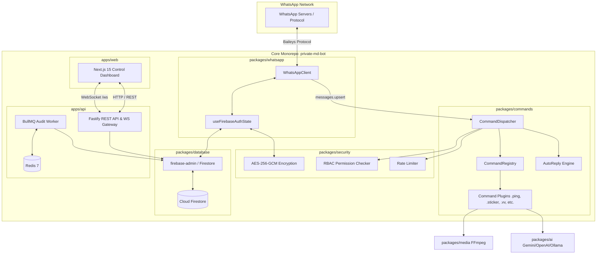
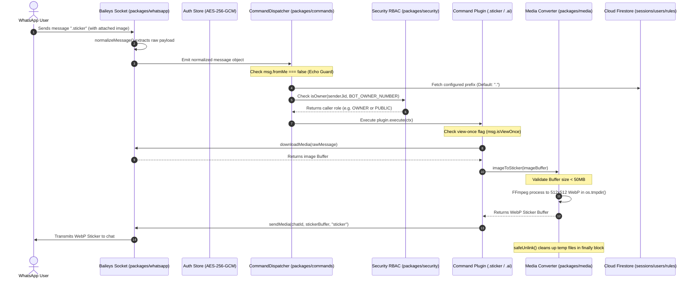

# Brain Architecture Blueprint — Private Self-Hosted WhatsApp Bot

This document serves as the comprehensive technical specification, architecture guide, and file-by-file reference for the **Private Self-Hosted WhatsApp Multi-Device Automation Bot**. It is designed so that any engineer or agent can immediately understand the entire codebase structure, design decisions, data flow, and exact responsibilities of every file.

---

## 1. High-Level Architecture & System Design

The application is structured as a single-user private monorepo powered by **pnpm workspaces** and **Turborepo**. It cleanly isolates WhatsApp protocol logic from API endpoints, database interactions, command execution, and the Next.js control dashboard.



### Core Monorepo Principles
1. **Isolated Protocol Layer (`packages/whatsapp`)**: Baileys protocol code is strictly encapsulated inside `packages/whatsapp`. The rest of the application interacts with WhatsApp only through clean internal interfaces.
2. **Session Security at Rest**: Baileys auth keys and credentials are encrypted using Node.js `crypto` **AES-256-GCM** before being stored in Firestore (`sessions` collection) via the `firebase-admin` SDK. If `SESSION_ENCRYPTION_KEY` is missing or invalid, the app fails securely.
3. **Mandatory Privacy Defaults**: `MESSAGE_LOGGING=false` and `AI_ENABLED=false` are default settings. No message content is written to disk or logs unless explicitly enabled.
4. **View-Once Media Handling**: View-once media is respected by default — `sticker` and `toimg` reject it. A dedicated `.vv` / `.avv` command allows revealing view-once media: it unwraps the inner media message from a quoted view-once message, downloads it, and re-sends it as normal saveable media.
5. **Zero Telemetry**: No third-party analytics, remote tracking, or cloud bot host dependencies.

---

## 2. Comprehensive File-by-File Blueprint

---

### Root Workspace Files

#### 1. [package.json](file:///c:/Users/Subhankar%20Roy/Downloads/wp_bot/package.json)
- **Purpose**: Root package manifest for the monorepo workspace.
- **Key Fields & Responsibilities**:
  - `name`: `"private-md-bot-monorepo"`, `private: true`.
  - `packageManager`: `"pnpm@11.9.0"` (Enforces exact pnpm version for Turborepo 2.x compatibility).
  - `scripts`:
    - `build`: `turbo run build` (Executes build tasks across workspace in dependency order).
    - `dev`: `turbo run dev` (Starts API server and Next.js web app concurrently).
    - `test`: `turbo run test` (Executes Vitest test suites in packages).
    - `type-check`: `turbo run type-check` (Runs `tsc --noEmit` across all packages).
  - `devDependencies`: `turbo` (^2.4.0), `typescript` (^5.7.3), `vitest` (^3.0.5).

#### 2. [pnpm-workspace.yaml](file:///c:/Users/Subhankar%20Roy/Downloads/wp_bot/pnpm-workspace.yaml)
- **Purpose**: Defines workspace package boundaries for pnpm.
- **Content**:
  ```yaml
  packages:
    - "apps/*"
    - "packages/*"
  ```
- **Function**: Directs pnpm to recursively discover packages in `apps/api`, `apps/web`, `packages/whatsapp`, `packages/commands`, `packages/ai`, `packages/database`, `packages/security`, `packages/media`, and `packages/config`.

#### 3. [turbo.json](file:///c:/Users/Subhankar%20Roy/Downloads/wp_bot/turbo.json)
- **Purpose**: Turborepo task pipeline orchestration config.
- **Function**: Uses Turborepo 2.0+ `tasks` syntax:
  - `build`: Specifies `dependsOn: ["^build"]` so dependent packages build first. Caches `.next` and `dist` outputs.
  - `dev`: `cache: false`, `persistent: true`.

#### 4. [.gitignore](file:///c:/Users/Subhankar%20Roy/Downloads/wp_bot/.gitignore)
- **Purpose**: Git tracking exclusion list.
- **Function**: Prevents committing `node_modules`, build artifacts (`.next`, `dist`, `out`, `*.tsbuildinfo`), temporary media processing files (`tmp/`, `temp/`), logs, and secrets (`.env`, `firebase-service-account.json`).

#### 5. [.env.example](file:///c:/Users/Subhankar%20Roy/Downloads/wp_bot/.env.example)
- **Purpose**: Master environment variable schema template.
- **Documented Variables**:
  - `PORT`: API server port (default `4000`).
  - `SESSION_ENCRYPTION_KEY`: 64-character hex string (32 bytes) for AES-256-GCM.
  - `JWT_SECRET`: Secret key for dashboard JWT tokens.
  - `FIREBASE_SERVICE_ACCOUNT_PATH`: Path to the Firebase service account JSON key (downloaded from Firebase console → Project settings → Service accounts → Generate new private key). Read directly by `packages/database`.
  - `FIREBASE_PROJECT_ID`: Project ID (only needed when running against the local emulator without a service account).
  - `NEXT_PUBLIC_FIREBASE_API_KEY`, `NEXT_PUBLIC_FIREBASE_AUTH_DOMAIN`, `NEXT_PUBLIC_FIREBASE_PROJECT_ID`, `NEXT_PUBLIC_FIREBASE_STORAGE_BUCKET`, `NEXT_PUBLIC_FIREBASE_MESSAGING_SENDER_ID`, `NEXT_PUBLIC_FIREBASE_APP_ID`: Firebase **web SDK** config inlined into the dashboard at build time for Google sign-in. MUST be the same project as the service account (Admin SDK verifies the ID token against it).
  - `REDIS_URL`: Redis connection string (`redis://localhost:6379`).
  - Privacy flags: `MESSAGE_LOGGING=false`, `AI_ENABLED=false`, `MEDIA_RETENTION=temporary`.
  - `BOT_OWNER_NUMBER`: Phone number of bot owner (digits only or JID).
  - AI keys: `GEMINI_API_KEY`, `OPENAI_API_KEY`, `OPENAI_BASE_URL`, `OLLAMA_BASE_URL`.

#### 6. [.npmrc](file:///c:/Users/Subhankar%20Roy/Downloads/wp_bot/.npmrc)
- **Purpose**: pnpm CLI & network configuration.
- **Settings**:
  - `block-exotic-subdeps=false`: Allows exotic subdependencies (e.g. Baileys `libsignal` git subdependency).
  - `node-linker=hoisted`: Uses flat node_modules linking for maximum tool compatibility.
  - `fetch-retries=5`, `fetch-timeout=300000`: Extended network retries for tarball downloads.

#### 7. [server.js](file:///c:/Users/Subhankar%20Roy/Downloads/wp_bot/server.js)
- **Purpose**: Single command launcher — `node server.js` runs the whole stack (API + WhatsApp bot + dashboard).
- **Function**: Auto-builds `apps/api` (`pnpm --filter @private-md-bot/api build`) and `apps/web` (`pnpm --filter @private-md-bot/web build`) when `dist` / `.next` are missing, spawns api via `node apps/api/dist/index.js` (port 4000) and web via `node apps/web/node_modules/next/dist/bin/next start -p 3000`, prefixes logs with `[api]`/`[web]`, and tears down both children on SIGINT/SIGTERM or child exit.
- **Prereq**: Firestore reachable — run `pnpm --filter @private-md-bot/api firebase:setup` once after placing the service account.

#### 7. [.pnpmfile.cjs](file:///c:/Users/Subhankar%20Roy/Downloads/wp_bot/.pnpmfile.cjs)
- **Purpose**: Programmatic pnpm package resolution hook script.
- **Function**: Exports `hooks.readPackage(pkg)`. Strips out `@whiskeysockets/eslint-config` from package dependency trees during `pnpm install` resolution.

#### 8. [docker-compose.yml](file:///c:/Users/Subhankar%20Roy/Downloads/wp_bot/docker-compose.yml)
- **Purpose**: Multi-container production deployment orchestration.
- **Services Defined**:
  - `redis`: Redis 7 Alpine container for BullMQ queues & rate limiters with healthcheck (`redis-cli ping`).
  - `api`: Fastify API server container built from `docker/Dockerfile.api`; mounts `./firebase-service-account.json` read-only at `/app/firebase-service-account.json`.
  - `web`: Next.js web dashboard container built from `docker/Dockerfile.web`.
  - `caddy`: Caddy 2 reverse proxy handling TLS and traffic routing.
- **Note**: The database is **Cloud Firestore** (managed by Firebase, no local container). `redis` is used by BullMQ (`apps/api/src/queue.ts`) for audit-log queuing.

---

### Database Package (`packages/database/`)

#### 9. [packages/database/src/index.ts](file:///c:/Users/Subhankar%20Roy/Downloads/wp_bot/packages/database/src/index.ts)
- **Purpose**: Firestore data-access layer via the `firebase-admin` SDK. Exports `db` (a typed object of CRUD helpers), `getDb()`, and types.
- **Collections** (doc id in parentheses):
  - `users` (doc id = `username`): `id`, `username`, `passwordHash`, `totpSecret`, `totpEnabled`, `googleUid`, `role`, `createdAt`, `updatedAt`.
  - `sessions` (doc id = `${sessionKey}_${key}`): `sessionKey`, `encryptedData` [AES-256-GCM Base64], `updatedAt`.
  - `commandConfigs` (doc id = `name`): `name`, `enabled`, `aliases`, `cooldown`, `ownerOnly`, `description`, `category`, `updatedAt`.
  - `autoReplies` (auto doc id): `trigger`, `matchType`, `response`, `enabled`, `priority`, `cooldown`, `createdAt`, `updatedAt`.
  - `settings` (doc id = `key`): `key`, `value`, `description`, `updatedAt`.
  - `auditLogs` (auto doc id): `action`, `actor`, `details`, `ipAddress`, `createdAt`.
- **Notable helpers**: `countUsers`, `createUser`, `findUserByUsername`, `findUserById`, `setUserGoogleUid`, `getSession`/`upsertSession`/`deleteSession`, `getSettings`/`getSetting`/`upsertSetting`, `getCommandConfigs`/`upsertCommandConfig`, `getAutoReplies`/`getEnabledAutoReplies`/`createAutoReply`/`updateAutoReply`/`deleteAutoReply`, `getAuditLogs`/`countAuditLogs`/`createAuditLog`, `ping`.
- **Design notes**: No composite indexes required — ordered data is sorted in memory. Credentials resolved in order: `FIREBASE_SERVICE_ACCOUNT` (inline JSON) → `FIREBASE_SERVICE_ACCOUNT_PATH` / `GOOGLE_APPLICATION_CREDENTIALS` (file) → `FIREBASE_PROJECT_ID` (emulator only). Honors `FIRESTORE_EMULATOR_HOST`.

#### 10. [packages/database/package.json](file:///c:/Users/Subhankar%20Roy/Downloads/wp_bot/packages/database/package.json)
- **Purpose**: Database package manifest exporting `@private-md-bot/database`.
- **Dependencies**: `firebase-admin` (^13.4.0), `@types/node`, `tsup`. The build marks `firebase-admin` as external (`--external firebase-admin`) so it stays a runtime dependency.

#### 11. [packages/database/tsconfig.json](file:///c:/Users/Subhankar%20Roy/Downloads/wp_bot/packages/database/tsconfig.json)
- **Purpose**: TypeScript configuration for database package.
- **Settings**: Target `ES2022`, module resolution `NodeNext`, declaration generation enabled.

#### 12. [packages/database/src/index.ts](file:///c:/Users/Subhankar%20Roy/Downloads/wp_bot/packages/database/src/index.ts)
- **Purpose**: Firestore singleton connection manager.
- **Function**: `getDb()` lazily initializes a single `firebase-admin` app + Firestore client (cached across hot-reloads). Resolves credentials from `FIREBASE_SERVICE_ACCOUNT` (inline JSON), `FIREBASE_SERVICE_ACCOUNT_PATH` / `GOOGLE_APPLICATION_CREDENTIALS` (file path), or `FIREBASE_PROJECT_ID` (emulator). Honors `FIRESTORE_EMULATOR_HOST` for local development. Exports `MatchType` and `Role` types (previously Prisma enums, now plain TS unions).

---

### Configuration Package (`packages/config/`)

#### 13. [packages/config/package.json](file:///c:/Users/Subhankar%20Roy/Downloads/wp_bot/packages/config/package.json)
- **Purpose**: Package manifest for `@private-md-bot/config`.
- **Dependencies**: `dotenv` (^16.4.7), `zod` (^3.24.2).

#### 14. [packages/config/tsconfig.json](file:///c:/Users/Subhankar%20Roy/Downloads/wp_bot/packages/config/tsconfig.json)
- **Purpose**: TypeScript configuration for config package.

#### 15. [packages/config/src/index.ts](file:///c:/Users/Subhankar%20Roy/Downloads/wp_bot/packages/config/src/index.ts)
- **Purpose**: Centralized environment variable parsing and validation.
- **Functions & Logic**:
  - Exports `envSchema` (Zod object validation).
  - Validates `SESSION_ENCRYPTION_KEY` is exactly 64 hex characters.
  - Transforms string boolean flags (`MESSAGE_LOGGING`, `AI_ENABLED`, `ANALYTICS`) to native booleans.
  - `getEnv()`: Lazily evaluates `process.env` against schema and returns frozen `env` object.

---

### Security Package (`packages/security/`)

#### 16. [packages/security/package.json](file:///c:/Users/Subhankar%20Roy/Downloads/wp_bot/packages/security/package.json)
- **Purpose**: Package manifest for `@private-md-bot/security`.

#### 17. [packages/security/tsconfig.json](file:///c:/Users/Subhankar%20Roy/Downloads/wp_bot/packages/security/tsconfig.json)
- **Purpose**: TypeScript compiler settings for security package.

#### 18. [packages/security/src/encryption.ts](file:///c:/Users/Subhankar%20Roy/Downloads/wp_bot/packages/security/src/encryption.ts)
- **Purpose**: AES-256-GCM symmetric encryption & decryption helpers.
- **Functions & Implementation Details**:
  - `getEncryptionKey(customKey?)`: Reads `SESSION_ENCRYPTION_KEY` from environment or argument. Throws hard error if key length is not 64 hex chars (32 bytes).
  - `encryptData(plaintext, customKey?)`: Generates 12-byte random IV via `crypto.randomBytes()`, encrypts plaintext using `aes-256-gcm`, retrieves 16-byte auth tag, concatenates `IV + AuthTag + Ciphertext`, and returns Base64 string.
  - `decryptData(ciphertextBase64, customKey?)`: Decodes Base64 buffer, extracts IV (first 12 bytes), AuthTag (next 16 bytes), and Ciphertext. Verifies authentication tag integrity before returning UTF-8 string.

#### 19. [packages/security/src/permissions.ts](file:///c:/Users/Subhankar%20Roy/Downloads/wp_bot/packages/security/src/permissions.ts)
- **Purpose**: RBAC role hierarchy and owner verification module.
- **Functions**:
  - `normalizePhoneNumber(input)`: Strips non-digit characters (`/\D/g`) to normalize WhatsApp JIDs (`1234567890@s.whatsapp.net` -> `1234567890`).
  - `isOwner(senderJid, configuredOwnerNumber, isFromMe?)`: Checks if normalized sender phone number matches configured owner number. Does not rely on `fromMe` flag alone.
  - `hasPermission(callerRole, requiredRole)`: Evaluates numeric role weights (`PUBLIC`: 1, `ADMIN`: 2, `OWNER`: 3).

#### 20. [packages/security/src/password.ts](file:///c:/Users/Subhankar%20Roy/Downloads/wp_bot/packages/security/src/password.ts)
- **Purpose**: Secure password hashing engine using Node.js native `crypto.scrypt`.
- **Functions**:
  - `hashPassword(password)`: Generates 16-byte random salt, derives 64-byte key via `scrypt`, returns `salt:derivedKeyHex`.
  - `verifyPassword(password, hash)`: Extracts salt, re-derives key, and compares using `crypto.timingSafeEqual()` to prevent timing side-channel attacks.

#### 21. [packages/security/src/sanitizer.ts](file:///c:/Users/Subhankar%20Roy/Downloads/wp_bot/packages/security/src/sanitizer.ts)
- **Purpose**: Injection and path traversal sanitizer.
- **Functions**:
  - `sanitizeShellArg(arg)`: Tests input against metacharacter regex (`/['"`$;|&><\\]/`). Throws error if shell characters are detected.
  - `sanitizeFilePath(filePath, allowedDir?)`: Normalizes path via `path.normalize()`, checks for directory traversal sequences (`..`, `\0`), and verifies path starts with `allowedDir`.

#### 22. [packages/security/src/rate-limiter.ts](file:///c:/Users/Subhankar%20Roy/Downloads/wp_bot/packages/security/src/rate-limiter.ts)
- **Purpose**: In-memory sliding window rate limiter.
- **Class**: `RateLimiter(windowMs, maxRequests)`.
- **Method**: `isRateLimited(key)` maintains timestamp arrays per key, filters out timestamps older than sliding window start, returns `true` if valid timestamp count exceeds `maxRequests`.

#### 23. [packages/security/src/index.ts](file:///c:/Users/Subhankar%20Roy/Downloads/wp_bot/packages/security/src/index.ts)
- **Purpose**: Barrel export file re-exporting encryption, permissions, password, sanitizer, and rate-limiter modules.

---

### WhatsApp Isolated Package (`packages/whatsapp/`)

#### 24. [packages/whatsapp/package.json](file:///c:/Users/Subhankar%20Roy/Downloads/wp_bot/packages/whatsapp/package.json)
- **Purpose**: Package manifest for `@private-md-bot/whatsapp`.
- **Dependencies**: `@whiskeysockets/baileys` (^6.7.16), `pino` (^9.6.0), `ws` (^8.18.0), plus workspace packages `@private-md-bot/config`, `@private-md-bot/database`, `@private-md-bot/security`. `@hapi/boom` is a **devDependency** (used for `DisconnectReason` typing only).

#### 25. [packages/whatsapp/tsconfig.json](file:///c:/Users/Subhankar%20Roy/Downloads/wp_bot/packages/whatsapp/tsconfig.json)
- **Purpose**: TypeScript configuration for WhatsApp package.

#### 26. [packages/whatsapp/src/types.ts](file:///c:/Users/Subhankar%20Roy/Downloads/wp_bot/packages/whatsapp/src/types.ts)
- **Purpose**: Type declarations for WhatsApp adapter.
- **Interfaces**:
  - `ConnectionStatus`: `'DISCONNECTED' | 'CONNECTING' | 'CONNECTED' | 'PAIRING'`.
  - `NormalizedMessage`: Standardized structure containing `id`, `chatId`, `senderJid`, `senderNumber`, `pushName`, `fromMe`, `isGroup`, `body`, `hasMedia`, `mediaType`, `isViewOnce`, `quotedMessage`, `rawMessage`.

#### 27. [packages/whatsapp/src/auth-store.ts](file:///c:/Users/Subhankar%20Roy/Downloads/wp_bot/packages/whatsapp/src/auth-store.ts)
- **Purpose**: Custom encrypted Firestore auth state adapter for Baileys.
- **Function**: `useFirebaseAuthState(sessionKey)`:
  - Intercepts Baileys credential reads (`readData`) and key mutations (`writeData`).
  - Serializes state objects using Baileys `BufferJSON.replacer` and encrypts with `encryptData()`.
  - Upserts encrypted strings into the `sessions` Firestore collection via `db.upsertSession`.
  - Decrypts via `decryptData()` and parses using `BufferJSON.reviver`.

#### 28. [packages/whatsapp/src/client.ts](file:///c:/Users/Subhankar%20Roy/Downloads/wp_bot/packages/whatsapp/src/client.ts)
- **Purpose**: Master WhatsApp client interface encapsulating Baileys lifecycle.
- **Class**: `WhatsAppClient`
- **Methods & Responsibilities**:
  - `connect()`: Loads auth state via `useFirebaseAuthState()`, initializes Baileys socket (`makeWASocket`), binds `creds.update` and `connection.update` handlers.
  - Reconnect Logic: Calculates exponential backoff delay (`1000 * 2^attempts` max 30s) on unexpected socket disconnects.
  - `requestPairingCode(phoneNumber)`: Triggers Baileys pairing code flow for 8-digit phone number pairing.
  - `disconnect()`: Unbinds all listeners and closes active socket (`socket.end()`).
  - `sendMessage(chatId, content)` & `sendMedia(chatId, media, type, options)`: Dispatches text and media messages to target chat.
  - `downloadMedia(msg)`: Downloads media buffer via Baileys `downloadMediaMessage`.
  - `downloadMediaFromContent(content)`: Downloads media directly from a raw message content object — used by `.vv` to download media unwrapped from a quoted view-once message.
  - `getCachedMessage(id)` / `cacheMessage(id, msg)`: In-memory LRU-style cache of recent incoming messages (bounded to 300 entries). Backs the `.vv` command — view-once media is downloaded from the **originally received message** (which keeps full `mediaKey`/`directPath`), because WhatsApp strips those from `contextInfo.quotedMessage`.
  - `normalizeMessage(msg)`: Normalizes Baileys raw messages. Detects view-once wrapper (`viewOnceMessage`, `viewOnceMessageV2`).
  - **Echo-Loop Guard**: Ignores `normalized.fromMe === true` incoming messages.
  - **Logging Guard**: Redacts message text in operational logs when `MESSAGE_LOGGING=false`.

#### 29. [packages/whatsapp/src/index.ts](file:///c:/Users/Subhankar%20Roy/Downloads/wp_bot/packages/whatsapp/src/index.ts)
- **Purpose**: Barrel export re-exporting `WhatsAppClient`, types, and `useFirebaseAuthState`.

---

### Media Processing Package (`packages/media/`)

#### 30. [packages/media/package.json](file:///c:/Users/Subhankar%20Roy/Downloads/wp_bot/packages/media/package.json)
- **Purpose**: Package manifest for `@private-md-bot/media`.

#### 31. [packages/media/tsconfig.json](file:///c:/Users/Subhankar%20Roy/Downloads/wp_bot/packages/media/tsconfig.json)
- **Purpose**: TypeScript configuration for media package.

#### 32. [packages/media/src/converter.ts](file:///c:/Users/Subhankar%20Roy/Downloads/wp_bot/packages/media/src/converter.ts)
- **Purpose**: FFmpeg media conversion engine.
- **Functions & Process Flow**:
  - `validateMediaBuffer(buffer, maxSize)`: Validates non-empty buffer and enforces file size limit (default 50MB).
  - `createTempFile(ext, buffer)`: Writes buffer to random temp file in `os.tmpdir()`.
  - `imageToSticker(imageBuffer)`: Runs FFmpeg via `child_process.execFile` with safe argument array: `scale=512:512:force_original_aspect_ratio=decrease,format=rgba,pad=512:512...` outputting WebP buffer.
  - `videoToSticker(videoBuffer)`: Runs FFmpeg with `fps=15,loop=0` trimming to max 10s animated WebP sticker.
  - `stickerToImage(stickerBuffer)`: Converts WebP sticker to PNG image.
  - `safeUnlink(filePath)`: Guarantees temporary input/output files are deleted inside `finally` blocks.

#### 33. [packages/media/src/index.ts](file:///c:/Users/Subhankar%20Roy/Downloads/wp_bot/packages/media/src/index.ts)
- **Purpose**: Barrel export file for media converter functions.

---

### AI Provider Package (`packages/ai/`)

#### 34. [packages/ai/package.json](file:///c:/Users/Subhankar%20Roy/Downloads/wp_bot/packages/ai/package.json)
- **Purpose**: Package manifest for `@private-md-bot/ai`.
- **Dependencies**: `@google/genai` (^2.16.0), `@private-md-bot/config`.

#### 35. [packages/ai/tsconfig.json](file:///c:/Users/Subhankar%20Roy/Downloads/wp_bot/packages/ai/tsconfig.json)
- **Purpose**: TypeScript compiler settings for AI package.

#### 36. [packages/ai/src/types.ts](file:///c:/Users/Subhankar%20Roy/Downloads/wp_bot/packages/ai/src/types.ts)
- **Purpose**: AI type declarations.
- **Interfaces**: `AIProviderType` (`'gemini' | 'openai' | 'ollama'`), `AIResponse`, `AIProvider`.

#### 37. [packages/ai/src/providers.ts](file:///c:/Users/Subhankar%20Roy/Downloads/wp_bot/packages/ai/src/providers.ts)
- **Purpose**: AI provider adapters and factory.
- **Classes**:
  - `GeminiProvider`: Connects to Google Gemini 2.5 Flash via `@google/genai` SDK.
  - `OpenAIProvider`: Issues HTTP POST to OpenAI-compatible `/chat/completions` endpoint.
  - `OllamaProvider`: Issues HTTP POST to local Ollama `/api/generate` endpoint.
- **Privacy Hard Guard**: Every `generateText` implementation checks `env.AI_ENABLED`. If `false`, throws `Error('AI features are disabled by configuration. No data was transmitted.')` without issuing network requests.

#### 38. [packages/ai/src/index.ts](file:///c:/Users/Subhankar%20Roy/Downloads/wp_bot/packages/ai/src/index.ts)
- **Purpose**: Barrel export for AI types and providers.

---

### Plugin Command Registry Package (`packages/commands/`)

#### 39. [packages/commands/package.json](file:///c:/Users/Subhankar%20Roy/Downloads/wp_bot/packages/commands/package.json)
- **Purpose**: Package manifest for `@private-md-bot/commands`.

#### 40. [packages/commands/tsconfig.json](file:///c:/Users/Subhankar%20Roy/Downloads/wp_bot/packages/commands/tsconfig.json)
- **Purpose**: TypeScript compiler settings for commands package.

#### 41. [packages/commands/src/types.ts](file:///c:/Users/Subhankar%20Roy/Downloads/wp_bot/packages/commands/src/types.ts)
- **Purpose**: Command execution context and plugin interfaces.
- **Interfaces**:
  - `CommandContext`: Includes `client`, `message`, `args`, `prefix`, `callerRole`, `reply()`, `replyMedia()`.
  - `CommandPlugin`: Includes `name`, `aliases`, `description`, `category`, `ownerOnly`, `enabled`, `cooldown`, `execute()`.

#### 42. [packages/commands/src/registry.ts](file:///c:/Users/Subhankar%20Roy/Downloads/wp_bot/packages/commands/src/registry.ts)
- **Purpose**: Plugin registry holding active command plugins.
- **Class**: `CommandRegistry` registers default commands, manages command-to-alias maps, and resolves commands via `getCommand(nameOrAlias)`.

#### 43. [packages/commands/src/auto-reply.ts](file:///c:/Users/Subhankar%20Roy/Downloads/wp_bot/packages/commands/src/auto-reply.ts)
- **Purpose**: Automated rule evaluation engine.
- **Function**: `processAutoReplies(client, msg)`:
  - Ignores bot's own messages (`msg.fromMe`).
  - Fetches enabled rules from Firestore via `db.getEnabledAutoReplies()` sorted by priority descending.
  - Matches rule triggers against message text (`EXACT`, `CONTAINS`, `STARTS_WITH`, `ENDS_WITH`, `REGEX`).
  - Applies sender rate limiting before transmitting rule response.

#### 44. [packages/commands/src/dispatcher.ts](file:///c:/Users/Subhankar%20Roy/Downloads/wp_bot/packages/commands/src/dispatcher.ts)
- **Purpose**: Master message processing pipeline handler.
- **Class**: `CommandDispatcher`
- **Pipeline Execution Steps**:
  1. Ignores outbound bot messages (`msg.fromMe`).
  2. Fetches dynamic command prefix from database settings or default `.`.
  3. Checks if message starts with prefix.
  4. Resolves target plugin from `CommandRegistry`.
  5. Determines caller role (`OWNER` vs `PUBLIC`) via `isOwner()`. Rejects non-owners for `ownerOnly` commands.
  6. Evaluates rate limiter (`RateLimiter`).
  7. Constructs `CommandContext` and executes `plugin.execute(ctx)`.
  8. Falls back to `processAutoReplies()` if prefix is not matched.

#### 45. Command Plugins (`packages/commands/src/plugins/`)
- [ping.ts](file:///c:/Users/Subhankar%20Roy/Downloads/wp_bot/packages/commands/src/plugins/ping.ts): `.ping` command plugin. Calculates message round-trip latency and system uptime.
- [menu.ts](file:///c:/Users/Subhankar%20Roy/Downloads/wp_bot/packages/commands/src/plugins/menu.ts): `.menu` command plugin. Dynamically formats enabled commands by category, filtering out owner-only commands for public users.
- [help.ts](file:///c:/Users/Subhankar%20Roy/Downloads/wp_bot/packages/commands/src/plugins/help.ts): `.help` command plugin. Displays detailed usage, description, aliases, and cooldown for a target command.
- [about.ts](file:///c:/Users/Subhankar%20Roy/Downloads/wp_bot/packages/commands/src/plugins/about.ts): `.about` command plugin. Summarizes bot architecture, encryption status, and privacy parameters.
- [owner.ts](file:///c:/Users/Subhankar%20Roy/Downloads/wp_bot/packages/commands/src/plugins/owner.ts): `.owner` command plugin. Displays owner `wa.me` contact link.
- [settings.ts](file:///c:/Users/Subhankar%20Roy/Downloads/wp_bot/packages/commands/src/plugins/settings.ts): `.settings` command plugin (Owner only). Views and updates key-value database settings.
- [sticker.ts](file:///c:/Users/Subhankar%20Roy/Downloads/wp_bot/packages/commands/src/plugins/sticker.ts): `.sticker` command plugin. Converts attached or quoted image/video into WhatsApp sticker. Rejects view-once media.
- [toimg.ts](file:///c:/Users/Subhankar%20Roy/Downloads/wp_bot/packages/commands/src/plugins/toimg.ts): `.toimg` command plugin. Converts quoted sticker to PNG image.
- [ai.ts](file:///c:/Users/Subhankar%20Roy/Downloads/wp_bot/packages/commands/src/plugins/ai.ts): `.ai` command plugin. Invokes AI assistant if enabled.
- [group.ts](file:///c:/Users/Subhankar%20Roy/Downloads/wp_bot/packages/commands/src/plugins/group.ts): `.group`, `.promote`, `.demote`, `.kick`, `.tagall` (group admin controls).
- [antilink.ts](file:///c:/Users/Subhankar%20Roy/Downloads/wp_bot/packages/commands/src/plugins/antilink.ts): `.antilink` command plugin to enable/disable group chat link suppression.
- [downloader.ts](file:///c:/Users/Subhankar%20Roy/Downloads/wp_bot/packages/commands/src/plugins/downloader.ts): `.ytmp3` and `.ytmp4` (media downloader engines).
- [vv.ts](file:///c:/Users/Subhankar%20Roy/Downloads/wp_bot/packages/commands/src/plugins/vv.ts): `.vv` / `.avv` command. Silently reveals view-once media: resolves the quoted message id via `contextInfo.stanzaId`, looks up the originally received message from the client's recent-message cache (falling back to unwrapping `contextInfo.quotedMessage`), downloads it via `downloadMedia`/`downloadMediaFromContent`, and re-sends it as normal image/video/audio.

#### 46. [packages/commands/src/index.ts](file:///c:/Users/Subhankar%20Roy/Downloads/wp_bot/packages/commands/src/index.ts)
- **Purpose**: Barrel export re-exporting types, registry, dispatcher, and auto-reply modules.

---

### Backend Fastify API Server (`apps/api/`)

#### 47. [apps/api/package.json](file:///c:/Users/Subhankar%20Roy/Downloads/wp_bot/apps/api/package.json)
- **Purpose**: Application manifest for Fastify API backend.
- **Dependencies**: `fastify`, `@fastify/cors`, `@fastify/cookie`, `@fastify/jwt`, `@fastify/rate-limit`, `@fastify/websocket`, `bullmq`, `ioredis`, `pino`, `ws`, `zod`, `firebase-admin`, plus all `@private-md-bot/*` workspace packages.

#### 48. [apps/api/tsconfig.json](file:///c:/Users/Subhankar%20Roy/Downloads/wp_bot/apps/api/tsconfig.json)
- **Purpose**: TypeScript configuration for API application.

#### 49. [apps/api/src/server.ts](file:///c:/Users/Subhankar%20Roy/Downloads/wp_bot/apps/api/src/server.ts)
- **Purpose**: Fastify application factory function (`buildServer()`).
- **Function**: Registers plugins (CORS, global rate-limit, Cookie, JWT, WebSockets), defines `fastify.authenticate` JWT decorator, configures global error handler to prevent secret leakage, instantiates `WhatsAppClient` and `CommandDispatcher`, wires `waClient.onMessage(dispatcher.handleMessage)`, and registers routes. Returns `{ fastify, waClient }`.

#### 50. [apps/api/src/websocket.ts](file:///c:/Users/Subhankar%20Roy/Downloads/wp_bot/apps/api/src/websocket.ts)
- **Purpose**: Real-time authenticated WebSocket gateway.
- **Function**: `registerWebSocketGateway()` handles `/ws` endpoint connections. Authenticates JWT token from query string or cookie, tracks connected clients, and broadcasts `waClient.onStatusChange()` status & QR updates. Requires `@fastify/websocket` v11 handler signature — the handler receives the raw `ws` WebSocket as its first argument (not a `{ socket }` wrapper).

#### 51. [apps/api/src/queue.ts](file:///c:/Users/Subhankar%20Roy/Downloads/wp_bot/apps/api/src/queue.ts)
- **Purpose**: Redis & BullMQ audit log worker.
- **Function**: Instantiates BullMQ `auditQueue` and background `Worker` when Redis is reachable. `logAudit()` enqueues audit events (`action`, `actor`, `details`, `ipAddress`) to be persisted into Firestore via `db.createAuditLog`. **Resilience**: if Redis is offline or enqueue fails, it falls back to writing the audit log directly to Firestore.

#### 52. API Route Handlers (`apps/api/src/routes/`)
- [health.ts](file:///c:/Users/Subhankar%20Roy/Downloads/wp_bot/apps/api/src/routes/health.ts): Registers `/api/health` and `/api/ready` endpoints verifying database query response and WhatsApp status without exposing internal keys.
- [auth.ts](file:///c:/Users/Subhankar%20Roy/Downloads/wp_bot/apps/api/src/routes/auth.ts): Registers `/api/auth/status`, `/api/auth/setup` (initial admin creation), `/api/auth/login` (verifies scrypt password and sets HTTP-only cookie), `/api/auth/google` (verifies Firebase ID token via Admin SDK `getAuth().verifyIdToken`, links by email; first-ever user auto-created as OWNER, existing users must match an existing username/email, otherwise 403), `/api/auth/logout`, and `/api/auth/me`.
- [firebase-bootstrap.js](file:///c:/Users/Subhankar%20Roy/Downloads/wp_bot/apps/api/scripts/firebase-bootstrap.js): Run via `pnpm --filter @private-md-bot/api firebase:setup`. Loads `.env`, resolves the service account (inline JSON, `FIREBASE_SERVICE_ACCOUNT_PATH`, or `GOOGLE_APPLICATION_CREDENTIALS`), connects to Firestore, and eagerly creates the collections (`users`, `sessions`, `settings`, `commandConfigs`, `autoReplies`, `auditLogs`) by writing + deleting a `__bootstrap__` placeholder doc in each. Verifies connectivity before `node server.js`.
- [whatsapp.ts](file:///c:/Users/Subhankar%20Roy/Downloads/wp_bot/apps/api/src/routes/whatsapp.ts): Registers `/api/whatsapp/status`, `/api/whatsapp/connect`, `/api/whatsapp/disconnect`, `/api/whatsapp/pair-code`.
- [commands.ts](file:///c:/Users/Subhankar%20Roy/Downloads/wp_bot/apps/api/src/routes/commands.ts): Registers `/api/commands` (GET all merged commands, PUT update command configuration).
- [autoreply.ts](file:///c:/Users/Subhankar%20Roy/Downloads/wp_bot/apps/api/src/routes/autoreply.ts): Registers `/api/auto-replies` CRUD endpoints (GET list, POST create, PUT update, DELETE remove).
- [settings.ts](file:///c:/Users/Subhankar%20Roy/Downloads/wp_bot/apps/api/src/routes/settings.ts): Registers `/api/settings` (GET view privacy flags & database settings, PUT update setting).
- [logs.ts](file:///c:/Users/Subhankar%20Roy/Downloads/wp_bot/apps/api/src/routes/logs.ts): Registers `/api/logs` to retrieve paginated security audit history.

#### 53. [apps/api/src/index.ts](file:///c:/Users/Subhankar%20Roy/Downloads/wp_bot/apps/api/src/index.ts)
- **Purpose**: API entry point executable script.
- **Function**: Calls `buildServer()`, starts Fastify server listening on configured `PORT` (0.0.0.0), and initiates auto-connection attempt for WhatsApp client.

---

### Frontend Next.js Web Dashboard App (`apps/web/`)

#### 54. [apps/web/package.json](file:///c:/Users/Subhankar%20Roy/Downloads/wp_bot/apps/web/package.json)
- **Purpose**: Application manifest for Next.js control dashboard.
- **Dependencies**: `next` (^15.1.7), `react` (^19.0.0), `react-dom`, `lucide-react`, `qrcode.react`, `clsx`, `tailwind-merge`.

#### 55. Next.js Configurations
- [tsconfig.json](file:///c:/Users/Subhankar%20Roy/Downloads/wp_bot/apps/web/tsconfig.json): Next.js TypeScript config with `@/*` path alias mapping.
- [next.config.js](file:///c:/Users/Subhankar%20Roy/Downloads/wp_bot/apps/web/next.config.js): Configures Next.js compiler and transpiles monorepo packages (`@private-md-bot/config`, `@private-md-bot/security`).
- [tailwind.config.js](file:///c:/Users/Subhankar%20Roy/Downloads/wp_bot/apps/web/tailwind.config.js): Defines custom dark color tokens (`#090d16` background, `#111827` surface).
- [postcss.config.js](file:///c:/Users/Subhankar%20Roy/Downloads/wp_bot/apps/web/postcss.config.js): Configures Tailwind and Autoprefixer PostCSS plugins.

#### 56. Pages & Components (`apps/web/src/app/`)
- [globals.css](file:///c:/Users/Subhankar%20Roy/Downloads/wp_bot/apps/web/src/app/globals.css): Global CSS directives.
- [layout.tsx](file:///c:/Users/Subhankar%20Roy/Downloads/wp_bot/apps/web/src/app/layout.tsx): Root layout adding `dark` class to HTML document.
- [page.tsx](file:///c:/Users/Subhankar%20Roy/Downloads/wp_bot/apps/web/src/app/page.tsx): Root path component redirecting to `/dashboard`.
- [login/page.tsx](file:///c:/Users/Subhankar%20Roy/Downloads/wp_bot/apps/web/src/app/login/page.tsx): Authentication page supporting initial admin account creation, standard password login, and Google sign-in (`signInWithPopup` → ID token → `POST /api/auth/google`).
- [lib/firebase.ts](file:///c:/Users/Subhankar%20Roy/Downloads/wp_bot/apps/web/src/lib/firebase.ts): Client-side Firebase lazy init from `NEXT_PUBLIC_FIREBASE_*` env vars (no top-level `initializeApp`, so SSR/prerender is safe). Exports `signInWithGoogle()` and `googleErrorToMessage()`. `firebase` web SDK is a dependency of `apps/web` only.
- [dashboard/layout.tsx](file:///c:/Users/Subhankar%20Roy/Downloads/wp_bot/apps/web/src/app/dashboard/layout.tsx): Sidebar navigation layout with links to all dashboard sections and sign out handler.
- [dashboard/page.tsx](file:///c:/Users/Subhankar%20Roy/Downloads/wp_bot/apps/web/src/app/dashboard/page.tsx): Overview page displaying connection status, total commands count, auto-reply count, and architecture cards.
- [dashboard/whatsapp/page.tsx](file:///c:/Users/Subhankar%20Roy/Downloads/wp_bot/apps/web/src/app/dashboard/whatsapp/page.tsx): Live QR Code display, 8-digit Pairing Code request form, connect/disconnect triggers.
- [dashboard/commands/page.tsx](file:///c:/Users/Subhankar%20Roy/Downloads/wp_bot/apps/web/src/app/dashboard/commands/page.tsx): Command registry management table with status toggles.
- [dashboard/auto-reply/page.tsx](file:///c:/Users/Subhankar%20Roy/Downloads/wp_bot/apps/web/src/app/dashboard/auto-reply/page.tsx): Auto-reply rule table and rule creation modal.
- [dashboard/ai/page.tsx](file:///c:/Users/Subhankar%20Roy/Downloads/wp_bot/apps/web/src/app/dashboard/ai/page.tsx): AI engine provider status and model selection.
- [dashboard/media/page.tsx](file:///c:/Users/Subhankar%20Roy/Downloads/wp_bot/apps/web/src/app/dashboard/media/page.tsx): FFmpeg conversion specifications and view-once handling policy (`.vv` / `.avv` reveal, `.sticker` / `.toimg` reject).
- [dashboard/logs/page.tsx](file:///c:/Users/Subhankar%20Roy/Downloads/wp_bot/apps/web/src/app/dashboard/logs/page.tsx): Administrative audit logs table showing action history without message content.
- [dashboard/security/page.tsx](file:///c:/Users/Subhankar%20Roy/Downloads/wp_bot/apps/web/src/app/dashboard/security/page.tsx): AES-256-GCM encryption status and RBAC controls overview.
- [dashboard/settings/page.tsx](file:///c:/Users/Subhankar%20Roy/Downloads/wp_bot/apps/web/src/app/dashboard/settings/page.tsx): Command prefix updater and environment privacy flag monitor.

---

### Deployment & Containerization (`docker/`)

#### 57. [docker/Dockerfile.api](file:///c:/Users/Subhankar%20Roy/Downloads/wp_bot/docker/Dockerfile.api)
- **Purpose**: Multi-stage Docker container build script for API service.
- **Stages**:
  - `builder`: Installs pnpm, copies workspace dependencies, compiles API package.
  - `runner`: Installs runtime `ffmpeg` binary, copies built assets, exposes port 4000, runs `node apps/api/dist/index.js`. Firestore is a cloud service — no local database container required.

#### 58. [docker/Dockerfile.web](file:///c:/Users/Subhankar%20Roy/Downloads/wp_bot/docker/Dockerfile.web)
- **Purpose**: Multi-stage Docker container build script for Next.js web dashboard.
- **Stages**:
  - `builder`: Compiles Next.js production build (`next build`).
  - `runner`: Minimal Node.js 22 runtime exposing port 3000.

#### 59. [docker/Caddyfile](file:///c:/Users/Subhankar%20Roy/Downloads/wp_bot/docker/Caddyfile)
- **Purpose**: Caddy reverse proxy server configuration.
- **Rules**:
  - `handle /*`: Proxies web traffic to `web:3000`.
  - `handle /api/*`: Proxies REST traffic to `api:4000`.
  - `handle /ws`: Proxies WebSocket connections to `api:4000`. Handles TLS automatically.

---

### Automated Tests Suite

#### 60. [packages/security/src/__tests__/encryption.test.ts](file:///c:/Users/Subhankar%20Roy/Downloads/wp_bot/packages/security/src/__tests__/encryption.test.ts)
- **Purpose**: Vitest unit tests for AES-256-GCM cipher.
- **Tests**: Validates string encryption/decryption round-trip, verifies hard error on invalid key length, checks error handling on corrupted Base64 ciphertext.

#### 61. [packages/security/src/__tests__/permissions.test.ts](file:///c:/Users/Subhankar%20Roy/Downloads/wp_bot/packages/security/src/__tests__/permissions.test.ts)
- **Purpose**: Vitest unit tests for RBAC and phone number matching.
- **Tests**: Verifies phone number digit normalization, verifies explicit owner matching, checks role weight evaluation (`OWNER` > `ADMIN` > `PUBLIC`).

#### 62. [packages/media/src/__tests__/media.test.ts](file:///c:/Users/Subhankar%20Roy/Downloads/wp_bot/packages/media/src/__tests__/media.test.ts)
- **Purpose**: Vitest unit tests for media validation functions.
- **Tests**: Verifies empty payload buffer rejection and file size limit pre-validation (rejecting buffers over limit).

#### 63. [packages/ai/src/__tests__/ai.test.ts](file:///c:/Users/Subhankar%20Roy/Downloads/wp_bot/packages/ai/src/__tests__/ai.test.ts)
- **Purpose**: Vitest unit test for AI privacy hard guard.
- **Tests**: Confirms that when `AI_ENABLED=false`, calling `generateText()` throws immediately without performing any HTTP fetch requests.

---

## 3. End-to-End Execution & Data Flow Walkthrough



---

## 4. Security & Privacy Guarantees Summary

| Feature / Subsystem | Implementation Mechanism | Security Guarantee |
| :--- | :--- | :--- |
| **Session Encryption at Rest** | Node.js `crypto` AES-256-GCM + IV + AuthTag | Baileys session keys in Firestore are unreadable without 64-char hex key. |
| **Missing Key Guard** | Hard throw in `getEncryptionKey()` | App immediately terminates if encryption key is missing or invalid. |
| **Privacy Default Logging** | `MESSAGE_LOGGING=false` env check | Message bodies are strictly excluded from app logs, Redis, and database. |
| **Privacy Default AI** | `AI_ENABLED=false` hard check | Zero message content transmitted to AI engines unless explicitly toggled on. |
| **View-Once Handling** | Message parser + recent-message cache + `.vv`/`.avv` command (`getCachedMessage` / `downloadMediaFromContent`) | View-once respected by default (`sticker`/`toimg` reject it); `.vv` intentionally reveals a quoted view-once message by looking up the originally received message and re-sending it. |
| **Command Injection Guard** | `execFile` array arguments + regex sanitizer | User input never passed directly to shell interpreters. |
| **Path Traversal Guard** | `path.normalize()` + `..` checks | Prevents file system access outside authorized temporary folders. |
| **Arbitrary Code Guard** | Plugin-based static registry | No dynamic `eval` or arbitrary code execution command allowed. |
