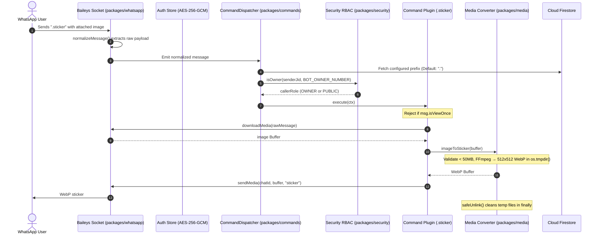
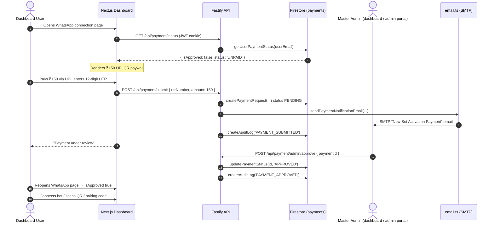
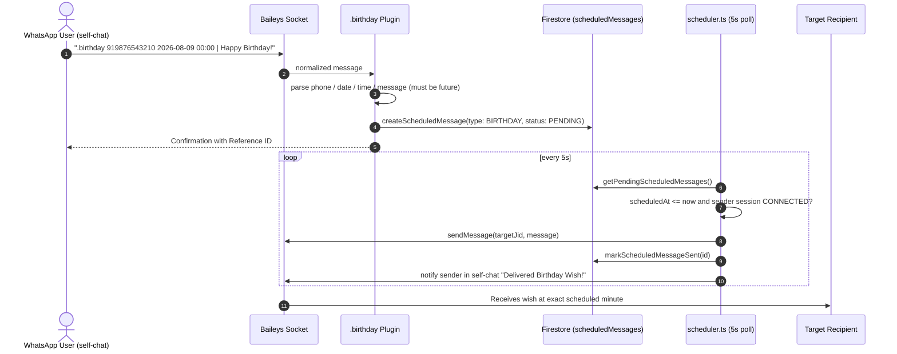

# Brain Architecture Blueprint — Caldera Bot (Private Self-Hosted WhatsApp Bot)

This document serves as the comprehensive technical specification, architecture guide, and file-by-file reference for the **Caldera Bot — Private Self-Hosted WhatsApp Multi-Device Automation Bot** (monorepo name `private-md-bot-monorepo`). It is designed so that any engineer or agent can immediately understand the entire codebase structure, design decisions, data flow, and exact responsibilities of every file.

---

## 1. High-Level Architecture & System Design

The application is a production, multi-user private monorepo powered by **pnpm workspaces** and **Turborepo**. WhatsApp protocol logic (`packages/whatsapp`) is cleanly isolated from API endpoints, database interactions, command execution, monetization, scheduling, and the Next.js control dashboard. Each dashboard user gets their **own per-user `WhatsAppClient` session** (managed by `SessionManager`), gated behind a ₹150 one-time UPI activation payment. It ships three front-end surfaces plus two cloud deployment targets:

| Surface | Technology | Hosted At | Purpose |
| :--- | :--- | :--- | :--- |
| **Landing page** (`landing/`) | Static HTML/CSS/JS | Netlify → `caldera-bot.netlify.app` | Marketing, features, pricing (₹150 lifetime), creator profile. Also served by the API at `/landing/` when the folder is present. |
| **Web dashboard** (`apps/web`) | Next.js 15 App Router | Netlify → `dashboard-caldera-bot.netlify.app` (can also run on Render / localhost:3000) | Authenticated control center: WhatsApp connection, commands, auto-replies, AI, media, logs, security, settings, admin portal. |
| **Standalone admin portal** (`admin/`) | Static HTML/CSS/JS + Firebase compat SDK | Netlify → `admin-caldera-bot.netlify.app` | Master admin approvals for the ₹150 UPI activation monetization flow. Realtime Firestore listener. |
| **API + Bot runtime** (`apps/api`) | Fastify REST + WebSocket | Render → `https://caldera-bot-api.onrender.com` (or localhost:4000) | Backend API, multi-tenant Baileys WhatsApp sessions (`SessionManager`), background scheduler, direct Firestore audit logging, payment verification. |

```mermaid
flowchart TD
    subgraph WhatsApp Network
        WA[WhatsApp Servers / Protocol]
    end

    subgraph Cloud Frontends (Netlify)
        L[landing/ static page]
        A[admin/ static admin portal]
        N[apps/web Next.js 15 Dashboard]
    end

    subgraph Core Monorepo: private-md-bot
        subgraph packages/whatsapp
            WAC[WhatsAppClient] <--> AuthStore[useFirebaseAuthState AES-256-GCM]
        end

        subgraph packages/commands
            Disp[CommandDispatcher] --> Reg[CommandRegistry]
            Disp --> AR[AutoReply Engine]
            Reg --> Plugins[Plugins .ping .sticker .vv .birthday .poll etc.]
        end

        subgraph packages/security
            Enc[AES-256-GCM Encryption]
            Perm[RBAC Permission Checker]
            RL[Rate Limiter]
        end

        subgraph packages/database
            DB[firebase-admin / Firestore] <--> Firestore[(Cloud Firestore)]
        end

        subgraph apps/api
            Fastify[Fastify REST API & WS Gateway]
            SM[SessionManager: per-user WhatsAppClient sessions]
            Sched[Scheduler: Birthday + Scheduled Messages 5s poll]
            Mail[email.ts nodemailer SMTP]
        end

        subgraph apps/web
            Next[Next.js 15 Control Dashboard]
        end
    end

    WA <-->|Baileys Protocol| WAC
    AuthStore <--> Enc
    AuthStore <--> DB
    WAC -->|messages.upsert| Disp
    Disp --> Perm
    Disp --> RL
    Plugins --> MediaPkg[packages/media FFmpeg]
    Plugins --> AIPkg[packages/ai Gemini/OpenAI/Ollama]
    Plugins --> DB
    SM -->|per-user instances| WAC
    Sched --> SM
    Sched --> DB

    Next <-->|HTTP / REST| Fastify
    Next <-->|WebSocket /ws| Fastify
    A -->|Firebase Auth + Firestore direct| Firestore
    A -->|API fallback| Fastify
    L --> N
    L --> A
    Fastify --> DB
    Mail -->|SMTP| AdminEmail
    AdminEmail[contact.subhroy@gmail.com / aarsxlan@gmail.com]
```

### Core Monorepo Principles
1. **Isolated Protocol Layer (`packages/whatsapp`)**: Baileys protocol code is strictly encapsulated inside `packages/whatsapp`. The rest of the application interacts with WhatsApp only through clean internal interfaces.
2. **Session Security at Rest**: Baileys auth keys and credentials are encrypted using Node.js `crypto` **AES-256-GCM** before being stored in Firestore (`sessions` collection) via the `firebase-admin` SDK. If `SESSION_ENCRYPTION_KEY` is missing or invalid, the app fails securely.
3. **Mandatory Privacy Defaults**: `MESSAGE_LOGGING=false` and `AI_ENABLED=false` are default settings. No message content is written to disk or logs unless explicitly enabled.
4. **View-Once Media Handling**: View-once media is respected by default — `sticker` and `toimg` reject it. A dedicated `.vv` / `.avv` command allows revealing view-once media: it looks up the **originally received message** from the client's recent-message cache, downloads it, and re-sends it as normal saveable media. **Auto-view-once reveal** (`handleAutoVv` in `dispatcher.ts`): any incoming view-once message (image/video/audio) from any chat is automatically downloaded and forwarded to the bot owner's private DM — no `.vv` command needed. The caption includes "from {group number}" for group messages.
5. **Monetization Gate**: WhatsApp connection (QR + pairing) is gated behind a **₹1200 one-time UPI activation payment** + admin approval. Payment requests are stored in Firestore (`payments`), verified by an admin (dashboard Admin Portal or the standalone `admin/` portal). **There are NO hard-coded exempt emails** — access is granted only by DB role (`ADMIN`/`OWNER`) or an approved `payments` record, so no email bypasses the gate in code. Admin users (`isAdminUser`) are auto-approved without payment.
6. **Scheduled Delivery Engine**: `.birthday` / `.schedule` (and the dashboard Schedule page → `POST /api/scheduled-messages`) queue messages in Firestore (`scheduledMessages`); a background scheduler in `apps/api` polls every **5 seconds** with **atomic claims** (PENDING→PROCESSING transition prevents double-sends across instances), delivers them at the scheduled minute through the sender's connected session, and writes 12 delivery event types (CREATED/SENT/FAILED/etc.) to the schedule event history.
7. **Zero Telemetry**: No third-party analytics, remote tracking, or cloud bot host dependencies beyond Firebase/Render/Netlify infra.
8. **Deployment Split**: Dashboard + static sites are hosted on Netlify; the API/bot runtime is hosted on Render; `docker-compose.yml` remains available for fully self-hosted deployments.

---

## 2. Comprehensive File-by-File Blueprint

---

### Root Workspace Files

#### 1. [package.json](file:///c:/Users/Subhankar%20Roy/Downloads/wp_bot/package.json)
- **Purpose**: Root package manifest for the monorepo workspace.
- **Key Fields & Responsibilities**:
  - `name`: `"private-md-bot-monorepo"`, `private: true`, `version: "1.0.0"`.
   - `packageManager`: `"pnpm@10.34.5"` (Pinned for monorepo consistency).
  - `engines.node`: `>=20.0.0`.
  - `scripts`:
    - `build`: `turbo run build` (Executes build tasks across workspace in dependency order).
    - `dev`: `turbo run dev` (Starts API server and Next.js web app concurrently).
    - `lint`: `turbo run lint`.
    - `test`: `turbo run test` (Executes Vitest test suites in packages).
    - `type-check`: `turbo run type-check` (Runs `tsc --noEmit` across all packages).
  - `devDependencies`: `turbo` (^2.4.0), `typescript` (^5.7.3), `vitest` (^3.0.5).

#### 2. [pnpm-workspace.yaml](file:///c:/Users/Subhankar%20Roy/Downloads/wp_bot/pnpm-workspace.yaml)
- **Purpose**: Defines workspace package boundaries for pnpm.
- **Content**:
  ```yaml
  packages:
    - "apps/*"
    - "packages/*"
  ```
- **Function**: Directs pnpm to recursively discover packages in `apps/api`, `apps/web`, `packages/whatsapp`, `packages/commands`, `packages/ai`, `packages/database`, `packages/security`, `packages/media`, and `packages/config`.

#### 3. [turbo.json](file:///c:/Users/Subhankar%20Roy/Downloads/wp_bot/turbo.json)
- **Purpose**: Turborepo task pipeline orchestration config.
- **Function**: Uses Turborepo 2.0+ `tasks` syntax:
  - `build`: `dependsOn: ["^build"]` so dependent packages build first. Caches `.next` and `dist` outputs (`.next/cache` excluded).
  - `dev`: `cache: false`, `persistent: true`.
  - `lint`, `test`, `type-check`: defined with empty outputs (no caching).

#### 4. [.gitignore](file:///c:/Users/Subhankar%20Roy/Downloads/wp_bot/.gitignore)
- **Purpose**: Git tracking exclusion list.
- **Function**: Prevents committing `node_modules`, build artifacts (`.next`, `dist`, `out`, `*.tsbuildinfo`), temporary media processing files (`tmp/`, `temp/`), logs, and secrets (`.env`, `firebase-service-account.json`, `openify-studio-firebase-adminsdk-*.json`).

#### 5. [.env.example](file:///c:/Users/Subhankar%20Roy/Downloads/wp_bot/.env.example)
- **Purpose**: Master environment variable schema template.
- **Documented Variables**:
  - `PORT`: API server port (default `4000`). `NODE_ENV` (`development`/`production`/`test`).
  - `API_URL` (default `http://localhost:4000`) and `WEB_URL` (default `http://localhost:3000`): CORS allow-list origins and absolute links used in outbound emails.
  - `SESSION_ENCRYPTION_KEY`: 64-character hex string (32 bytes) for AES-256-GCM.
  - `JWT_SECRET`: Secret key for dashboard JWT tokens.
  - `FIREBASE_SERVICE_ACCOUNT_PATH`: Path to the Firebase service account JSON key. Alternatives: inline `FIREBASE_SERVICE_ACCOUNT` JSON or `GOOGLE_APPLICATION_CREDENTIALS`. Local emulator only: `FIREBASE_PROJECT_ID` + `FIRESTORE_EMULATOR_HOST`.
  - `NEXT_PUBLIC_FIREBASE_API_KEY`, `NEXT_PUBLIC_FIREBASE_AUTH_DOMAIN`, `NEXT_PUBLIC_FIREBASE_PROJECT_ID`, `NEXT_PUBLIC_FIREBASE_STORAGE_BUCKET`, `NEXT_PUBLIC_FIREBASE_MESSAGING_SENDER_ID`, `NEXT_PUBLIC_FIREBASE_APP_ID`: Firebase **web SDK** config inlined into the dashboard at build time for Google sign-in. MUST be the same project as the service account. Next.js reads these from `apps/web/.env.local`.
  - `REDIS_URL`: Redis connection string (`redis://localhost:6379`). **Legacy** — the runtime no longer uses Redis/BullMQ (audit logging writes straight to Firestore), so this is not required.
  - Privacy flags: `MESSAGE_LOGGING=false`, `MESSAGE_CONTENT_RETENTION=90d` (controls body storage for deleted messages; options: `metadata`/`7d`/`30d`/`90d`), `DELETED_MESSAGE_RETENTION=90d` (how long deleted message records are kept), `AI_ENABLED=false`, `MEDIA_RETENTION=temporary`, `ANALYTICS=false`, `THIRD_PARTY_TRACKING=false`.
  - `BOT_OWNER_NUMBER`: Phone number of bot owner (digits only or JID).
  - AI keys: `GEMINI_API_KEY`, `OPENAI_API_KEY`, `OPENAI_BASE_URL`, `OLLAMA_BASE_URL`.
  - (Not documented in the example but read by `email.ts`: `SMTP_HOST`, `SMTP_USER`, `SMTP_PASS`, `SMTP_PORT`, `SMTP_SECURE`.)

#### 6. [.npmrc](file:///c:/Users/Subhankar%20Roy/Downloads/wp_bot/.npmrc)
- **Purpose**: pnpm CLI & network configuration.
- **Settings**:
  - `block-exotic-subdeps=false`: Allows exotic subdependencies (e.g. Baileys `libsignal` git subdependency).
  - `node-linker=hoisted`: Uses flat node_modules linking for maximum tool compatibility.
  - `fetch-retries=5`, `fetch-retry-mintimeout=20000`, `fetch-timeout=300000`: Extended network retries for tarball downloads.

#### 7. [server.js](file:///c:/Users/Subhankar%20Roy/Downloads/wp_bot/server.js)
- **Purpose**: Single command launcher — `node server.js` runs the whole stack (API + WhatsApp bot + dashboard).
- **Function**: Auto-builds `apps/api` (`pnpm --filter @private-md-bot/api build`) and `apps/web` (`pnpm --filter @private-md-bot/web build`) when `dist` / `.next` are missing, spawns api via `node apps/api/dist/index.js` (port 4000) and web via `next start -p 3000`, prefixes logs with `[api]`/`[web]`, and tears down both children on SIGINT/SIGTERM or child exit.
- **Notable behaviors**:
  - Locates the Next.js binary across monorepo/hoisted locations (`apps/web/node_modules/next/dist/bin/next`, root `node_modules/next/dist/bin/next`, root `node_modules/.bin/next`).
  - `API_ONLY=true` skips the web build/start entirely (used for the standalone Render API backend; dashboard is Netlify-hosted).
  - Patches `.next/routes-manifest.json` (ensures `dataRoutes`/`staticRoutes`/`dynamicRoutes` arrays exist) to keep `next start` happy after Netlify-style builds.
- **Prereq**: Firestore reachable — run `pnpm --filter @private-md-bot/api firebase:setup` once after placing the service account.

#### 8. [.pnpmfile.cjs](file:///c:/Users/Subhankar%20Roy/Downloads/wp_bot/.pnpmfile.cjs)
- **Purpose**: Programmatic pnpm package resolution hook script.
- **Function**: Exports `hooks.readPackage(pkg)`. Strips out `@whiskeysockets/eslint-config` from package dependency and devDependency trees during `pnpm install` resolution.

#### 9. [docker-compose.yml](file:///c:/Users/Subhankar%20Roy/Downloads/wp_bot/docker-compose.yml)
- **Purpose**: Multi-container self-hosted production deployment orchestration.
- **Services Defined**:
  - `redis`: Redis 7 Alpine container (legacy — see note below), with healthcheck (`redis-cli ping`).
  - `api`: Fastify API server container built from `docker/Dockerfile.api`; mounts `./firebase-service-account.json` read-only at `/app/firebase-service-account.json`; env-driven keys (`SESSION_ENCRYPTION_KEY`, `JWT_SECRET`, `BOT_OWNER_NUMBER`, privacy flags).
  - `web`: Next.js web dashboard container built from `docker/Dockerfile.web`; `API_URL=http://api:4000`.
  - `caddy`: Caddy 2 reverse proxy handling TLS and traffic routing (ports 80/443).
- **Note**: The database is **Cloud Firestore** (managed by Firebase, no local container). The `redis` service is a leftover from the pre-Firestore BullMQ era — the current runtime (`apps/api/src/queue.ts`) writes audit logs **directly to Firestore** and never connects to Redis, so `redis` can be removed from the compose stack without affecting the app.

#### 10. [netlify.toml](file:///c:/Users/Subhankar%20Roy/Downloads/wp_bot/netlify.toml)
- **Purpose**: Netlify deployment config for the Next.js dashboard.
- **Settings**:
  - `build.command`: `pnpm --filter @private-md-bot/web build`; `publish`: `apps/web/.next`.
   - `build.environment`: `NODE_VERSION=20.18.0`, `PNPM_VERSION=10.34.5`, `NETLIFY_USE_PNPM=true`.
  - `[[redirects]]`: `/api/*` → `https://caldera-bot-api.onrender.com/api/:splat` (status 200, proxies API calls to the Render backend).

#### 11. [render.yaml](file:///c:/Users/Subhankar%20Roy/Downloads/wp_bot/render.yaml)
- **Purpose**: Render Blueprint for cloud API + dashboard hosting.
- **Services**:
  - `private-whatsapp-bot-api` (Node web, region oregon): `pnpm install && pnpm build`, start `pnpm --filter @private-md-bot/api start`; auto-generates `SESSION_ENCRYPTION_KEY` and `JWT_SECRET`; defaults `MESSAGE_LOGGING=false`, `AI_ENABLED=false`, `PORT=4000`, `NODE_VERSION=22.0.0`.
  - `private-whatsapp-bot-web` (Node web, region oregon): `pnpm install && pnpm build`, start `pnpm --filter @private-md-bot/web start`; `PORT=3000`.

---

### Static Marketing Surfaces (`landing/` + `admin/`)

#### 12. [landing/index.html](file:///c:/Users/Subhankar%20Roy/Downloads/wp_bot/landing/index.html)
- **Purpose**: Editorial landing page for the bot (Caldera branding, Steep-style design).
- **Content**: Quiet navbar, hero with floating artifact cards, privacy/security section, "rare accent peach" editorial spotlight, features grid (`.vv`, `.birthday`, `.ai`, `.sticker`/`.toimg`), pricing section (**₹150 one-time lifetime license**, UPI), creator profile card (Subhankar Roy — avatar, bio, portfolio/social links), footer.
- **SEO**: `canonical` to `caldera-bot.netlify.app`, Open Graph + Twitter card meta, `robots: index,follow`, theme color `#fc5000`, links to `manifest.webmanifest`.
- **Constants**: `BOT_PRICE = '150'`, `BOT_CURRENCY = '₹'` inlined in a header script.

#### 13. [landing/style.css](file:///c:/Users/Subhankar%20Roy/Downloads/wp_bot/landing/style.css) & [landing/script.js](file:///c:/Users/Subhankar%20Roy/Downloads/wp_bot/landing/script.js)
- **Purpose**: Landing styling (Inter + Source Serif 4 typography, pill buttons, art-directed sections) and small JS behaviors. `script.js` is lightweight; pricing values come from the inline `BOT_PRICE` constant.
- **Serving**: Hosted on Netlify at `caldera-bot.netlify.app` and optionally by the API at `/landing/` via `@fastify/static` (see `apps/api/src/server.ts`).

#### 14. [admin/index.html](file:///c:/Users/Subhankar%20Roy/Downloads/wp_bot/admin/index.html)
- **Purpose**: Standalone **Master Admin Portal** (hosted at `admin-caldera-bot.netlify.app`, `noindex`).
- **Structure**: Login card (Google sign-in + email/password) → dashboard view with KPI grid (Pending Approvals, Total Revenue ₹150 × approved, Approved Users, Total Submissions) and a payments approval table with filter pills (ALL / PENDING / APPROVED / REJECTED).
- **Auth note**: Uses Firebase compat SDK (`firebase-app-compat`, `firebase-auth-compat`, `firebase-firestore-compat`). Only allowlisted admin emails (`contact.subhroy@gmail.com`, `aarxslan@gmail.com`) may proceed; others are force signed out.

#### 15. [admin/app.js](file:///c:/Users/Subhankar%20Roy/Downloads/wp_bot/admin/app.js)
- **Purpose**: Admin portal logic.
- **Function**:
  - Initializes Firebase (web config for project `openify-studio`).
  - `auth.onAuthStateChanged` enforces the `ALLOWED_ADMIN_EMAILS` allowlist.
  - `subscribeToPayments()` uses a **realtime Firestore `onSnapshot`** listener on the `payments` collection; on failure falls back to `GET https://caldera-bot-api.onrender.com/api/payment/admin/requests`.
  - Approve/reject **write both** the Firestore `payments` doc (merge) **and** the Render API (`POST /api/payment/admin/approve` / `/api/payment/admin/revoke`) — each attempt is try/catch-wrapped independently, so a failure in one still lets the other succeed. Reject/revoke always calls the `/revoke` endpoint, which disconnects the user's WhatsApp session.
  - **Row actions**: `PENDING` → Approve Access / Reject; `APPROVED` → **Revoke Access** (re-calls `rejectPayment`); `REJECTED` → **Re-Approve Access** (re-calls `approvePayment`).
  - Revenue KPI: `approved * 150`.

#### 16. [admin/style.css](file:///c:/Users/Subhankar%20Roy/Downloads/wp_bot/admin/style.css)
- **Purpose**: Admin portal styling (Plus Jakarta Sans + Space Grotesk, dark header, table cards).

---

### Database Package (`packages/database/`)

#### 17. [packages/database/src/index.ts](file:///c:/Users/Subhankar%20Roy/Downloads/wp_bot/packages/database/src/index.ts)
- **Purpose**: Firestore data-access layer via the `firebase-admin` SDK. Exports `db` (a typed object of CRUD helpers), `getDb()`, and types.
- **Collections** (doc id in parentheses):
  - `users` (doc id = `username`): `id`, `username`, `passwordHash`, `totpSecret`, `totpEnabled`, `googleUid`, `role`, `connectedPhone?` (captured on WhatsApp connect, persisted to Firestore for dashboard display), `createdAt`, `updatedAt`.
  - `sessions` (doc id = `${sessionKey}_${key}`): `sessionKey`, `encryptedData` [AES-256-GCM Base64], `updatedAt`.
  - `commandConfigs` (doc id = `name`): `name`, `enabled`, `aliases`, `cooldown`, `ownerOnly`, `description`, `category`, `updatedAt`.
  - `autoReplies` (auto doc id): `userId?`, `trigger`, `matchType` (`EXACT`/`CONTAINS`/`STARTS_WITH`/`ENDS_WITH`/`REGEX`/`ANY`), `specificNumber?`, `response`, `enabled`, `priority`, `cooldown`, `createdAt`, `updatedAt`.
  - `settings` (doc id = `key`): `key`, `value`, `description`, `updatedAt`.
  - `auditLogs` (auto doc id): `action`, `actor`, `details`, `ipAddress`, `createdAt`.
  - `payments` (auto doc id): `userId`, `userEmail`, `utrNumber`, `amount`, `status` (`PENDING`/`APPROVED`/`REJECTED`), `createdAt`, `updatedAt`.
  - `scheduledMessages` (auto doc id): `userId?`, `targetNumber`, `targetJid`, `message`, `scheduledAt`, `senderJid`, `type` (`BIRTHDAY`/`SCHEDULED`), `status` (`PENDING`/`PROCESSING`/`SENT`/`FAILED`), `createdAt`. **Atomic claims**: status transitions `PENDING→PROCESSING→SENT` prevent double-sends across instances.
  - `scheduleEvents` (auto doc id): `scheduleId`, `event` (12 types: `CREATED`/`UPDATED`/`DELETED`/`CANCELLED`/`PAUSED`/`RESUMED`/`DUPLICATED`/`RETRIED`/`DELIVERY_ATTEMPT`/`SENT`/`FAILED`/`REQUEUED`), `details?`, `createdAt`.
  - `deletedMessages` (auto doc id): `userId`, `chatId`, `senderJid`, `senderNumber`, `senderResolved`, `fromMe`, `messageType`, `body?`, `hasMedia`, `mediaType?`, `originalMessageId`, `originalTimestamp?`, `deletedAt`, `contentAvailable`, `retainedUntil`. **Auto-persisted** when a REVOKE event is detected; content retained per `MESSAGE_CONTENT_RETENTION` setting (default `90d`).
  - `messageHistory` (auto doc id): `messageId`, `chatId`, `senderJid`, `senderNumber`, `fromMe`, `isGroup`, `messageType`, `body?`, `hasMedia`, `mediaType?`, `isViewOnce`, `timestamp`. **Bounded buffer** flushed every 10s in batches of 50; enabled via `MESSAGE_HISTORY_ENABLED`.
- **Notable helpers**:
  - Users: `countUsers`, `getAllUsers`, `createUser`, `findUserByUsername`, `findUserById`, `setUserGoogleUid`, `setUserConnectedPhone(userId, phone)`. `findUserByUsername`/`findUserById` fall back to a `where('email'|'id', ...)` lookup so email-identified Google users resolve.
  - Sessions: `getSession`/`upsertSession`/`deleteSession`/`hasSavedSession(sessionKey)` (checks if any docs with the given prefix exist — used at startup to skip auto-connecting users without saved credentials).
  - Settings/commands/auto-replies/audit logs: unchanged set of CRUD helpers. `getAuditLogs` uses `orderBy('createdAt','desc').offset().limit()`. **Auto-replies are per-user scoped**: `getAutoReplies(userId?, isOwnerOrAdmin?)` / `createAutoReply` (stores `userId`) / `updateAutoReply(id, data, userId?, isAdmin?)` / `deleteAutoReply(id, userId?, isAdmin?)` — non-admin callers only see/edit/delete their own rules (`userId` match), admins see all; `getEnabledAutoReplies(userId?)` feeds the runtime auto-reply engine per session.
  - Payments: `createPaymentRequest`, `getPaymentRequests` (newest first), `getUserPaymentStatus(userIdOrEmail)` — queries `payments` by **`userId` OR `userEmail`**, returns `{ isApproved, status, request? }`. **No hard-coded exempt list** (the inline `EXEMPT_EMAILS` grant was removed): `isApproved` is `true` only when the user's payment record `status === 'APPROVED'`; no record → `{ isApproved: false, status: 'UNPAID' }`. `updatePaymentStatus(id, 'APPROVED'|'REJECTED')`.
  - Scheduled: `createScheduledMessage` (stores `userId`), `getPendingScheduledMessages` (`status == 'PENDING'`), `claimScheduledMessage(id)` (atomic `PENDING→PROCESSING` transition), `transitionScheduledMessage(id, from, to)` (generic atomic status transition), `requeueStaleProcessing(staleMs)` (resets stuck `PROCESSING` records back to `PENDING`), `getScheduledMessages(userId?, isOwnerOrAdmin?)` (per-user filtered for non-admins), `deleteScheduledMessage(id, userId?, isAdmin?)` (ownership-checked), `markScheduledMessageSent`.
  - Deleted Messages: `createDeletedMessage(record)`, `listDeletedMessages(options)` (paginated, filtered by userId/chatId/search), `deleteDeletedMessage(id, userId?, isOwnerOrAdmin?)`, `deleteExpiredDeletedMessages()` (purges records past `retainedUntil`).
  - Message History: `appendMessageHistory(userId, entries)` (batch insert), `getMessageHistory(userId, options)` (paginated), `pruneMessageHistory(olderThan, keepCount)`.
  - Health: `ping()`.
- **Resilience**: every helper runs through `withRetry()`, which detects Firestore connection-closed errors (a `CLOSED_ERROR_PATTERNS` substring list: `closing`, `closed`, `hidden`, `unavailable`, `deadline_exceeded`, `not_found`, `goaway`, `rst_stream`, `channel shutdown`, `service unavailable`, `connection reset`, `socket hang up`, `econnreset`) and transparently `resetDb()`s before retrying once. `resetDb()` nulls the cached instance **and calls `deleteApp(getApp())`** so the Firebase Admin app is fully torn down before re-init.
- **Design notes**: No composite indexes required for core reads. Credential resolution order in `getDb()`: `FIREBASE_SERVICE_ACCOUNT` (inline JSON) → files found at `FIREBASE_SERVICE_ACCOUNT_PATH` / `GOOGLE_APPLICATION_CREDENTIALS` → bundled candidates `openify-studio-firebase-adminsdk-fbsvc-8938483736.json` (repo-root) and `firebase-service-account.json` (searched relative to cwd, repo root, and `__dirname` `../../../`) → `FIREBASE_PROJECT_ID` (emulator only). Honors `FIRESTORE_EMULATOR_HOST`.

#### 18. [packages/database/package.json](file:///c:/Users/Subhankar%20Roy/Downloads/wp_bot/packages/database/package.json)
- **Purpose**: Database package manifest exporting `@private-md-bot/database`.
- **Dependencies**: `firebase-admin` (^13.4.0), `@types/node`, `tsup`. The build marks `firebase-admin` as external so it stays a runtime dependency.

#### 19. [packages/database/tsconfig.json](file:///c:/Users/Subhankar%20Roy/Downloads/wp_bot/packages/database/tsconfig.json)
- **Purpose**: TypeScript configuration for database package.
- **Settings**: Target `ES2022`, module resolution `NodeNext`, declaration generation enabled.

---

### Configuration Package (`packages/config/`)

#### 20. [packages/config/package.json](file:///c:/Users/Subhankar%20Roy/Downloads/wp_bot/packages/config/package.json)
- **Purpose**: Package manifest for `@private-md-bot/config`.
- **Dependencies**: `dotenv` (^16.4.7), `zod` (^3.24.2).

#### 21. [packages/config/tsconfig.json](file:///c:/Users/Subhankar%20Roy/Downloads/wp_bot/packages/config/tsconfig.json)
- **Purpose**: TypeScript configuration for config package.

#### 22. [packages/config/src/index.ts](file:///c:/Users/Subhankar%20Roy/Downloads/wp_bot/packages/config/src/index.ts)
- **Purpose**: Centralized environment variable parsing and validation.
- **Functions & Logic**:
  - Loads `.env` via dotenv from multiple candidate paths (cwd, `../../.env`, `__dirname`-relative `../../../`, `../../../../`) for Turborepo package resolution.
  - Exports `envSchema` (Zod object validation).
  - Validates `SESSION_ENCRYPTION_KEY` is exactly 64 hex characters (has a dev default), `JWT_SECRET` min 16 chars.
  - Parses `PORT`/`NODE_ENV`, `API_URL`, `WEB_URL` (URL-validated).
  - Transforms string boolean flags (`MESSAGE_LOGGING`, `AI_ENABLED`, `ANALYTICS`, `THIRD_PARTY_TRACKING`) to native booleans.
  - `MESSAGE_CONTENT_RETENTION`: enum `metadata`/`7d`/`30d`/`90d`, default `metadata`. Controls whether deleted-message body text is persisted (`metadata` strips all content).
  - `DELETED_MESSAGE_RETENTION`: enum `24h`/`7d`/`30d`/`90d`/`forever`, default `7d`. Controls how long deleted-message records are kept before auto-purge.
  - `MESSAGE_HISTORY_ENABLED`: string boolean, default `false`. Enables message-history buffering to Firestore.
  - `getEnv()`: Lazily evaluates `process.env` against schema and returns frozen `env` object; throws in production on validation failure. Also exports `env` (evaluated once at import).

---

### Security Package (`packages/security/`)

#### 23. [packages/security/package.json](file:///c:/Users/Subhankar%20Roy/Downloads/wp_bot/packages/security/package.json)
- **Purpose**: Package manifest for `@private-md-bot/security`.

#### 24. [packages/security/tsconfig.json](file:///c:/Users/Subhankar%20Roy/Downloads/wp_bot/packages/security/tsconfig.json)
- **Purpose**: TypeScript compiler settings for security package.

#### 25. [packages/security/src/encryption.ts](file:///c:/Users/Subhankar%20Roy/Downloads/wp_bot/packages/security/src/encryption.ts)
- **Purpose**: AES-256-GCM symmetric encryption & decryption helpers.
- **Functions & Implementation Details**:
  - `getEncryptionKey(customKey?)`: Reads `SESSION_ENCRYPTION_KEY` from environment or argument. Throws hard error if key length is not 64 hex chars (32 bytes).
  - `encryptData(plaintext, customKey?)`: Generates 12-byte random IV via `crypto.randomBytes()`, encrypts plaintext using `aes-256-gcm`, retrieves 16-byte auth tag, concatenates `IV + AuthTag + Ciphertext`, and returns Base64 string.
  - `decryptData(ciphertextBase64, customKey?)`: Decodes Base64 buffer, extracts IV (first 12 bytes), AuthTag (next 16 bytes), and Ciphertext. Verifies authentication tag integrity before returning UTF-8 string.

#### 26. [packages/security/src/permissions.ts](file:///c:/Users/Subhankar%20Roy/Downloads/wp_bot/packages/security/src/permissions.ts)
- **Purpose**: RBAC role hierarchy and owner verification module.
- **Functions**:
  - `normalizePhoneNumber(input)`: Strips non-digit characters (`/\D/g`) to normalize WhatsApp JIDs (`1234567890@s.whatsapp.net` -> `1234567890`).
  - `isOwner(senderJid, configuredOwnerNumber, isFromMe?)`: Checks if normalized sender phone number matches configured owner number. Does not rely on `fromMe` flag alone.
  - `hasPermission(callerRole, requiredRole)`: Evaluates numeric role weights (`PUBLIC`: 1, `ADMIN`: 2, `OWNER`: 3).

#### 27. [packages/security/src/password.ts](file:///c:/Users/Subhankar%20Roy/Downloads/wp_bot/packages/security/src/password.ts)
- **Purpose**: Secure password hashing engine using Node.js native `crypto.scrypt`.
- **Functions**:
  - `hashPassword(password)`: Generates 16-byte random salt, derives 64-byte key via `scrypt`, returns `salt:derivedKeyHex`.
  - `verifyPassword(password, hash)`: Extracts salt, re-derives key, and compares using `crypto.timingSafeEqual()` to prevent timing side-channel attacks.

#### 28. [packages/security/src/sanitizer.ts](file:///c:/Users/Subhankar%20Roy/Downloads/wp_bot/packages/security/src/sanitizer.ts)
- **Purpose**: Injection and path traversal sanitizer.
- **Functions**:
  - `sanitizeShellArg(arg)`: Tests input against metacharacter regex (`/['"`$;|&><\\]/`). Throws error if shell characters are detected.
  - `sanitizeFilePath(filePath, allowedDir?)`: Normalizes path via `path.normalize()`, checks for directory traversal sequences (`..`, `\0`), and verifies path starts with `allowedDir`.

#### 29. [packages/security/src/rate-limiter.ts](file:///c:/Users/Subhankar%20Roy/Downloads/wp_bot/packages/security/src/rate-limiter.ts)
- **Purpose**: In-memory sliding window rate limiter.
- **Class**: `RateLimiter(windowMs, maxRequests)`.
- **Method**: `isRateLimited(key)` maintains timestamp arrays per key, filters out timestamps older than sliding window start, returns `true` if valid timestamp count exceeds `maxRequests`.
- **Memory hygiene**: constructor spawns a `setInterval` (every 5 min, `.unref()`'d so it never blocks exit) that evicts expired entries; `destroy()` clears the interval and map.

#### 30. [packages/security/src/index.ts](file:///c:/Users/Subhankar%20Roy/Downloads/wp_bot/packages/security/src/index.ts)
- **Purpose**: Barrel export file re-exporting encryption, permissions, password, sanitizer, rate-limiter, **admin**, and **regex** modules.

#### 30a. [packages/security/src/admin.ts](file:///c:/Users/Subhankar%20Roy/Downloads/wp_bot/packages/security/src/admin.ts)
- **Purpose**: Server-side admin authorization gate (`isAdminUser`).
- **Security contract**: missing/invalid user → `false`; DB role `ADMIN`/`OWNER` → admin (authoritative path); otherwise an explicit `ADMIN_EMAILS` env allowlist (comma-separated) may grant admin. **No hardcoded email backdoors** — `contact.subhroy@gmail.com`, `aarxslan@gmail.com`, `admin`, `admin@openify.studio` alone grant nothing unless they hold the role or appear in `ADMIN_EMAILS`. Empty allowlist → role-based only. Used by logs/payment/settings/autoreply routes. Regressed by `__tests__/admin.test.ts`.

#### 30b. [packages/security/src/regex.ts](file:///c:/Users/Subhankar%20Roy/Downloads/wp_bot/packages/security/src/regex.ts)
- **Purpose**: ReDoS guard `isSafeRegex(pattern)` — conservative allowlist-style static checks (pattern ≤100 chars, no backrefs/lookarounds/nested quantifiers/alternation+quantifier/big repeat bounds/`(.*)`) returning `false` for anything not proven safe. Powers the auto-reply `REGEX` trigger guard. Regressed by `__tests__/regex.test.ts`.

---

### WhatsApp Isolated Package (`packages/whatsapp/`)

#### 31. [packages/whatsapp/package.json](file:///c:/Users/Subhankar%20Roy/Downloads/wp_bot/packages/whatsapp/package.json)
- **Purpose**: Package manifest for `@private-md-bot/whatsapp`.
- **Dependencies**: `@whiskeysockets/baileys` (^6.7.16), `pino` (^9.6.0), `ws` (^8.18.0), plus workspace packages `@private-md-bot/config`, `@private-md-bot/database`, `@private-md-bot/security`. `@hapi/boom` is a **devDependency** (used for `DisconnectReason` typing only).

#### 32. [packages/whatsapp/tsconfig.json](file:///c:/Users/Subhankar%20Roy/Downloads/wp_bot/packages/whatsapp/tsconfig.json)
- **Purpose**: TypeScript configuration for WhatsApp package.

#### 33. [packages/whatsapp/src/types.ts](file:///c:/Users/Subhankar%20Roy/Downloads/wp_bot/packages/whatsapp/src/types.ts)
- **Purpose**: Type declarations for WhatsApp adapter.
- **Interfaces**:
  - `ConnectionStatus`: `'DISCONNECTED' | 'CONNECTING' | 'CONNECTED' | 'PAIRING'`.
  - `NormalizedMessage`: `id`, `chatId`, `senderJid`, `senderNumber`, `senderResolved` (true when sender is a verified phone identity; false for unresolved LID), `pushName?`, `fromMe`, `isGroup`, `body`, `hasMedia`, `mediaType?` (`'image'|'video'|'audio'|'document'|'sticker'`), `isViewOnce`, `quotedMessage?` (optional; see note below), `rawMessage`.
  - `MessageHandler` / `StatusHandler` callback types.
  - **Note**: `quotedMessage` is declared on `NormalizedMessage` but **never populated** by `normalizeMessage()`. Plugins that need the quoted message (`.toaudio`, `.togif`) do **not** depend on it — they read `ctx.message.rawMessage?...?.contextInfo?.quotedMessage` directly and download via `ctx.downloadQuotedMedia()`.

#### 34. [packages/whatsapp/src/auth-store.ts](file:///c:/Users/Subhankar%20Roy/Downloads/wp_bot/packages/whatsapp/src/auth-store.ts)
- **Purpose**: Custom encrypted Firestore auth state adapter for Baileys.
- **Functions**:
  - `useFirebaseAuthState(sessionKey = 'default_session')`:
    - Intercepts Baileys credential reads (`readData`) and key mutations (`writeData`).
    - Serializes state objects using Baileys `BufferJSON.replacer` and encrypts with `encryptData()`.
    - Upserts encrypted strings into the `sessions` Firestore collection via `db.upsertSession` (doc id `${sessionKey}_${key}`).
    - Decrypts via `decryptData()` and parses using `BufferJSON.reviver`.
-   `clearFirebaseAuthState(sessionKey = 'default_session')`: Batch-deletes session docs **only when `doc.id.startsWith(`${sessionKey}_`)`** (exact prefix match — never a substring/`includes` test). This prevents cross-tenant session wipes when one session key is a suffix of another (e.g. `user_917000000000` inside `user_1917000000000`). Used on logout / logged-out disconnect; `WhatsAppClient.disconnect()` passes `this.sessionKey` (e.g. `user_${userId}`), so per-user session docs are fully wiped on disconnect (previously it cleared `default_session_*`). Regressed by `packages/whatsapp/src/__tests__/auth-store.test.ts`.

#### 35. [packages/whatsapp/src/client.ts](file:///c:/Users/Subhankar%20Roy/Downloads/wp_bot/packages/whatsapp/src/client.ts)
- **Purpose**: Master WhatsApp client interface encapsulating Baileys lifecycle.
- **Class**: `WhatsAppClient`
- **Actual method surface** (verified against source — the doc previously listed methods that do NOT exist, e.g. `sendPoll`, `sendImageAsSticker`, `sendVideoAsGif`, `downloadQuotedMedia`, `getCachedQuotedMessage`, `reconnect`):
  - `getStatus()` / `getQRCode()`: current `ConnectionStatus` and cached QR string.
  - `getConnectedPhone()`: returns the phone number of the currently connected WhatsApp account (digits-only, captured from Baileys `connection.update` JID).
  - `onMessage(handler)` / `onDeletedMessage(handler)` / `onHistoryMessage(handler)` / `onStatusChange(handler)`: subscribe handlers (returns unsubscribe).
  - `connect()`: loads auth state via `useFirebaseAuthState(this.sessionKey)`, initializes Baileys socket (`makeWASocket` with `syncFullHistory: false`, `generateHighQualityLinkPreview: true`), binds `creds.update` (`saveCreds`) and `connection.update` handlers, and registers LID-mapping listeners (`contacts.upsert`, `contacts.update`, `chats.phoneNumberShare`).
  - Reconnect Logic: Exponential backoff (`1000 * 2^attempts`, max 30s) on unexpected disconnects. `DisconnectReason.loggedOut` clears the Firestore auth store and reconnects after 500ms.
  - `requestPairingCode(phoneNumber)`: triggers Baileys pairing code flow (auto-connects first if no socket).
  - `disconnect()`: sets explicit-disconnect flag, unbinds listeners, closes socket, clears Firestore auth state for `this.sessionKey` (per-user docs, not `default_session_*`).
  - `sendMessage(chatId, content)` & `sendMedia(chatId, media, type, options)`: dispatch text and media (`image`/`video`/`audio`/`sticker`) messages; both throw when not `CONNECTED`.
  - `downloadMedia(msg)` / `downloadMediaFromContent(content)`: download via Baileys `downloadMediaMessage` — the content-based variant powers `.vv` unwrapping of quoted view-once media.
  - `getCachedMessage(id)` / `cacheMessage(id, msg)`: in-memory recent-message cache (bounded by `MAX_CACHED_MESSAGES = 300`) backing `.vv`.
  - `registerLidMapping(lid, pnJid)` / `getPnForLid(lid)` / `getLidForPn(pn)`: **LID→phone-number mapping** for WhatsApp privacy LIDs. Digits-only keys are kept in `lidToPnMap` / `pnToLidMap`; mappings are learned from `contacts.upsert` / `contacts.update` / `chats.phoneNumberShare` events.
  - `normalizeMessage(msg)` / `unwrapMessageContent(msg)`: (private) `unwrapMessageContent` recursively unwraps `ephemeralMessage` / `viewOnceMessage` (V1, V2, V2Extension) / `documentWithCaptionMessage` / `deviceSentMessage` / `editedMessage` wrappers before extracting body/media; `normalizeMessage` builds `NormalizedMessage` and **resolves `@lid` sender JIDs** to `@s.whatsapp.net` phone JIDs — via `getPnForLid`, else falling back to `remoteJid`/`participant` when those are already phone JIDs.
  - **Message dedup**: `processedMsgIds` Set (capped at 1000) prevents double-processing on multi-device sync.
  - **History skip**: only `type === 'append'` messages older than 300 seconds (5 min) are dropped; live `notify` messages are always processed.
  - **Logging Guard**: Pino logger redacts `message.body`, `creds`, `keys`, `qr`, `pairingCode`; log lines omit body when `MESSAGE_LOGGING=false`.
  - **Deleted Message Detection**: `messages.update` listener checks for `StubType.REVOKE` (handles both direct and nested update shapes across Baileys versions). On detection, builds a `DeletedMessageEvent` from the local cache (`buildDeletedMessageEvent`) and fires all registered `deletedMessageHandlers`.
  - **Sender PN Cache Bridge**: Short-lived (120s TTL) ID-keyed cache bridging raw CB:message `sender_pn` attribute to normalized messages. WhatsApp exposes `sender_pn` only on the raw protocol node — it never reaches the decoded message or event payload, so this bridge is required for accurate sender identity.
  - **Message History Events**: Emits `HistoryMessageEvent` for every incoming message (after normalization), enabling bounded history buffering in `SessionManager`.
- **Note**: `quotedMessage` is declared on `NormalizedMessage` but never populated (see types.ts note). `.toaudio`/`.togif` bypass it via the raw `contextInfo` path + `downloadQuotedMedia()`.

#### 36. [packages/whatsapp/src/index.ts](file:///c:/Users/Subhankar%20Roy/Downloads/wp_bot/packages/whatsapp/src/index.ts)
- **Purpose**: Barrel export re-exporting `WhatsAppClient`, types, and auth-store helpers.

---

### Media Processing Package (`packages/media/`)

#### 37. [packages/media/package.json](file:///c:/Users/Subhankar%20Roy/Downloads/wp_bot/packages/media/package.json)
- **Purpose**: Package manifest for `@private-md-bot/media`.

#### 38. [packages/media/tsconfig.json](file:///c:/Users/Subhankar%20Roy/Downloads/wp_bot/packages/media/tsconfig.json)
- **Purpose**: TypeScript configuration for media package.

#### 39. [packages/media/src/converter.ts](file:///c:/Users/Subhankar%20Roy/Downloads/wp_bot/packages/media/src/converter.ts)
- **Purpose**: FFmpeg media conversion engine.
- **Functions & Process Flow**:
  - `runFfmpeg(args, timeoutMs = 60_000)`: `execFileAsync('ffmpeg', args, { timeout, killSignal: 'SIGKILL', maxBuffer: 10MB })` — **CPU/time DoS guard**: any ffmpeg run longer than 60s is killed with SIGKILL and re-thrown as `Media conversion timed out`.
  - `readOutputSized(filePath, maxBytes = 25MB)`: reads converted output and **throws if it exceeds the 25MB cap** — **disk DoS guard** against decompression-bomb/oversized outputs.
  - `validateMediaBuffer(buffer, maxSize)`: Validates non-empty buffer and enforces file size limit (default 50MB).
  - `createTempFile(ext, buffer)` / `safeUnlink(filePath)`: Write/clean random temp files in `os.tmpdir()` inside `finally` blocks.
  - `imageToSticker(imageBuffer)`: FFmpeg `scale=512:512:force_original_aspect_ratio=decrease,format=rgba,pad=512:512...` → WebP.
  - `videoToSticker(videoBuffer)`: FFmpeg with `-t 10` (max 10s), `fps=15`, `-loop 0` → animated WebP sticker.
  - `stickerToImage(stickerBuffer)`: WebP → PNG.
  - `extractAudioFromVideo(videoBuffer, maxSize?)`: FFmpeg `-vn -acodec aac -ab 128k -ar 44100` → AAC/MP4 audio buffer (powers `.toaudio`).

#### 40. [packages/media/src/index.ts](file:///c:/Users/Subhankar%20Roy/Downloads/wp_bot/packages/media/src/index.ts)
- **Purpose**: Barrel export file for media converter functions (`export * from './converter'`).

---

### AI Provider Package (`packages/ai/`)

#### 41. [packages/ai/package.json](file:///c:/Users/Subhankar%20Roy/Downloads/wp_bot/packages/ai/package.json)
- **Purpose**: Package manifest for `@private-md-bot/ai`.
- **Dependencies**: `@google/genai` (^2.16.0), `@private-md-bot/config`.

#### 42. [packages/ai/tsconfig.json](file:///c:/Users/Subhankar%20Roy/Downloads/wp_bot/packages/ai/tsconfig.json)
- **Purpose**: TypeScript compiler settings for AI package.

#### 43. [packages/ai/src/types.ts](file:///c:/Users/Subhankar%20Roy/Downloads/wp_bot/packages/ai/src/types.ts)
- **Purpose**: AI type declarations.
- **Interfaces**: `AIProviderType` (`'gemini' | 'openai' | 'ollama'`), `AIResponse`, `AIProvider`.

#### 44. [packages/ai/src/providers.ts](file:///c:/Users/Subhankar%20Roy/Downloads/wp_bot/packages/ai/src/providers.ts)
- **Purpose**: AI provider adapters and factory.
- **Classes**:
  - `GeminiProvider`: Connects to Google Gemini 2.5 Flash via `@google/genai` SDK.
  - `OpenAIProvider`: Issues HTTP POST to OpenAI-compatible `/chat/completions` endpoint.
  - `OllamaProvider`: Issues HTTP POST to local Ollama `/api/generate` endpoint.
- **Privacy Hard Guard**: Every `generateText` implementation checks `env.AI_ENABLED`. If `false`, throws `Error('AI features are disabled by configuration. No data was transmitted.')` without issuing network requests.

#### 45. [packages/ai/src/index.ts](file:///c:/Users/Subhankar%20Roy/Downloads/wp_bot/packages/ai/src/index.ts)
- **Purpose**: Barrel export for AI types and providers.

---

### Plugin Command Registry Package (`packages/commands/`)

#### 46. [packages/commands/package.json](file:///c:/Users/Subhankar%20Roy/Downloads/wp_bot/packages/commands/package.json)
- **Purpose**: Package manifest for `@private-md-bot/commands`.

#### 47. [packages/commands/tsconfig.json](file:///c:/Users/Subhankar%20Roy/Downloads/wp_bot/packages/commands/tsconfig.json)
- **Purpose**: TypeScript compiler settings for commands package.

#### 48. [packages/commands/src/types.ts](file:///c:/Users/Subhankar%20Roy/Downloads/wp_bot/packages/commands/src/types.ts)
- **Purpose**: Command execution context and plugin interfaces.
- **Interfaces**:
  - `GroupParticipant`: `id`, `admin` (`'admin'|'superadmin'|null`). `GroupMetadata`: `id`, `subject`, `creation?`, `participants[]`.
  - `CommandContext`: `client`, `message`, `msg?`, `args`, `prefix`, `callerRole`, `reply()`, `replyMedia()` — plus the newly added media/group helpers: `replyWithVideo(media, mimetype, gifPlayback?, caption?)`, `replyWithAudio(media, mimetype)`, `downloadQuotedMedia()` (cached-message first, then synthetic Baileys message), `getGroupMetadata()`.
  - `CommandPlugin`: `name`, `aliases`, `description`, `category` (**`'general'|'utility'|'media'|'ai'|'admin'|'group'|'fun'`** — `'group'`/`'fun'` added), `ownerOnly`, `enabled`, `cooldown`, `execute()` (required), `handler?` (optional fallback).

#### 49. [packages/commands/src/registry.ts](file:///c:/Users/Subhankar%20Roy/Downloads/wp_bot/packages/commands/src/registry.ts)
- **Purpose**: Plugin registry holding active command plugins.
- **Class**: `CommandRegistry` registers default commands, manages command-to-alias maps, and resolves commands via `getCommand(nameOrAlias)` (checks primary name then alias map). Exposes `getAllCommands()` for the dynamic `.menu`. **⚠️ There is NO `getCommandByAlias` method**, yet `POST /api/commands/execute` calls it — see Known Issues.
- **Registered defaults** (51 plugins): `ping`, `menu`, `help`, `about`, `owner`, `settings`, `system`, `eval`, `restart`, `sticker`, `toimg`, `toaudio`, `togif`, `vv`, `ai`, `summarize`, `imagine`, `group`, `promote`, `demote`, `kick`, `tagall`, `hidetag`, `groupinfo`, `link`, `antilink`, `admins`, `translate`, `weather`, `dict`, `shorten`, `qrcode`, `calc`, `poll`, `birthday`, `id`, `time`, `currency`, `remind`, `ytmp3`, `ytmp4`, `roll`, `flip`, `quote`, `joke`, `trivia`, `fact`, `8ball`, `emoji`, `roast`.

#### 50. [packages/commands/src/auto-reply.ts](file:///c:/Users/Subhankar%20Roy/Downloads/wp_bot/packages/commands/src/auto-reply.ts)
- **Purpose**: Automated rule evaluation engine.
- **Function**: `processAutoReplies(client, msg)` → returns `boolean` (whether a response was sent):
  - Ignores bot's own messages (`msg.fromMe`).
  - Fetches enabled rules from Firestore via `db.getEnabledAutoReplies()` sorted by priority descending.
-   **Per-rule phone filter**: if `rule.specificNumber` is set, the rule only fires when it matches `msg.senderNumber`, `msg.senderJid`, or `msg.chatId`. Matching uses `isPhoneMatch(target, candidate)` (digit-normalized via `extractCleanPhone`, tolerating `@s.whatsapp.net` / `@lid` / `@g.us` suffixes and `:device` IDs): **exact match always fires; two full-length numbers (both ≥ 11 digits, i.e. with country codes) must match exactly — suffix matching is allowed only when at least one side is a short/partial or local-format number.** This prevents a rule targeting `917000000000` from firing for sender `1917000000000` (a different number that merely ends with the target's digits). Regressed by the `specificNumber phone matching` suite in `packages/commands/src/__tests__/autoreply.test.ts`.
  - Matches rule triggers against message text — `ANY` or trigger `*` matches everything; otherwise `EXACT`, `CONTAINS`, `STARTS_WITH`, `ENDS_WITH`, `REGEX` (case-insensitive).
  - **ReDoS guard on `REGEX`**: triggers longer than 200 chars are skipped, and a `redosPatterns` list (`(.*)+`, `(.+)*`, `(X+)+`, `(X*)*`, `(X|Y)*`) rejects catastrophic-backtracking patterns before compiling.
  - Applies a per-rule per-sender `RateLimiter(5000, 1)` before transmitting `rule.response`.

#### 51. [packages/commands/src/dispatcher.ts](file:///c:/Users/Subhankar%20Roy/Downloads/wp_bot/packages/commands/src/dispatcher.ts)
- **Purpose**: Master message processing pipeline handler.
- **Class**: `CommandDispatcher`
- **Pipeline Execution Steps**:
  1. Fetches dynamic command prefix from database settings or default `.`.
  2. Checks if message starts with prefix; parses command name + args.
  3. Resolves target plugin from `CommandRegistry` (skips unknown/disabled).
  4. Determines caller role (`OWNER` if `msg.fromMe` or `isOwner(senderJid, BOT_OWNER_NUMBER)` else `PUBLIC`). **New: for group messages it also detects WhatsApp group admins** — fetches `socket.groupMetadata(msg.chatId)` and promotes the sender to `ADMIN` when their clean JID has `admin`/`superadmin`. Rejects non-owners for `ownerOnly` commands.
  5. Evaluates cooldown via `RateLimiter(5000, 3)` (bypassed for owner self-commands).
  6. Constructs `CommandContext` inline — `reply`/`replyMedia` bound to client sends, plus `replyWithVideo` (raw socket `video` + `gifPlayback`), `replyWithAudio` (raw socket `audio`), `downloadQuotedMedia` (cached original message first, else a synthetic Baileys message built from `contextInfo`), and `getGroupMetadata` (raw socket call) — and executes the plugin via `plugin.execute || plugin.handler` (errors are caught, logged, and surfaced to the chat).
  7. Ignores non-command `fromMe` messages (prevents auto-replying to own chat texts).
  8. Falls back to `processAutoReplies()` for unmatched incoming messages.

#### 52. Command Plugins (`packages/commands/src/plugins/`)
- [ping.ts](file:///c:/Users/Subhankar%20Roy/Downloads/wp_bot/packages/commands/src/plugins/ping.ts): `.ping` — round-trip latency and system uptime.
- [menu.ts](file:///c:/Users/Subhankar%20Roy/Downloads/wp_bot/packages/commands/src/plugins/menu.ts): `.menu` / `.m` / `.commands` / `.helpmenu` / `.list` — **dynamic** command menu built from `registry.getAllCommands()` at call time: groups **enabled** commands by `category` (uppercased, per-category icons for ADMIN/GROUP/AI/UTILITY/FUN/MEDIA/GENERAL/DOWNLOADER), prepends a stats banner (prefix, total plugin count, "Connected & Operational"), appends a `.ping`/`.system` tip. Uses `execute: async ({ client, msg, message = msg }: any)`. Advertises "50+ available bot commands".
- [help.ts](file:///c:/Users/Subhankar%20Roy/Downloads/wp_bot/packages/commands/src/plugins/help.ts): `.help` — usage, description, aliases, cooldown for a target command.
- [about.ts](file:///c:/Users/Subhankar%20Roy/Downloads/wp_bot/packages/commands/src/plugins/about.ts): `.about` — bot architecture, encryption status, privacy parameters.
- [owner.ts](file:///c:/Users/Subhankar%20Roy/Downloads/wp_bot/packages/commands/src/plugins/owner.ts): `.owner` — owner `wa.me` contact link.
- [settings.ts](file:///c:/Users/Subhankar%20Roy/Downloads/wp_bot/packages/commands/src/plugins/settings.ts): `.settings` (Owner only) — view/update key-value database settings. **Sensitive keys** (`key`/`secret`/`token`/`password`/`uid`/`credential` substring match) display as `***`.
- [sticker.ts](file:///c:/Users/Subhankar%20Roy/Downloads/wp_bot/packages/commands/src/plugins/sticker.ts): `.sticker` — image/video → WhatsApp sticker. Rejects view-once media.
- [toimg.ts](file:///c:/Users/Subhankar%20Roy/Downloads/wp_bot/packages/commands/src/plugins/toimg.ts): `.toimg` — quoted sticker → PNG image.
- [ai.ts](file:///c:/Users/Subhankar%20Roy/Downloads/wp_bot/packages/commands/src/plugins/ai.ts): `.ai` — invokes AI assistant if enabled. **Prompt capped at 2000 chars** (longer prompts rejected before any network call).
- [group.ts](file:///c:/Users/Subhankar%20Roy/Downloads/wp_bot/packages/commands/src/plugins/group.ts): `.group` / `.promote` / `.demote` / `.kick` / `.tagall` / `.hidetag` / `.groupinfo` / `.link` — **now real group management** via raw Baileys socket calls. All gate on `callerRole` (`OWNER` or `ADMIN`). `.group <open|close>` → `socket.groupSettingUpdate` (`not_announcement`/`announcement`); `.promote`/`.demote`/`.kick` → `socket.groupParticipantsUpdate` against the **first mentioned/ quoted JID** (`getMentionedJid` helper reads `contextInfo.mentionedJid[0]` then `participant`); `.tagall`/`.hidetag` → `socket.groupMetadata` → real participant mention list; `.groupinfo` → live subject/member/admin/creation stats; `.link` → real `socket.groupInviteCode` → `https://chat.whatsapp.com/<code>`.
- [antilink.ts](file:///c:/Users/Subhankar%20Roy/Downloads/wp_bot/packages/commands/src/plugins/antilink.ts): `.antilink` — toggle group link suppression.
- [downloader.ts](file:///c:/Users/Subhankar%20Roy/Downloads/wp_bot/packages/commands/src/plugins/downloader.ts): `.ytmp3` / `.ytmp4` media downloader engines.
- [vv.ts](file:///c:/Users/Subhankar%20Roy/Downloads/wp_bot/packages/commands/src/plugins/vv.ts): `.vv` / `.avv` — reveals view-once media from the client's recent-message cache (falling back to unwrapping `contextInfo.quotedMessage`), downloads via `downloadMedia`/`downloadMediaFromContent`, re-sends as normal media.
- [birthday.ts](file:///c:/Users/Subhankar%20Roy/Downloads/wp_bot/packages/commands/src/plugins/birthday.ts): `.birthday` / `.wish` / `.schedule` / `.schedulemsg` — schedules a birthday wish or automated message. Syntax: `<phone> <YYYY-MM-DD HH:mm> | <message>`. Validates number/datetime (must be future), creates a `scheduledMessages` record with `type` derived from the command token (`BIRTHDAY` when the command body contains "birthday", else `SCHEDULED`), confirms with a reference ID. The target person never sees the command text.
- [id.ts](file:///c:/Users/Subhankar%20Roy/Downloads/wp_bot/packages/commands/src/plugins/id.ts): `.id` / `.jid` / `.chatid` — prints chat JID, sender JID/number, and chat type.
- [calc.ts](file:///c:/Users/Subhankar%20Roy/Downloads/wp_bot/packages/commands/src/plugins/calc.ts): `.calc` / `.math` / `.calculate` / `=` — **safe arithmetic via a custom recursive-descent parser** (`SafeMathParser`: add/sub → mul/div/mod → unary → atoms, `^`→`**`), replacing the old `new Function` approach. Zero code-injection surface; result rounded to 10 decimals.
- [poll.ts](file:///c:/Users/Subhankar%20Roy/Downloads/wp_bot/packages/commands/src/plugins/poll.ts): `.poll` / `.createpoll` — **now functional**: creates a real interactive poll via `socket.sendMessage(chatId, { poll: { name, values, selectableCount: 1 } })` (max 12 options), with a numbered-text fallback when the socket is unreachable. **Input caps**: question ≤ 100 chars, each option ≤ 50 chars (over-length rejected).
- [toaudio.ts](file:///c:/Users/Subhankar%20Roy/Downloads/wp_bot/packages/commands/src/plugins/toaudio.ts): `.toaudio` / `.tomp3` / `.mp3` — converts quoted video/voice to AAC via `extractAudioFromVideo` + `ctx.downloadQuotedMedia()` + `ctx.replyWithAudio()`. **⚠️ Blocked at runtime**: reads `ctx.message.quoted`, which `normalizeMessage()` never populates → always hits the "reply to a media" usage branch (type error at `toaudio.ts:13`).
- [togif.ts](file:///c:/Users/Subhankar%20Roy/Downloads/wp_bot/packages/commands/src/plugins/togif.ts): `.togif` / `.gif` — converts quoted video/animated sticker to GIF playback via `ctx.downloadQuotedMedia()` + `ctx.replyWithVideo(media, 'video/mp4', true)` (raw socket `gifPlayback`). **⚠️ Blocked at runtime**: reads `ctx.message.quoted`, which is never populated (type error at `togif.ts:12`).
- [admins.ts](file:///c:/Users/Subhankar%20Roy/Downloads/wp_bot/packages/commands/src/plugins/admins.ts): `.admins` / `.adminlist` / `.groupadmins` — lists group administrators via `ctx.getGroupMetadata()`; now compiles (`category: 'group'` valid, helper exists).
- [utility.ts](file:///c:/Users/Subhankar%20Roy/Downloads/wp_bot/packages/commands/src/plugins/utility.ts): `.translate`/`.tr`/`.trans` (Google translate free endpoint), `.weather`/`.w`/`.climate` (wttr.in), `.dict`/`.dictionary`/`.meaning`/`.define` (dictionaryapi.dev), `.shorten`/`.short`/`.shorturl` (tinyurl API), `.qrcode`/`.qr` — **now fetches the QR PNG from api.qrserver.com and sends it as an image** via `replyMedia` (max 300 chars, 10s timeout).
- [fun.ts](file:///c:/Users/Subhankar%20Roy/Downloads/wp_bot/packages/commands/src/plugins/fun.ts): `.roll`/`.dice` (custom `dN` dice), `.flip`/`.coin`/`.coinflip`, `.quote`/`.motivate`, `.joke`/`.pun`, `.trivia`/`.quiz`, `.fact`/`.funfact`, `.8ball`/`.eightball`. Now compiles (`category: 'fun'` added to the union).
- [system.ts](file:///c:/Users/Subhankar%20Roy/Downloads/wp_bot/packages/commands/src/plugins/system.ts): `.system`/`.sys`/`.sysinfo`/`.server` (**Owner-only** — exposes PID/CPU/memory), `.eval`/`.e`/`.js` (**Owner-only**, **hardened sandbox**): runs inside `vm.createContext({})` with an **empty sandbox** — passing host builtins (`Array`/`Object`/`Date`/…) into the sandbox leaks the **host `Function` constructor** (`Array.constructor('return process')()` reaches the real process = RCE), so the context uses only its own realm-bound builtins; `codeGeneration: { strings: false, wasm: false }` forbids `eval`/`Function`-from-string; 3s sync `timeout` caps CPU; a host-side 5s `Promise.race` prevents a never-resolving sandbox promise from hanging the bot thread; console shim injected first via `runInContext`; output truncated to 2000 chars. **Note: `vm` is not a hard security boundary — the command stays OWNER-ONLY.** Regressed by `packages/commands/src/__tests__/eval-sandbox.test.ts`. `.restart`/`.reboot` (**Owner-only**, calls `client.reconnect()`). **⚠️ `client.reconnect()` still does not exist on `WhatsAppClient`** — `.restart` throws at runtime.
- [extras.ts](file:///c:/Users/Subhankar%20Roy/Downloads/wp_bot/packages/commands/src/plugins/extras.ts): **7 new commands (43 → 51)**:
  - `.time`/`.clock`/`.timezone`/`.tz` — world clock via worldtimeapi.org (city→IANA map, Intl fallback).
  - `.currency`/`.convert`/`.forex`/`.fx` — live FX via open.er-api.com (`<amount> <FROM> <TO>`).
  - `.remind`/`.reminder`/`.remindme` — in-process `setTimeout` reminder (`30s`/`5m`/`2h`, max 6h, min 5s).
  - `.emoji`/`.emojify`/`.letteremoji` — text → regional-indicator emoji art (max 30 chars).
  - `.roast`/`.burn`/`.rekt` — random friendly roast (12 canned lines).
  - `.summarize`/`.tldr`/`.sum`/`.brief` — AI TLDR via Gemini (inline or quoted text, 50–8000 chars, requires `AI_ENABLED`).
  - `.imagine`/`.image`/`.generate`/`.img`/`.draw` — AI image gen via **pollinations.ai** (free, `flux` model, no key) sent as media.

#### 53. [packages/commands/src/index.ts](file:///c:/Users/Subhankar%20Roy/Downloads/wp_bot/packages/commands/src/index.ts)
- **Purpose**: Barrel export re-exporting types, registry, dispatcher, and auto-reply modules.

---

### Backend Fastify API Server (`apps/api/`)

#### 54. [apps/api/package.json](file:///c:/Users/Subhankar%20Roy/Downloads/wp_bot/apps/api/package.json)
- **Purpose**: Application manifest for Fastify API backend.
- **Dependencies**: `fastify`, `@fastify/cors`, `@fastify/cookie`, `@fastify/jwt`, `@fastify/rate-limit`, `@fastify/websocket`, `@fastify/static`, `bullmq`, `ioredis`, `pino`, `ws`, `zod`, `firebase-admin`, `nodemailer`, plus all `@private-md-bot/*` workspace packages. Also a `firebase:setup` script running `scripts/firebase-bootstrap.js`.

#### 55. [apps/api/tsconfig.json](file:///c:/Users/Subhankar%20Roy/Downloads/wp_bot/apps/api/tsconfig.json)
- **Purpose**: TypeScript configuration for API application.

#### 56. [apps/api/src/server.ts](file:///c:/Users/Subhankar%20Roy/Downloads/wp_bot/apps/api/src/server.ts)
- **Purpose**: Fastify application factory function (`buildServer()`).
- **Function**:
  - Logger with redaction of `authorization` / `cookie` headers.
  - Registers CORS (`origin: [env.WEB_URL, 'http://localhost:3000']`, credentials), global rate-limit (**`max: 100` per minute** with a custom 429 JSON), Cookie, JWT (secret from env, cookie name `token`, unsigned), WebSocket.
  - Registers `@fastify/static` to serve the `landing/` directory at prefix `/landing/` when present (searched at cwd, `../../landing`, and `__dirname`-relative paths).
  - Defines `fastify.authenticate` JWT decorator and a global error handler that never leaks stack traces/secrets.
  - Instantiates `SessionManager`, starts `startMessageScheduler(sessionManager)` (birthday + scheduled message delivery).
  - Registers all routes: health, auth, whatsapp, commands, autoreply, settings, logs, payment, **scheduled-messages**, and the WebSocket gateway.
  - Returns **`{ fastify, sessionManager }`** (not a single `waClient`).

#### 56b. [apps/api/src/session-manager.ts](file:///c:/Users/Subhankar%20Roy/Downloads/wp_bot/apps/api/src/session-manager.ts)
- **Purpose**: Multi-tenant WhatsApp session lifecycle manager — one `WhatsAppClient` per dashboard user, replacing the old single `waClient` design.
- **Class**: `SessionManager`
- **Internals**: `Map<string, WhatsAppClient>` keyed by `userId`; a client is created with session key `user_${userId}` and gets its own `CommandDispatcher` wired via `client.onMessage(...)`.
- **Methods**:
  - `getOrCreate(userId)`: lazily builds a client + dispatcher pair.
  - `get(userId)` / `remove(userId)`: map lookups.
  - `connect(userId)` / `disconnect(userId)`: connect / disconnect-and-remove a session (`disconnect` deletes it from the map).
  - `getStatus(userId)`: `{ status, qrCode }` (returns `DISCONNECTED`/`null` for unknown users).
  - `isConnected(userId)` / `getConnectedCount()`: connected-state checks.
  - `getClientForMessage(senderJid)`: resolves the sender's phone from the JID, then **digits-normalized exact session-key match only** (loop comparing `userId.replace(/\D/g,'') === senderPhone` over `CONNECTED` clients). The old substring/`includes` routing (email/username containment) was **removed** — it could route a message to the wrong session when one phone number contains another (e.g. `917000000000` inside `1917000000000`). **Returns `undefined` instead of an arbitrary connected client** when nothing matches (fail-closed, prevents wrong-user sends).
  - `connectAllApproved()`: iterates `db.getAllUsers()`; a user connects only when `user.role` is `OWNER`/`ADMIN` **or** `getUserPaymentStatus()` returns `isApproved: true`. **No exempt-email list** (the old `EXEMPT_EMAILS` bypass was removed). Called from `index.ts` on startup.

#### 57. [apps/api/src/websocket.ts](file:///c:/Users/Subhankar%20Roy/Downloads/wp_bot/apps/api/src/websocket.ts)
- **Purpose**: Real-time authenticated WebSocket gateway.
- **Function**: `registerWebSocketGateway(fastify, sessionManager)` handles `/ws` connections. Authenticates JWT from the `token` query param or `token` cookie, groups sockets per `userId`, and broadcasts the **per-user** session's `STATUS_UPDATE` events (`client.onStatusChange`) with status + QR. Sends the current status immediately on connect, closes with code 4001 when unauthenticated.

#### 58. [apps/api/src/queue.ts](file:///c:/Users/Subhankar%20Roy/Downloads/wp_bot/apps/api/src/queue.ts)
- **Purpose**: Audit log helper — **no Redis/BullMQ anymore**.
- **Function**: Exports `logAudit(action, actor, details?, ipAddress?)`, which writes the audit entry directly to Firestore via `db.createAuditLog(...)` with a try/catch fallback (errors are logged, never thrown). `bullmq` / `ioredis` remain in `apps/api/package.json` but are **unused by runtime code**.

#### 59. [apps/api/src/scheduler.ts](file:///c:/Users/Subhankar%20Roy/Downloads/wp_bot/apps/api/src/scheduler.ts)
- **Purpose**: Background message & birthday delivery engine.
- **Function**: `startMessageScheduler(sessionManager)` polls every **5 seconds**:
  - Fetches `PENDING` `scheduledMessages` from Firestore; for each record whose `scheduledAt <= now`, resolves the sender's session (`sessionManager.get(senderEmail)` falling back to `getClientForMessage`), skips when no connected session.
  - Sends `message` to `targetJid` via `client.sendMessage`, marks the record `SENT`.
  - Sends a delivery receipt to `item.senderJid` in the sender's self-chat **only when `senderJid` includes `@s.whatsapp.net`** ("Delivered Birthday Wish!" / "Delivered Scheduled Message!" with recipient + message).

#### 60. [apps/api/src/services/email.ts](file:///c:/Users/Subhankar%20Roy/Downloads/wp_bot/apps/api/src/services/email.ts)
- **Purpose**: Payment submission email notification.
- **Function**: `sendPaymentNotificationEmail({ userEmail, utrNumber, amount, paymentId })`:
  - **Recipients come from the `ADMIN_EMAILS` env allowlist** (comma-separated; no hard-coded list baked into source). Logs a console banner with the payment details to those admins.
  - **HTML-escapes every user-supplied value** (`escapeHtml` on `userEmail`, `utrNumber`, `paymentId`, `env.WEB_URL`) — the UTR reference is user-supplied and could otherwise inject markup/phishing content into the admin email. Subject line left unescaped (subject is not HTML).
  - If `SMTP_HOST`/`SMTP_USER`/`SMTP_PASS` are set, sends an HTML email via **nodemailer** titled `💳 New Bot Activation Payment (₹X) from <user>` with a link to `<WEB_URL>/dashboard/security` for approval.

#### 61. API Route Handlers (`apps/api/src/routes/`)
- [health.ts](file:///c:/Users/Subhankar%20Roy/Downloads/wp_bot/apps/api/src/routes/health.ts): `/health` and `/api/health` (status + uptime), `/api/ready` — pings Firestore (`db.ping()`), returns `{ ready, services: { database, activeSessions } }` where `activeSessions` comes from `sessionManager.getConnectedCount()`; returns 503 when the DB is down.
- [auth.ts](file:///c:/Users/Subhankar%20Roy/Downloads/wp_bot/apps/api/src/routes/auth.ts): `/api/auth/status`, `/api/auth/setup` (initial admin, role OWNER), `/api/auth/login` (scrypt + HTTP-only cookie), `/api/auth/google` (calls `getDb()` first to guarantee the Firebase Admin SDK app is initialized, then `getAuth().verifyIdToken`; links by email; first user auto-created as OWNER, new Google users auto-created as USER (self-registration via Google sign-in; bot access gated by payment status)), `/api/auth/logout`, `/api/auth/me`. All sessions issue a JWT with `expiresIn: '7d'` and set a `token` cookie with `maxAge: COOKIE_MAX_AGE` (7 days, `httpOnly`, `secure` in production, `sameSite: 'lax'`) — **shortened from 30d to 7d for security**.
- [whatsapp.ts](file:///c:/Users/Subhankar%20Roy/Downloads/wp_bot/apps/api/src/routes/whatsapp.ts): `/api/whatsapp/status` (status + QR), `/api/whatsapp/connect`, `/api/whatsapp/disconnect`, `/api/whatsapp/pair-code`. All delegate to the per-user session: `sessionManager.getStatus/connect/disconnect(userId)` and `sessionManager.getOrCreate(userId).requestPairingCode(...)`. All audit-logged.
- [commands.ts](file:///c:/Users/Subhankar%20Roy/Downloads/wp_bot/apps/api/src/routes/commands.ts): `/api/commands` (GET merges registry defaults with `commandConfigs` overrides for aliases/ownerOnly/enabled/cooldown; PUT `/api/commands/:name` updates config + `COMMAND_CONFIG_UPDATE` audit, admin-only). **`POST /api/commands/execute`** — "Test & Execute" from the dashboard: parses `.cmd args`, resolves the plugin via `registry.getCommand(...)` (the broken `getCommandByAlias` fallback was removed), runs it against a **mock client** (captures `sendMessage` text into an `output` string) with `senderJid` derived from the auth user, returns the captured output, writes a `COMMAND_TEST_EXECUTE` audit log.
- [logs.ts](file:///c:/Users/Subhankar%20Roy/Downloads/wp_bot/apps/api/src/routes/logs.ts): `/api/logs` paginated audit history. **Admin gate is `isAdminUser(user)` (DB role/`ADMIN_EMAILS` only)** — the old `EXEMPT_EMAILS` const was removed; non-admins get a hard 403.
- [autoreply.ts](file:///c:/Users/Subhankar%20Roy/Downloads/wp_bot/apps/api/src/routes/autoreply.ts): `/api/auto-replies` CRUD — **per-user scoped** (rules tagged with the caller's `userId`; non-admins only see/edit/delete their own, admins manage all). **zod input bounds**: `trigger` ≤ 100 chars, `specificNumber` ≤ 15 chars and digits-only (after stripping non-digits), `response` 1–2000 chars, `priority` int 0–1000 (default 1), `cooldown` int 0–3600s (default 5).
- [settings.ts](file:///c:/Users/Subhankar%20Roy/Downloads/wp_bot/apps/api/src/routes/settings.ts): `/api/settings` (GET privacy flags & settings; **API keys and `BOT_OWNER_NUMBER` are masked (`***`) for non-admin users**; PUT update, admin-only). **PUT is restricted to an `ALLOWED_SETTING_KEYS` allowlist** (10 keys: `BOT_OWNER_NUMBER`, `prefix`, `COMMAND_PREFIX`, `MESSAGE_LOGGING`, `AI_ENABLED`, `AI_PROVIDER`, `GEMINI_API_KEY`, `OPENAI_API_KEY`, `OPENAI_BASE_URL`, `OLLAMA_BASE_URL`) — arbitrary keys that other components trust are rejected 400. Key ≤ 64 chars, value ≤ 2000 chars, `BOT_OWNER_NUMBER` must contain 7–15 digits; both batch (`settings` object) and single-key paths enforce this.
- [payment.ts](file:///c:/Users/Subhankar%20Roy/Downloads/wp_bot/apps/api/src/routes/payment.ts): Monetization endpoints:
  - `GET /api/payment/status` (auth): returns `getUserPaymentStatus(userIdentifier)` — `{ isApproved, status, request? }`.
  - `POST /api/payment/submit` (auth): validates body via `submitPaymentSchema` zod (non-object bodies rejected; `utrNumber` trimmed, 4–32 chars, regex `^[A-Za-z0-9\s-]+$`; `amount` number 1–100000, default `100` — the dashboard submits ₹150), creates `payments` record, sends the admin notification email, writes a `PAYMENT_SUBMITTED` audit log.
  - `GET /api/payment/admin/requests` (admin): all payment requests; admin check is `isAdminUser(user)` (DB role or `ADMIN_EMAILS` — no hard-coded allowlist).
  - `POST /api/payment/admin/approve` (admin): updates status, writes `PAYMENT_APPROVED` audit log. **Approval also auto-connects the approved user's WhatsApp session** via `sessionManager.connect(approvedUserId)`.
  - `POST /api/payment/admin/reject` **and** `POST /api/payment/admin/revoke` (admin): shared handler — updates status to `REJECTED`, writes a `PAYMENT_REVOKED` audit log, and **disconnects the user's active WhatsApp session** (`sessionManager.disconnect(revokedUserId)`) so revoked users lose bot access immediately.
- [scheduler.ts](file:///c:/Users/Subhankar%20Roy/Downloads/wp_bot/apps/api/src/routes/scheduler.ts): Scheduled-message REST API for the dashboard Schedule page:
  - `GET /api/scheduled-messages` (auth): lists the caller's scheduled messages (admins see all; newest `scheduledAt` first).
  - `POST /api/scheduled-messages` (auth, zod: `targetNumber`, `message`, `scheduledAt`, optional `type` `SCHEDULED|BIRTHDAY`): normalizes the phone to digits, builds `targetJid` as `${digits}@s.whatsapp.net` and `senderJid` from the auth user, stores the caller's `userId` on the record, creates a `scheduledMessages` record, writes a `SCHEDULED_MESSAGE_CREATE` audit log.
  - `DELETE /api/scheduled-messages/:id` (auth): deletes/cancels a record owned by the caller (admins can delete any) + `SCHEDULED_MESSAGE_DELETE` audit log.

#### 62. [apps/api/scripts/firebase-bootstrap.js](file:///c:/Users/Subhankar%20Roy/Downloads/wp_bot/apps/api/scripts/firebase-bootstrap.js)
- **Purpose**: Firestore bootstrap + connectivity verification (run via `pnpm --filter @private-md-bot/api firebase:setup`).
- **Function**: Loads `.env`, resolves the service account (inline JSON, `FIREBASE_SERVICE_ACCOUNT_PATH`, or `GOOGLE_APPLICATION_CREDENTIALS`), connects to Firestore, and eagerly creates the base collections (`users`, `sessions`, `settings`, `commandConfigs`, `autoReplies`, `auditLogs`) by writing + deleting a placeholder doc in each. Fails loudly if any collection cannot be verified.

#### 63. [apps/api/src/index.ts](file:///c:/Users/Subhankar%20Roy/Downloads/wp_bot/apps/api/src/index.ts)
- **Purpose**: API entry point executable script.
- **Function**: Calls `buildServer()`, destructures `{ fastify, sessionManager }`, starts Fastify listening on `0.0.0.0:PORT`, then calls `sessionManager.connectAllApproved()` to auto-connect every eligible user's WhatsApp session at boot.

---

### Frontend Next.js Web Dashboard App (`apps/web/`)

#### 64. [apps/web/package.json](file:///c:/Users/Subhankar%20Roy/Downloads/wp_bot/apps/web/package.json)
- **Purpose**: Application manifest for Next.js control dashboard.
- **Dependencies**: `next` (^15.1.7), `react` (^19.0.0), `react-dom`, `firebase`, `lucide-react`, `qrcode.react`, `clsx`, `tailwind-merge`.

#### 65. Next.js Configurations
- [tsconfig.json](file:///c:/Users/Subhankar%20Roy/Downloads/wp_bot/apps/web/tsconfig.json): Next.js TypeScript config with `@/*` path alias mapping.
- [next.config.js](file:///c:/Users/Subhankar%20Roy/Downloads/wp_bot/apps/web/next.config.js): Configures Next.js compiler and transpiles monorepo packages (`@private-md-bot/config`, `@private-md-bot/security`).
- [tailwind.config.js](file:///c:/Users/Subhankar%20Roy/Downloads/wp_bot/apps/web/tailwind.config.js): Caldera design tokens — limestone `#e2e2df`, obsidian `#070607`, ember `#fc5000`, sulfur `#f5f28e`, plasma violet `#524ae9`.
- [postcss.config.js](file:///c:/Users/Subhankar%20Roy/Downloads/wp_bot/apps/web/postcss.config.js): Tailwind + Autoprefixer.

#### 66. Pages & Components (`apps/web/src/app/`)
- [globals.css](file:///c:/Users/Subhankar%20Roy/Downloads/wp_bot/apps/web/src/app/globals.css): Global CSS directives (Caldera theme).
- [layout.tsx](file:///c:/Users/Subhankar%20Roy/Downloads/wp_bot/apps/web/src/app/layout.tsx): Root layout adding `dark` class to HTML document; imports Caldera fonts.
- [page.tsx](file:///c:/Users/Subhankar%20Roy/Downloads/wp_bot/apps/web/src/app/page.tsx): Root path component redirecting to `/dashboard`.
- [manifest.ts](file:///c:/Users/Subhankar%20Roy/Downloads/wp_bot/apps/web/src/app/manifest.ts): PWA web manifest (name, `#fc5000` theme color, `#e2e2df` background, standalone).
- [robots.ts](file:///c:/Users/Subhankar%20Roy/Downloads/wp_bot/apps/web/src/app/robots.ts): Disallows `/dashboard/` and `/api/`; references `sitemap.xml`.
- [sitemap.ts](file:///c:/Users/Subhankar%20Roy/Downloads/wp_bot/apps/web/src/app/sitemap.ts): Sitemap with `/login` (base URL from `NEXT_PUBLIC_APP_URL` or `dashboard-caldera-bot.netlify.app`).
- [login/page.tsx](file:///c:/Users/Subhankar%20Roy/Downloads/wp_bot/apps/web/src/app/login/page.tsx): Auth page supporting initial admin account creation (`/api/auth/setup`), password login (`/api/auth/login`), and Google sign-in (`signInWithPopup` → ID token → `POST /api/auth/google`). Decides setup-vs-login via `/api/auth/status`; on mount it also calls `/api/auth/me` and **auto-redirects already-authenticated users to `/dashboard`**.
- [lib/firebase.ts](file:///c:/Users/Subhankar%20Roy/Downloads/wp_bot/apps/web/src/lib/firebase.ts): Client-side Firebase lazy init from `NEXT_PUBLIC_FIREBASE_*` env vars (no top-level `initializeApp`, so SSR/prerender is safe). Calls `setPersistence(auth, browserLocalPersistence)` so Google sessions survive page reloads. Exports `signInWithGoogle()` and `googleErrorToMessage()`. `firebase` web SDK is a dependency of `apps/web` only.
- [dashboard/layout.tsx](file:///c:/Users/Subhankar%20Roy/Downloads/wp_bot/apps/web/src/app/dashboard/layout.tsx): Responsive dashboard shell — desktop sticky sidebar plus a **mobile hamburger drawer** header (md:hidden) with sign-out. Nav: Overview, WhatsApp, Commands, Auto-Reply, **Schedule**, AI Assistant, Media Settings, Audit Logs, Security, Settings. **Audit Logs and Security are `adminOnly`** — they are hidden unless `GET /api/auth/me` reports `role === 'ADMIN' || role === 'OWNER'` (the old `EXEMPT_EMAILS` client-side check was removed; cached in `sessionStorage` as `caldera_is_admin`). (No Admin link — the Admin Portal lives at the `dashboard/admin/page.tsx` tab and the standalone `admin/` site.)
- [dashboard/schedule/page.tsx](file:///c:/Users/Subhankar%20Roy/Downloads/wp_bot/apps/web/src/app/dashboard/schedule/page.tsx): Scheduled Messages page — lists records (3s auto-refresh) with delete, plus a "Schedule New Message" modal with a **custom 12-hour AM/PM digital time picker** (hour steppers 1-12, minute steppers with full 00-59 precision, quick ±1m buttons, AM/PM pills), quick presets (+15m/+1h/+3h/Tomorrow 9AM/6PM), a human-readable delivery preview card, and `SCHEDULED`/`BIRTHDAY` type selector. Submits ISO-8601 timestamps to `POST /api/scheduled-messages`.
- [dashboard/page.tsx](file:///c:/Users/Subhankar%20Roy/Downloads/wp_bot/apps/web/src/app/dashboard/page.tsx): Overview page — connection status, command/auto-reply counts, architecture cards.
- [dashboard/whatsapp/page.tsx](file:///c:/Users/Subhankar%20Roy/Downloads/wp_bot/apps/web/src/app/dashboard/whatsapp/page.tsx): WhatsApp connection page with **activation paywall**:
  - Non-approved users see a ₹150 UPI payment card (`upi://pay?pa=contact.subhroy@okaxis...`) with a scannable QR and a UTR submission form → `POST /api/payment/submit`.
  - Pending approvals show a "Payment Under Review" banner.
  - Connect button and pairing form are disabled until `isApproved` (from `GET /api/payment/status`).
  - Approved users get the live QR (QRCodeSVG), 8-digit pairing code form, and connect/disconnect controls. Status polls every 2s.
- [dashboard/commands/page.tsx](file:///c:/Users/Subhankar%20Roy/Downloads/wp_bot/apps/web/src/app/dashboard/commands/page.tsx): Command registry management table with status toggles — **toggles are gated on `isAdmin`** (resolved from `GET /api/auth/me` as `role === 'ADMIN' || role === 'OWNER'`; the old exempt-email check was removed; non-admins see the table read-only).
- [dashboard/auto-reply/page.tsx](file:///c:/Users/Subhankar%20Roy/Downloads/wp_bot/apps/web/src/app/dashboard/auto-reply/page.tsx): Auto-reply rule table and creation modal — supports trigger/match-type, **specific phone-number targeting** (rule fires only for that contact), priority, cooldown, and enable toggle.
- [dashboard/ai/page.tsx](file:///c:/Users/Subhankar%20Roy/Downloads/wp_bot/apps/web/src/app/dashboard/ai/page.tsx): AI engine provider status and model selection.
- [dashboard/media/page.tsx](file:///c:/Users/Subhankar%20Roy/Downloads/wp_bot/apps/web/src/app/dashboard/media/page.tsx): FFmpeg conversion specs and view-once handling policy (`.vv`/`.avv` reveal, `.sticker`/`.toimg` reject).
- [dashboard/logs/page.tsx](file:///c:/Users/Subhankar%20Roy/Downloads/wp_bot/apps/web/src/app/dashboard/logs/page.tsx): Administrative audit logs table (no message content).
- [dashboard/security/page.tsx](file:///c:/Users/Subhankar%20Roy/Downloads/wp_bot/apps/web/src/app/dashboard/security/page.tsx): Encryption status, RBAC overview, **embedded payment approvals table** (approve/reject via `/api/payment/admin/*`; **`APPROVED` rows show a "Revoke Access" button and `REJECTED` rows show "Re-Approve"**), and a link out to the standalone Master Admin Portal. Admin-gated by `role === 'ADMIN' || role === 'OWNER'` (exempt-email check removed).
- [dashboard/settings/page.tsx](file:///c:/Users/Subhankar%20Roy/Downloads/wp_bot/apps/web/src/app/dashboard/settings/page.tsx): Command prefix updater and privacy flag monitor. **Non-admin users see a read-only "System parameters are managed by Administrators" banner instead of the Save button** (admin check resolved from `GET /api/auth/me` as `role === 'ADMIN' || role === 'OWNER'`; exempt-email check removed).
- [dashboard/admin/page.tsx](file:///c:/Users/Subhankar%20Roy/Downloads/wp_bot/apps/web/src/app/dashboard/admin/page.tsx): **Admin Portal** tab (not linked from the sidebar) — KPI cards (Pending Approvals, Total Revenue, Total Users Paid, WhatsApp Engine status), master-admin email banner, and a filterable payment approval table with 5s auto-refresh. **`APPROVED` rows get a "Revoke Access" button and `REJECTED` rows get "Re-Approve Access"** (both call `handleReject`/`handleApprove`). Revenue card multiplies `approvedCount * 200` (see Known Issues — inconsistent with the ₹150 price).

---

### Deployment & Containerization (`docker/`)

#### 67. [docker/Dockerfile.api](file:///c:/Users/Subhankar%20Roy/Downloads/wp_bot/docker/Dockerfile.api)
- **Purpose**: Multi-stage Docker container build script for API service.
- **Stages**:
  - `builder`: Node 22 Alpine, corepack pnpm, copies workspace + `apps/api`, installs frozen lockfile, runs `pnpm build --filter=@private-md-bot/api...`. (Also copies `prisma/` and runs `pnpm db:generate` — stale leftovers from the pre-Firestore era.)
  - `runner`: Node 22 Alpine with **ffmpeg** installed (`apk add ffmpeg`), copies build, exposes 4000, runs `node apps/api/dist/index.js`.

#### 68. [docker/Dockerfile.web](file:///c:/Users/Subhankar%20Roy/Downloads/wp_bot/docker/Dockerfile.web)
- **Purpose**: Multi-stage Docker container build script for Next.js web dashboard.
- **Stages**:
  - `builder`: Compiles Next.js production build.
  - `runner`: Minimal Node 22 runtime exposing port 3000; runs `node_modules/.bin/next start apps/web`.

#### 69. [docker/Caddyfile](file:///c:/Users/Subhankar%20Roy/Downloads/wp_bot/docker/Caddyfile)
- **Purpose**: Caddy reverse proxy server configuration.
- **Rules**:
  - `handle /*`: Proxies web traffic to `web:3000`.
  - `handle /api/*`: Proxies REST traffic to `api:4000`.
  - `handle /ws`: Proxies WebSocket connections to `api:4000`. Domain from `{$DOMAIN:localhost}`; TLS automatic.

---

### Automated Tests Suite

#### 70. [packages/security/src/__tests__/encryption.test.ts](file:///c:/Users/Subhankar%20Roy/Downloads/wp_bot/packages/security/src/__tests__/encryption.test.ts)
- **Purpose**: Vitest unit tests for AES-256-GCM cipher.
- **Tests**: String encryption/decryption round-trip, hard error on invalid key length, error handling on corrupted Base64 ciphertext.

#### 71. [packages/security/src/__tests__/permissions.test.ts](file:///c:/Users/Subhankar%20Roy/Downloads/wp_bot/packages/security/src/__tests__/permissions.test.ts)
- **Purpose**: Vitest unit tests for RBAC and phone number matching.
- **Tests**: Phone digit normalization, explicit owner matching, role weight evaluation (`OWNER` > `ADMIN` > `PUBLIC`).

#### 72. [packages/media/src/__tests__/media.test.ts](file:///c:/Users/Subhankar%20Roy/Downloads/wp_bot/packages/media/src/__tests__/media.test.ts)
- **Purpose**: Vitest unit tests for media validation functions.
- **Tests**: Empty payload buffer rejection and file size limit pre-validation.

#### 73. [packages/ai/src/__tests__/ai.test.ts](file:///c:/Users/Subhankar%20Roy/Downloads/wp_bot/packages/ai/src/__tests__/ai.test.ts)
- **Purpose**: Vitest unit test for AI privacy hard guard.
- **Tests**: When `AI_ENABLED=false`, `generateText()` throws immediately without performing HTTP fetches.

#### 73b. [packages/security/src/__tests__/admin.test.ts](file:///c:/Users/Subhankar%20Roy/Downloads/wp_bot/packages/security/src/__tests__/admin.test.ts)
- **Purpose**: Regression test for `isAdminUser` — proves **no hardcoded admin backdoors**.
- **Tests**: null/undefined/empty user → false; `ADMIN`/`OWNER` role → true; `USER` role with legacy exempt emails (`contact.subhroy@gmail.com`, `admin`, `admin@openify.studio`) → **false**; explicit `ADMIN_EMAILS` override grants only matching case-insensitive emails.

#### 73c. [packages/security/src/__tests__/regex.test.ts](file:///c:/Users/Subhankar%20Roy/Downloads/wp_bot/packages/security/src/__tests__/regex.test.ts)
- **Purpose**: Regression tests for `isSafeRegex` ReDoS guard.
- **Tests**: safe patterns pass; backrefs, lookarounds, nested quantifiers, alternation+quantifier, oversized repeat bounds, and `(.*)` are rejected.

#### 73d. [packages/whatsapp/src/__tests__/auth-store.test.ts](file:///c:/Users/Subhankar%20Roy/Downloads/wp_bot/packages/whatsapp/src/__tests__/auth-store.test.ts)
- **Purpose**: Regression test for `clearFirebaseAuthState` **session isolation** (mocked Firestore `sessions` collection).
- **Tests**: clearing `user_917000000000` deletes only `user_917000000000_*` docs — `user_1917000000000_creds`, `user_9170000000000_creds`, and `other_session_creds` survive; empty collection is a no-op. (Adds `vitest` devDependency + `test` script to `packages/whatsapp`.)

#### 73e. [packages/commands/src/__tests__/eval-sandbox.test.ts](file:///c:/Users/Subhankar%20Roy/Downloads/wp_bot/packages/commands/src/__tests__/eval-sandbox.test.ts)
- **Purpose**: Regression tests for the hardened `.eval` vm sandbox.
- **Tests**: safe expression evaluates (with `return` prefix); the classic host-escape `Array.constructor('return process')()` throws Eval Error; `eval('typeof process')` stays `undefined` (sandbox realm, no host globals); `typeof process + '|' + typeof require` → `undefined|undefined`.

#### 73f. [packages/commands/src/__tests__/autoreply.test.ts](file:///c:/Users/Subhankar%20Roy/Downloads/wp_bot/packages/commands/src/__tests__/autoreply.test.ts)
- **Purpose**: Vitest unit tests for the auto-reply engine (trigger matching, ReDoS guard, and phone targeting).
- **Tests** (new `specificNumber phone matching` suite): exact match hits; `1917000000000` does **not** match a rule targeting `917000000000`; a local 10-digit rule still matches the E.164 sender; short/partial numbers still suffix-match.

---

### Known Issues / Current Build Status

- `pnpm type-check` now **passes 9/9 packages** (down from 19 errors). Previously broken plugins were fixed:
  1. `admins.ts` — fixed (`category: 'group'` added to the union; `ctx.getGroupMetadata` added).
  2. `fun.ts` — fixed (`category: 'fun'` added to the union).
  3. `group.ts` — rewritten with real socket group management.
  4. `poll.ts` — now creates real polls via the raw socket poll API (no more `replyWithPoll`).
  5. `toaudio.ts` / `togif.ts` — type errors resolved by reading `ctx.message.rawMessage?.message?...?.contextInfo?.quotedMessage` (raw Baileys path) instead of the never-populated `ctx.message.quoted`, combined with the new `ctx.downloadQuotedMedia()` (cached message first, synthetic Baileys message fallback).
- **Runtime-only bug (no type error)**: `.restart` (`system.ts`) calls `client.reconnect()`, which does not exist on `WhatsAppClient` — it throws "client.reconnect is not a function" at runtime. A real `reconnect()` (socket teardown + `connect()`) should be added to `packages/whatsapp`.
- `pnpm lint` fails on `apps/web` (`next lint` needs the next/babel cache) — a pre-existing tooling failure unrelated to the security work.
- `apps/web` dashboard Admin Portal (`dashboard/admin/page.tsx`) revenue KPI computes `approvedCount * 200` while the advertised activation price is ₹150 (use `BOT_PRICE`). The standalone `admin/` portal correctly uses `approved * 150`.
- **Pricing inconsistency in code**: `POST /api/payment/submit` defaults `amount` to **100** (comment "after paying ₹100"), while the landing page, dashboard, and `admin/` portal all use **₹150** (`BOT_PRICE`). `about.ts` mentions a ₹200 fee.
- **Security hardening already shipped** (latest audit round): all 7 `EXEMPT_EMAILS`/`isExempt` backdoor sites removed — admin authorization flows **exclusively** from DB role (`ADMIN`/`OWNER`) via `isAdminUser` (or explicit `ADMIN_EMAILS` env allowlist), and `connectAllApproved`/`getUserPaymentStatus` grant no email-based bypass. `.eval` sandbox hardened (empty vm context — passing host builtins proved RCE; `codeGeneration: { strings: false, wasm: false }`, 3s sync timeout, 5s host race) and stays owner-only. `isPhoneMatch` requires exact match when both sides are full-length numbers. `clearFirebaseAuthState` wipes only the exact `${sessionKey}_` prefix. ffmpeg runs capped at 60s/SIGKILL and 25MB output. `/api/settings` key allowlist + `BOT_OWNER_NUMBER` 7–15-digit validation; `/api/payment/submit` zod (UTR regex, amount 1–100000); auto-reply zod bounds; `.ai` prompt ≤ 2000, `.poll` question ≤ 100 / option ≤ 50; admin email HTML-escaped. Regression tests added: `admin.test.ts`, `regex.test.ts`, `auth-store.test.ts`, `eval-sandbox.test.ts`, `autoreply.test.ts` phone suite. Earlier rounds: `.system` owner-only, `.calc` recursive-descent parser (no `new Function`), auto-reply `REGEX` ReDoS guards, `/api/settings` key masking for non-admins, JWT/cookie TTL 30d → 7d, `getClientForMessage` fail-closed exact match, per-user auth-doc wipe on disconnect.
- `README.md` was refreshed to match reality but remains deliberately light — point readers to `brain.md` for the full file-by-file reference.
- `.github/workflows/ci.yml` still runs `pnpm db:push` (a Prisma-era step; there is no Prisma schema) — it will fail and should be removed. It also pins `pnpm/action-setup` version `11.9.0` while the repo's `packageManager` is `pnpm@9.15.4`.
- `docker/Dockerfile.api` copies `prisma/` and runs `pnpm db:generate`, which no longer apply after the Firestore migration.
- `docker-compose.yml` still provisions a `redis` service although the runtime no longer uses Redis/BullMQ.

---

## 3. End-to-End Execution & Data Flow Walkthroughs

### 3.1 Sticker Conversion Flow (`.sticker`)



### 3.2 Monetization Activation Flow (₹150 UPI + Admin Approval)



### 3.3 Scheduled Birthday / Message Delivery (`.birthday`)



---

## 4. Security & Privacy Guarantees Summary

| Feature / Subsystem | Implementation Mechanism | Security Guarantee |
| :--- | :--- | :--- |
| **Session Encryption at Rest** | Node.js `crypto` AES-256-GCM + IV + AuthTag | Baileys session keys in Firestore are unreadable without 64-char hex key. |
| **Missing Key Guard** | Hard throw in `getEncryptionKey()` | App immediately terminates if encryption key is missing or invalid. |
| **Privacy Default Logging** | `MESSAGE_LOGGING=false` env check + pino redaction (`body`, `creds`, `keys`, `qr`, `pairingCode`) | Message bodies are strictly excluded from app logs, Redis, and database. |
| **Privacy Default AI** | `AI_ENABLED=false` hard check | Zero message content transmitted to AI engines unless explicitly toggled on. |
| **View-Once Handling** | Message parser + recent-message cache + `.vv`/`.avv` command (`getCachedMessage` / `downloadMediaFromContent`) | View-once respected by default (`sticker`/`toimg` reject it); `.vv` intentionally reveals a quoted view-once message by re-sending the originally received copy. |
| **Monetization Access Gate** | `getUserPaymentStatus()` (no hard-coded exempt list; `isApproved` only when a `payments` record is `APPROVED`) + admin approval on `payments` | WhatsApp connect/pairing is blocked until a ₹150 UTR is verified by an admin; approval auto-connects the user's session, rejection/revoke disconnects it immediately. |
| **Multi-Tenant Session Isolation** | `SessionManager` — separate `WhatsAppClient` + encrypted Firestore auth state per user (`user_${userId}` session key) | One user's WhatsApp credentials/QR never leak into another user's session; `clearFirebaseAuthState` deletes only the exact `${sessionKey}_` prefix; `getClientForMessage` exact-match only (fail-closed). |
| **Admin Portal Allowlist** | `ALLOWED_ADMIN_EMAILS` in `admin/app.js` (client-side UX) + API-side `isAdminUser` (DB role `ADMIN`/`OWNER`, else `ADMIN_EMAILS` env — no hard-coded emails) | Only role-granted or env-allowlisted admins can approve payments; the API never trusts a client-side allowlist. |
| **Command Injection Guard** | `execFile` array arguments + regex sanitizer + `.calc` char whitelist | User input never passed directly to shell interpreters. |
| **Path Traversal Guard** | `path.normalize()` + `..` checks | Prevents file system access outside authorized temporary folders. |
| **Media Processing Guard** | ffmpeg runs via `execFileAsync` with 60s timeout + SIGKILL; converted output capped at 25MB; input capped at 50MB | CPU/time and disk DoS via media conversion are bounded; hung/converted-overlarge jobs fail fast instead of pinning the bot. |
| **Arbitrary Code Guard** | Plugin-based static registry; `.calc` uses a recursive-descent parser (no `new Function`); the only raw eval surface is the **owner-only** `.eval` command, hardened with an empty vm context, `codeGeneration: { strings: false, wasm: false }`, 3s sync timeout + 5s host race | Public users can never inject code; even the owner's `.eval` cannot reach host globals (`process`/`require`) or compile code from strings; `vm` is documented as not a hard security boundary so the command remains owner-only. |
| **AuthN / AuthZ** | scrypt password hashing + timing-safe compare, JWT HTTP-only cookie, Google ID-token verification | Dashboard and API access is authenticated; RBAC weights gate owner-only commands. |
| **Rate Limiting** | Global Fastify rate-limit (100/min) + per-command sliding-window limiter | DDoS/brute-force and command spam are throttled. |

(End of file)
